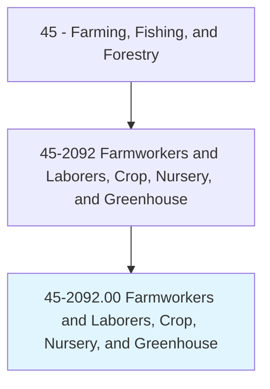
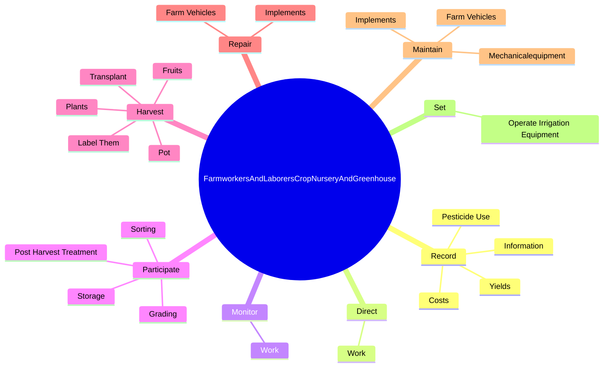
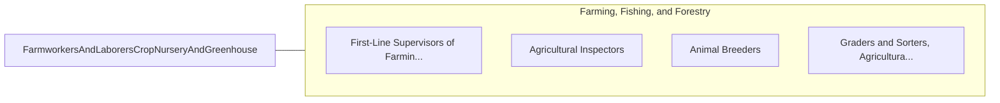

# Farmworkers and Laborers, Crop, Nursery, and Greenhouse

> Manually plant, cultivate, and harvest vegetables, fruits, nuts, horticultural specialties, and field crops. Use hand tools, such as shovels, trowels, hoes, tampers, pruning hooks, shears, and knives. Duties may include tilling soil and applying fertilizers; transplanting, weeding, thinning, or pruning crops; applying pesticides; or cleaning, grading, sorting, packing, and loading harvested products. May construct trellises, repair fences and farm buildings, or participate in irrigation activities.

## Overview

Farmworkers and Laborers, Crop, Nursery, and Greenhouse is an occupation within the Farming, Fishing, and Forestry category. Manually plant, cultivate, and harvest vegetables, fruits, nuts, horticultural specialties, and field crops. Use hand tools, such as shovels, trowels, hoes, tampers, pruning hooks, shears, and knives.

## Classification Hierarchy

## Key Statistics

| Metric | Value |
|--------|-------|
| SOC Code | 45-2092.00 |
| Category | [Farming, Fishing, and Forestry](/occupations/Agriculture) |
| Task Count | 161 |
| Source | O*NET |

## Core Tasks

### record.Information

Farmworkers and Laborers, Crop, Nursery, and Greenhouse record information as part of their core responsibilities.

**Actions:**
- `record.Information.about.Crops`
- `record.PesticideUse`
- `record.Yields`
- `record.Costs`

### direct.Work

Farmworkers and Laborers, Crop, Nursery, and Greenhouse direct work as part of their core responsibilities.

**Actions:**
- `direct.Work.of.CasualHelpDuringPlantingHarvesting`
- `direct.Work.of.SeasonalHelpDuringPlantingHarvesting`

### monitor.Work

Farmworkers and Laborers, Crop, Nursery, and Greenhouse monitor work as part of their core responsibilities.

**Actions:**
- `monitor.Work.of.CasualHelpDuringPlantingHarvesting`
- `monitor.Work.of.SeasonalHelpDuringPlantingHarvesting`

## Skills & Competencies

### Technical Skills
- **Agricultural Operations** - Advanced
- **Equipment Operation** - Advanced
- **Resource Management** - Advanced

### Soft Skills
- **Communication** - Essential
- **Problem Solving** - Essential
- **Critical Thinking** - Important
- **Teamwork** - Important
- **Adaptability** - Important

## Related Occupations

## Industries

This occupation is found across multiple industries. See [Industries](/industries) for sector-specific employment data.

## Career Progression

---

*Source: O*NET 45-2092.00 - ONETOccupation*
