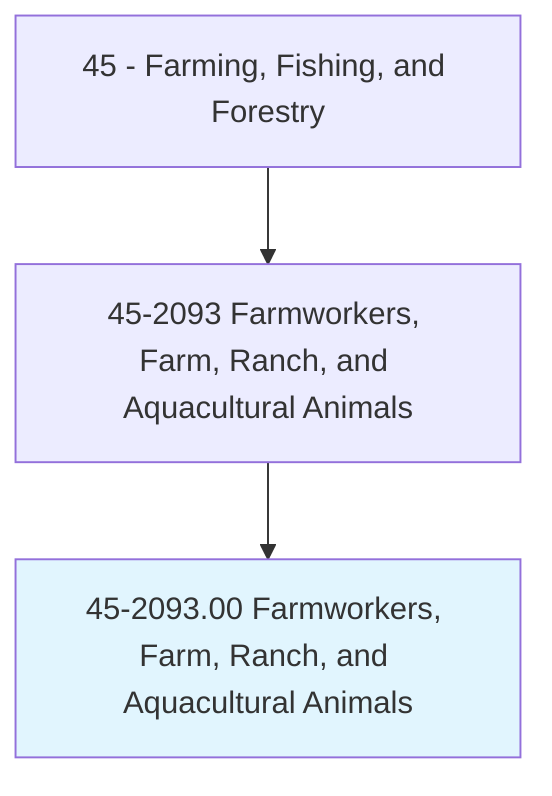
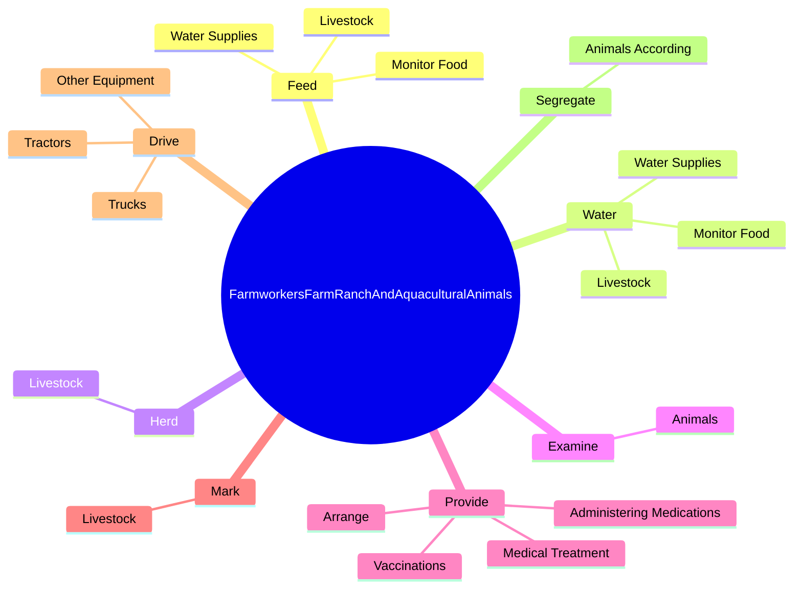
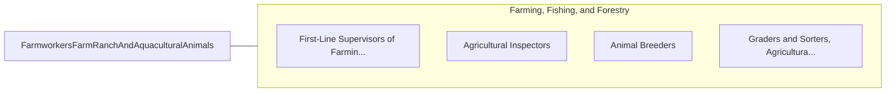

# Farmworkers, Farm, Ranch, and Aquacultural Animals

> Attend to live farm, ranch, open range or aquacultural animals that may include cattle, sheep, swine, goats, horses and other equines, poultry, rabbits, finfish, shellfish, and bees. Attend to animals produced for animal products, such as meat, fur, skins, feathers, eggs, milk, and honey. Duties may include feeding, watering, herding, grazing, milking, castrating, branding, de-beaking, weighing, catching, and loading animals. May maintain records on animals; examine animals to detect diseases and injuries; assist in birth deliveries; and administer medications, vaccinations, or insecticides as appropriate. May clean and maintain animal housing areas. Includes workers who shear wool from sheep and collect eggs in hatcheries.

## Overview

Farmworkers, Farm, Ranch, and Aquacultural Animals is an occupation within the Farming, Fishing, and Forestry category. Attend to live farm, ranch, open range or aquacultural animals that may include cattle, sheep, swine, goats, horses and other equines, poultry, rabbits, finfish, shellfish, and bees. Attend to animals produced for animal products, such as meat, fur, skins, feathers, eggs, milk, and honey.

## Classification Hierarchy

## Key Statistics

| Metric | Value |
|--------|-------|
| SOC Code | 45-2093.00 |
| Category | [Farming, Fishing, and Forestry](/occupations/Agriculture) |
| Task Count | 97 |
| Source | O*NET |

## Core Tasks

### feed.Livestock

Farmworkers, Farm, Ranch, and Aquacultural Animals feed livestock as part of their core responsibilities.

**Actions:**
- `feed.Livestock`
- `feed.MonitorFood`
- `feed.WaterSupplies`

### water.Livestock

Farmworkers, Farm, Ranch, and Aquacultural Animals water livestock as part of their core responsibilities.

**Actions:**
- `water.Livestock`
- `water.MonitorFood`
- `water.WaterSupplies`

### herd.Livestock

Farmworkers, Farm, Ranch, and Aquacultural Animals herd livestock as part of their core responsibilities.

**Actions:**
- `herd.Livestock.to.PasturesForGrazingScales`
- `herd.Livestock.to.ToScales`
- `herd.Livestock.to.Trucks`
- `herd.Livestock.to.OtherEnclosures`

## Skills & Competencies

### Technical Skills
- **Agricultural Operations** - Advanced
- **Equipment Operation** - Advanced
- **Resource Management** - Advanced

### Soft Skills
- **Communication** - Essential
- **Problem Solving** - Essential
- **Critical Thinking** - Important
- **Teamwork** - Important
- **Adaptability** - Important

## Related Occupations

## Industries

This occupation is found across multiple industries. See [Industries](/industries) for sector-specific employment data.

## Career Progression

---

*Source: O*NET 45-2093.00 - ONETOccupation*
