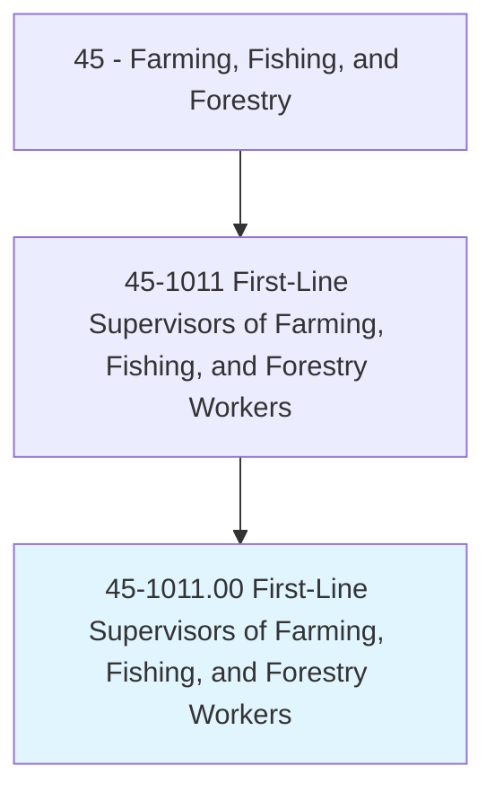
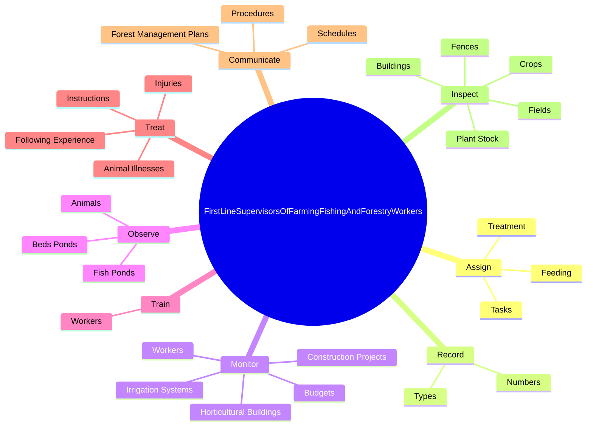
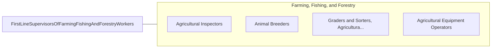

# First-Line Supervisors of Farming, Fishing, and Forestry Workers

> Directly supervise and coordinate the activities of agricultural, forestry, aquacultural, and related workers.

## Overview

First-Line Supervisors of Farming, Fishing, and Forestry Workers is classified under Farming, Fishing, and Forestry (SOC 45). Directly supervise and coordinate the activities of agricultural, forestry, aquacultural, and related workers.

## Classification Hierarchy

## Key Statistics

| Metric | Value |
|--------|-------|
| SOC Code | 45-1011.00 |
| Category | [Farming, Fishing, and Forestry](/occupations/Agriculture/index) |
| Task Count | 190 |
| Source | O*NET |

## Core Tasks

### assign.Tasks

First-Line Supervisors of Farming, Fishing, and Forestry Workers assign tasks as part of their core responsibilities.

**Actions:**
- `assign.Tasks.of.Animals`
- `assign.Tasks.of.Cleaning`
- `assign.Tasks.of.Maintenance.of.AnimalQuarters`
- `assign.Feeding.of.Animals`

### record.Numbers

First-Line Supervisors of Farming, Fishing, and Forestry Workers record numbers as part of their core responsibilities.

**Actions:**
- `record.Numbers.of.FishReared`
- `record.Numbers.of.ShellfishReared`
- `record.Numbers.of.Harvested`
- `record.Numbers.of.Released`

### monitor.Workers

First-Line Supervisors of Farming, Fishing, and Forestry Workers monitor workers as part of their core responsibilities.

**Actions:**
- `monitor.Workers.to.ensure.SafetyRegulationsAreFollowed`
- `monitor.Workers.to.Warning`
- `monitor.Workers.to.DiscipliningWhoViolateSafetyRegulations`
- `monitor.ConstructionProjects`

## Skills & Competencies

### Technical Skills
- **Agricultural Operations** - Advanced
- **Equipment Operation** - Advanced
- **Resource Management** - Advanced

### Soft Skills
- **Communication** - Essential
- **Problem Solving** - Essential
- **Critical Thinking** - Important
- **Teamwork** - Important
- **Adaptability** - Important

## Related Occupations

## Industries

This occupation is found across multiple industries. See [Industries](/industries) for sector-specific employment data.

## Career Progression

---

*Source: O*NET 45-1011.00 - ONETOccupation*
