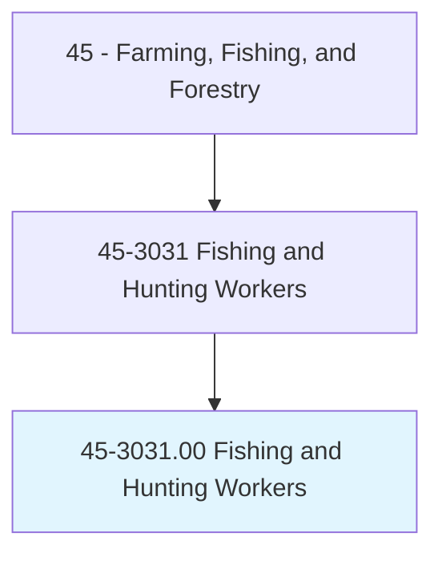
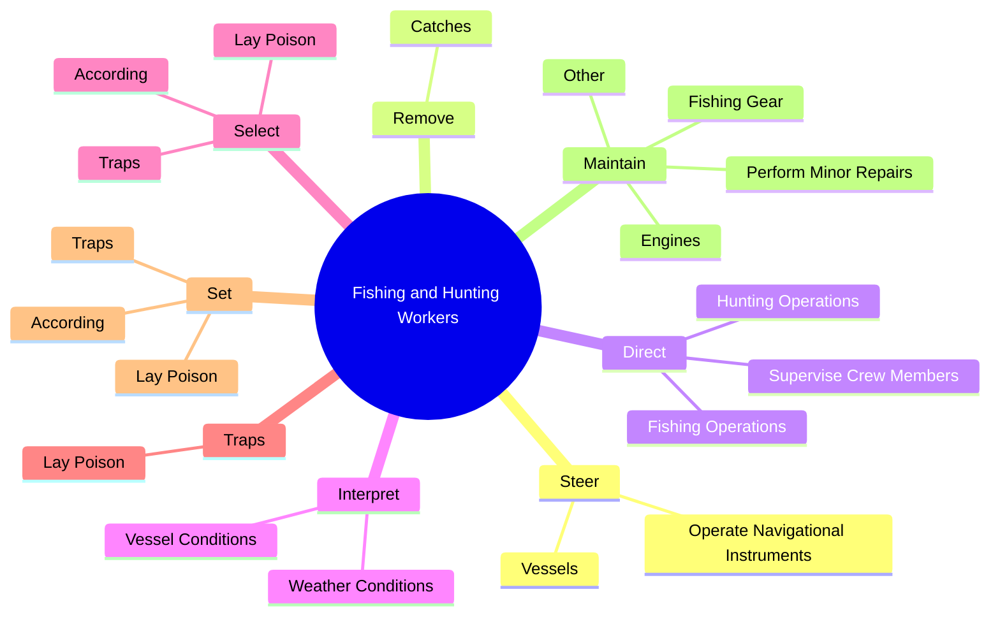
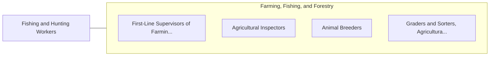

# Fishing and Hunting Workers

> Hunt, trap, catch, or gather wild animals or aquatic animals and plants. May use nets, traps, or other equipment. May haul catch onto ship or other vessel.

## Overview

Fishing and Hunting Workers is an occupation within the Farming, Fishing, and Forestry category. Hunt, trap, catch, or gather wild animals or aquatic animals and plants. May use nets, traps, or other equipment.

## Classification Hierarchy

## Key Statistics

| Metric | Value |
|--------|-------|
| SOC Code | 45-3031.00 |
| Category | [Farming, Fishing, and Forestry](/occupations/Agriculture/index) |
| Task Count | 184 |
| Source | O*NET |

## Core Tasks

### steer.Vessels

Fishing and Hunting Workers steer vessels as part of their core responsibilities.

**Actions:**
- `steer.Vessels`
- `steer.OperateNavigationalInstruments`

### remove.Catches

Fishing and Hunting Workers remove catches as part of their core responsibilities.

**Actions:**
- `remove.Catches.from.FishingEquipment`
- `remove.Catches.from.MeasureThem.to.ensure.ComplianceWithLegalSize`

### direct.FishingOperations

Fishing and Hunting Workers direct fishing operations as part of their core responsibilities.

**Actions:**
- `direct.FishingOperations`
- `direct.HuntingOperations`
- `direct.SuperviseCrewMembers`

## Skills & Competencies

### Technical Skills
- **Agricultural Operations** - Advanced
- **Equipment Operation** - Advanced
- **Resource Management** - Advanced

### Soft Skills
- **Communication** - Essential
- **Problem Solving** - Essential
- **Critical Thinking** - Important
- **Teamwork** - Important
- **Adaptability** - Important

## Related Occupations

## Industries

This occupation is found across multiple industries. See [Industries](/industries) for sector-specific employment data.

## Career Progression

---

*Source: O*NET 45-3031.00 - ONETOccupation*
