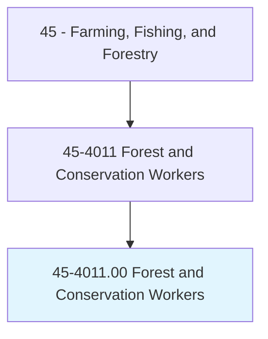
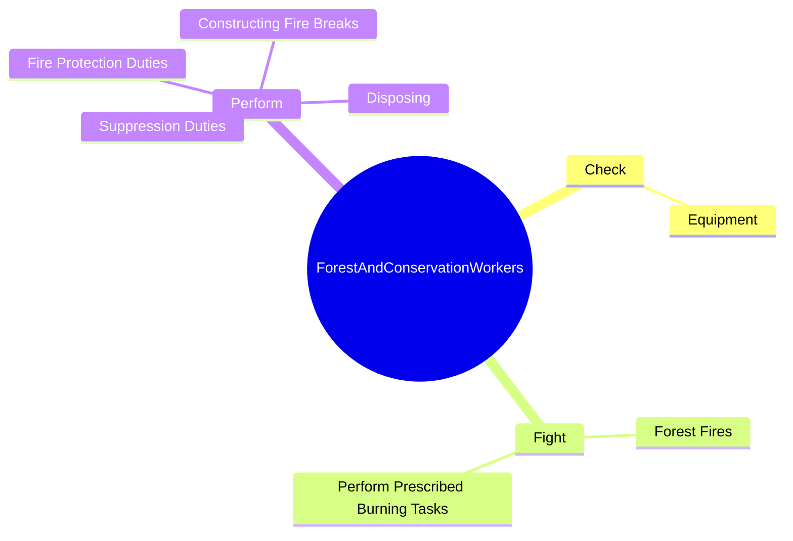
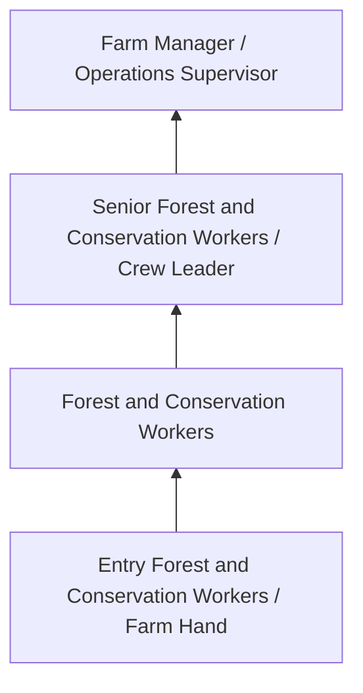
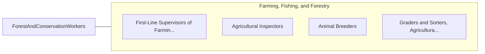

# Forest and Conservation Workers

> Under supervision, perform manual labor necessary to develop, maintain, or protect areas such as forests, forested areas, woodlands, wetlands, and rangelands through such activities as raising and transporting seedlings; combating insects, pests, and diseases harmful to plant life; and building structures to control water, erosion, and leaching of soil. Includes forester aides, seedling pullers, tree planters, and gatherers of nontimber forestry products such as pine straw.

## Overview

Forest and Conservation Workers professionals under supervision, perform manual labor necessary to develop, maintain, or protect areas such as forests, forested areas, woodlands, wetlands, and rangelands through such activities as raising and transporting seedlings; combating insects, pests, and diseases harmful to plant life; and building structures to control water, erosion, and leaching of soil. This occupation falls within the Farming, Fishing, and Forestry category and requires a combination of specialized knowledge, technical skills, and practical experience.

These professionals work across diverse settings and organizational contexts, applying their expertise to meet the demands of their field. They must stay current with industry standards, emerging practices, and regulatory requirements that affect their work. The role demands both independent judgment and collaborative skills, as practitioners regularly interact with colleagues, stakeholders, and the public.

As the field continues to evolve, Forest and Conservation Workers professionals increasingly leverage technology and data-driven approaches to enhance their effectiveness. Career opportunities span the public and private sectors, with demand influenced by economic conditions, demographic shifts, and technological advancement.

## Classification Hierarchy



## Key Statistics

| Metric | Value |
|--------|-------|
| SOC Code | 45-4011.00 |
| Job Zone | N/A |
| Category | [Farming, Fishing, and Forestry](/occupations/Agriculture/index) |
| Core Tasks | N/A+ |
| Salary Range | $28,000 - $60,000 |
| Median Salary | $38,000 |
| Growth Outlook | -2% (Decline) |
| Source | O*NET |

## Core Tasks



### check.Equipment

Forest and Conservation Workers check equipment as part of their core responsibilities.

**Actions:**
- `check.Equipment.to.ensure.ItIsOperatingProperly`

### fight.ForestFires

Forest and Conservation Workers fight forest fires as part of their core responsibilities.

**Actions:**
- `fight.ForestFires.of.FireSuppressionOfficersTechnicians`
- `fight.ForestFires.of.ForestryTechnicians`
- `fight.PerformPrescribedBurningTasks.under.Direction.of.FireSuppressionOfficersTechnicians`
- `fight.PerformPrescribedBurningTasks.under.Direction.of.ForestryTechnicians`

### perform.FireProtectionDuties

Forest and Conservation Workers perform fire protection duties as part of their core responsibilities.

**Actions:**
- `perform.FireProtectionDuties.of.Brush`
- `perform.SuppressionDuties.of.Brush`
- `perform.ConstructingFireBreaks.of.Brush`
- `perform.Disposing.of.Brush`

### Technical Skills
- **Agricultural Operations** - Advanced
- **Equipment Operation** - Advanced
- **Resource Management** - Advanced

### Soft Skills
- **Communication** - Essential
- **Problem Solving** - Essential
- **Critical Thinking** - Important
- **Teamwork** - Important
- **Adaptability** - Important


## Skills & Competencies

### Technical Skills
- **Agricultural Operations** - Advanced
- **Equipment Operation** - Advanced
- **Crop/Animal Management** - Advanced
- **Safety Procedures** - Advanced
- **Pest Management** - Proficient
- **Soil/Resource Management** - Proficient

### Soft Skills
- **Physical Stamina** - Critical
- **Problem Solving** - Essential
- **Adaptability** - Essential
- **Reliability** - Essential
- **Teamwork** - Important

## Education & Certifications

| Requirement | Details |
|-------------|---------|
| Typical Education | High school diploma; some positions require agricultural training |
| Work Experience | 0-2 years farming or forestry experience |
| On-the-Job Training | Moderate - equipment and safety training |
| Certifications | Pesticide applicator license, equipment operation certifications |

## Career Progression



## Industry Variations

### Crop Production
Field crop and specialty crop cultivation. Forest and Conservation Workers professionals manage planting, cultivation, and harvesting operations.

### Livestock and Dairy
Animal husbandry and production management. Focus on animal health, breeding, and production efficiency.

### Forestry and Logging
Timber management and harvesting operations. Emphasis on sustainability, safety, and environmental compliance.

### Nursery and Greenhouse
Controlled environment production of ornamental plants and seedlings. Focus on plant health and customer specifications.

## Technology & Tools

- **GPS-guided equipment**
- **Precision agriculture software**
- **Irrigation control systems**
- **Soil testing equipment**
- **Farm management information systems**

## Related Occupations



## Industries

- [Crop Production](/industries/CropProduction) - High Employment
- [Animal Production](/industries/AnimalProduction) - High Employment
- [Forestry and Logging](/industries/Forestry) - Moderate Employment
- [Support Activities for Agriculture](/industries/AgricultureSupport) - Moderate Employment

## Departments

This occupation typically works in:
- [Farm Operations](/departments/FarmOperations)
- [Crop Management](/departments/CropManagement)
- [Equipment Operations](/departments/EquipmentOps)

## GraphDL Semantic Structure

```
Forest and Conservation Workers perform:
- operate.Equipment.for.FarmOperations
- maintain.Crops.for.OptimalGrowth
- inspect.Fields.for.PestAndDisease
- harvest.Products.using.ProperTechniques
- follow.Procedures.for.SafetyCompliance
```

---

*Source: O*NET 45-4011.00 - ONETOccupation*
