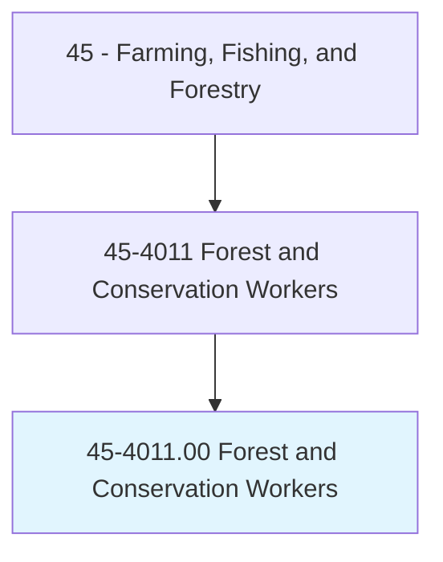
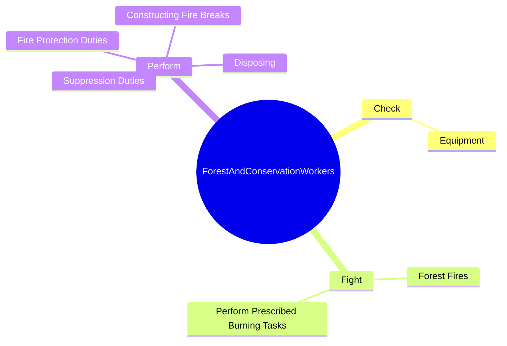
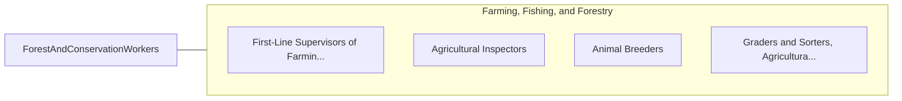

# Forest and Conservation Workers

> Under supervision, perform manual labor necessary to develop, maintain, or protect areas such as forests, forested areas, woodlands, wetlands, and rangelands through such activities as raising and transporting seedlings; combating insects, pests, and diseases harmful to plant life; and building structures to control water, erosion, and leaching of soil. Includes forester aides, seedling pullers, tree planters, and gatherers of nontimber forestry products such as pine straw.

## Overview

Forest and Conservation Workers is an occupation within the Farming, Fishing, and Forestry category. Under supervision, perform manual labor necessary to develop, maintain, or protect areas such as forests, forested areas, woodlands, wetlands, and rangelands through such activities as raising and transporting seedlings; combating insects, pests, and diseases harmful to plant life; and building structures to control water, erosion, and leaching of soil. 

## Classification Hierarchy

## Key Statistics

| Metric | Value |
|--------|-------|
| SOC Code | 45-4011.00 |
| Category | [Farming, Fishing, and Forestry](/occupations/Agriculture) |
| Task Count | 84 |
| Source | O*NET |

## Core Tasks

### check.Equipment

Forest and Conservation Workers check equipment as part of their core responsibilities.

**Actions:**
- `check.Equipment.to.ensure.ItIsOperatingProperly`

### fight.ForestFires

Forest and Conservation Workers fight forest fires as part of their core responsibilities.

**Actions:**
- `fight.ForestFires.of.FireSuppressionOfficersTechnicians`
- `fight.ForestFires.of.ForestryTechnicians`
- `fight.PerformPrescribedBurningTasks.under.Direction.of.FireSuppressionOfficersTechnicians`
- `fight.PerformPrescribedBurningTasks.under.Direction.of.ForestryTechnicians`

### perform.FireProtectionDuties

Forest and Conservation Workers perform fire protection duties as part of their core responsibilities.

**Actions:**
- `perform.FireProtectionDuties.of.Brush`
- `perform.SuppressionDuties.of.Brush`
- `perform.ConstructingFireBreaks.of.Brush`
- `perform.Disposing.of.Brush`

## Skills & Competencies

### Technical Skills
- **Agricultural Operations** - Advanced
- **Equipment Operation** - Advanced
- **Resource Management** - Advanced

### Soft Skills
- **Communication** - Essential
- **Problem Solving** - Essential
- **Critical Thinking** - Important
- **Teamwork** - Important
- **Adaptability** - Important

## Related Occupations

## Industries

This occupation is found across multiple industries. See [Industries](/industries) for sector-specific employment data.

## Career Progression

---

*Source: O*NET 45-4011.00 - ONETOccupation*
