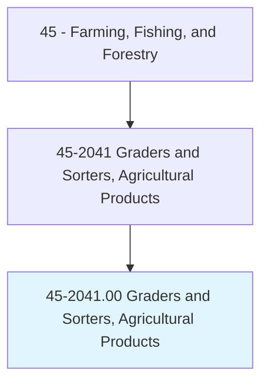
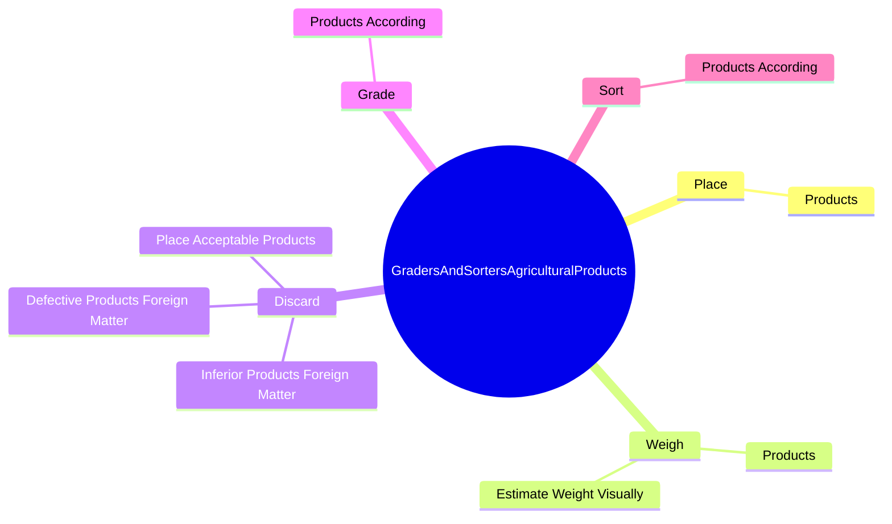
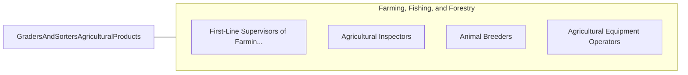

# Graders and Sorters, Agricultural Products

> Grade, sort, or classify unprocessed food and other agricultural products by size, weight, color, or condition.

## Overview

Graders and Sorters, Agricultural Products is classified under Farming, Fishing, and Forestry (SOC 45). Grade, sort, or classify unprocessed food and other agricultural products by size, weight, color, or condition.

## Classification Hierarchy

## Key Statistics

| Metric | Value |
|--------|-------|
| SOC Code | 45-2041.00 |
| Category | [Farming, Fishing, and Forestry](/occupations/Agriculture) |
| Task Count | 35 |
| Source | O*NET |

## Core Tasks

### place.Products

Graders and Sorters, Agricultural Products place products as part of their core responsibilities.

**Actions:**
- `place.Products.in.ContainersAccording.to.Grade`
- `place.Products.in.MarkGrades.on.Containers`

### weigh.Products

Graders and Sorters, Agricultural Products weigh products as part of their core responsibilities.

**Actions:**
- `weigh.Products.by.Feel`
- `weigh.EstimateWeightVisually.by.Feel`

### discard.InferiorProductsForeignMatter

Graders and Sorters, Agricultural Products discard inferior products foreign matter as part of their core responsibilities.

**Actions:**
- `discard.InferiorProductsForeignMatter.in.Containers.for.FurtherProcessing`
- `discard.DefectiveProductsForeignMatter.in.Containers.for.FurtherProcessing`
- `discard.PlaceAcceptableProducts.in.Containers.for.FurtherProcessing`

## Skills & Competencies

### Technical Skills
- **Agricultural Operations** - Advanced
- **Equipment Operation** - Advanced
- **Resource Management** - Advanced

### Soft Skills
- **Communication** - Essential
- **Problem Solving** - Essential
- **Critical Thinking** - Important
- **Teamwork** - Important
- **Adaptability** - Important

## Related Occupations

## Industries

This occupation is found across multiple industries. See [Industries](/industries) for sector-specific employment data.

## Career Progression

---

*Source: O*NET 45-2041.00 - ONETOccupation*
