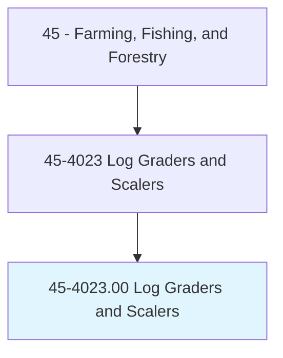
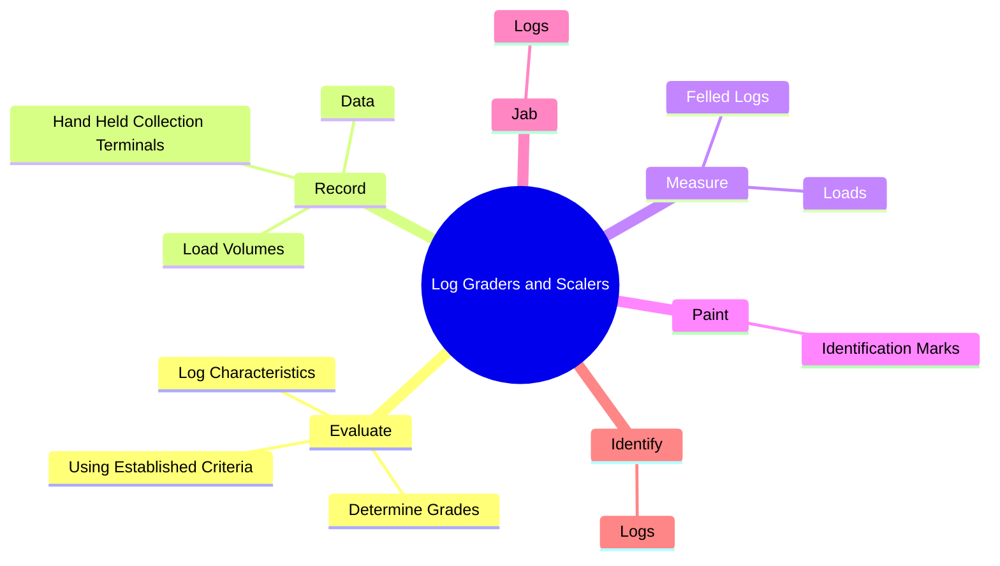
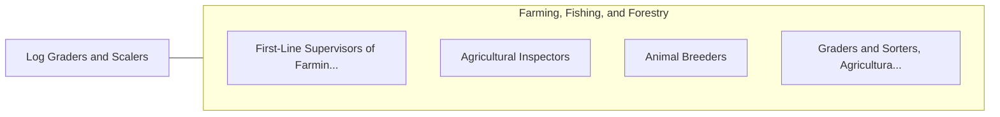

# Log Graders and Scalers

> Grade logs or estimate the marketable content or value of logs or pulpwood in sorting yards, millpond, log deck, or similar locations. Inspect logs for defects or measure logs to determine volume.

## Overview

Log Graders and Scalers is an occupation within the Farming, Fishing, and Forestry category. Grade logs or estimate the marketable content or value of logs or pulpwood in sorting yards, millpond, log deck, or similar locations. 

## Classification Hierarchy

## Key Statistics

| Metric | Value |
|--------|-------|
| SOC Code | 45-4023.00 |
| Category | [Farming, Fishing, and Forestry](/occupations/Agriculture/index) |
| Task Count | 50 |
| Source | O*NET |

## Core Tasks

### evaluate.LogCharacteristics

Log Graders and Scalers evaluate log characteristics as part of their core responsibilities.

**Actions:**
- `evaluate.LogCharacteristics`
- `evaluate.DetermineGrades`
- `evaluate.UsingEstablishedCriteria`

### record.Data

Log Graders and Scalers record data as part of their core responsibilities.

**Actions:**
- `record.Data.about.IndividualTrees`
- `record.LoadVolumes.into.TallyBooksCollectionTerminals`
- `record.HandHeldCollectionTerminals`

### measure.FelledLogs

Log Graders and Scalers measure felled logs as part of their core responsibilities.

**Actions:**
- `measure.FelledLogs.of.Pulpwood.to.calculate.Volume`
- `measure.FelledLogs.of.Weight`
- `measure.FelledLogs.of.Dimensions`
- `measure.FelledLogs.of.MarketableValue`

## Skills & Competencies

### Technical Skills
- **Agricultural Operations** - Advanced
- **Equipment Operation** - Advanced
- **Resource Management** - Advanced

### Soft Skills
- **Communication** - Essential
- **Problem Solving** - Essential
- **Critical Thinking** - Important
- **Teamwork** - Important
- **Adaptability** - Important

## Related Occupations

## Industries

This occupation is found across multiple industries. See [Industries](/industries) for sector-specific employment data.

## Career Progression

---

*Source: O*NET 45-4023.00 - ONETOccupation*
