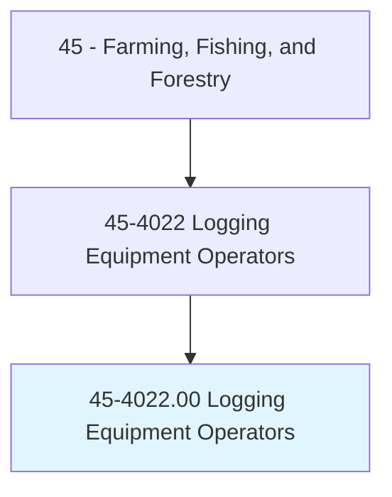
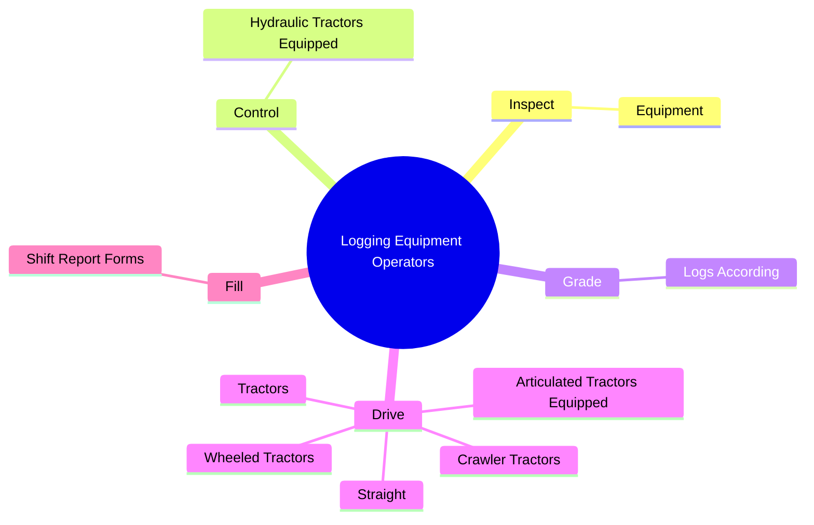
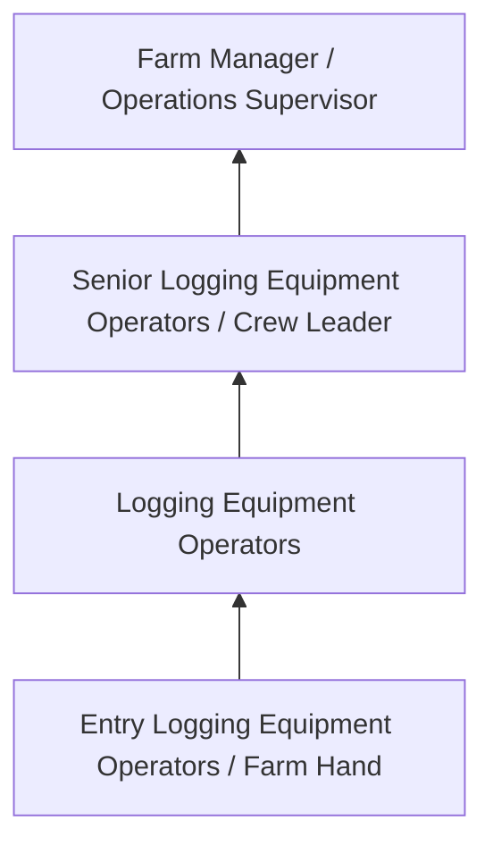
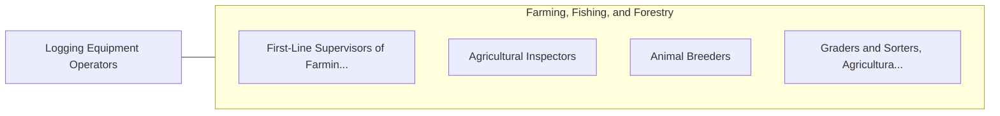

# Logging Equipment Operators

> Drive logging tractor or wheeled vehicle equipped with one or more accessories, such as bulldozer blade, frontal shear, grapple, logging arch, cable winches, hoisting rack, or crane boom, to fell tree; to skid, load, unload, or stack logs; or to pull stumps or clear brush. Includes operating stand-alone logging machines, such as log chippers.

## Overview

Logging Equipment Operators professionals drive logging tractor or wheeled vehicle equipped with one or more accessories, such as bulldozer blade, frontal shear, grapple, logging arch, cable winches, hoisting rack, or crane boom, to fell tree; to skid, load, unload, or stack logs; or to pull stumps or clear brush. This occupation falls within the Farming, Fishing, and Forestry category and requires a combination of specialized knowledge, technical skills, and practical experience.

These professionals work across diverse settings and organizational contexts, applying their expertise to meet the demands of their field. They must stay current with industry standards, emerging practices, and regulatory requirements that affect their work. The role demands both independent judgment and collaborative skills, as practitioners regularly interact with colleagues, stakeholders, and the public.

As the field continues to evolve, Logging Equipment Operators professionals increasingly leverage technology and data-driven approaches to enhance their effectiveness. Career opportunities span the public and private sectors, with demand influenced by economic conditions, demographic shifts, and technological advancement.

## Classification Hierarchy



## Key Statistics

| Metric | Value |
|--------|-------|
| SOC Code | 45-4022.00 |
| Job Zone | N/A |
| Category | [Farming, Fishing, and Forestry](/occupations/Agriculture/index) |
| Core Tasks | 62+ |
| Salary Range | $28,000 - $60,000 |
| Median Salary | $38,000 |
| Growth Outlook | -2% (Decline) |
| Source | O*NET |

## Core Tasks



### drive.Straight

Logging Equipment Operators drive straight as part of their core responsibilities.

**Actions:**
- `drive.Straight.with.Accessories` - Drive straight or articulated tractors equipped with accessories such as bull...
- `drive.Straight.with.BulldozerBlades` - Drive straight or articulated tractors equipped with accessories such as bull...
- `drive.Straight.with.Grapples` - Drive straight or articulated tractors equipped with accessories such as bull...
- `drive.Straight.with.LoggingArches` - Drive straight or articulated tractors equipped with accessories such as bull...
- `drive.Straight.with.CableWinches` - Drive straight or articulated tractors equipped with accessories such as bull...

### maneuver.TractorsHarvesters

Logging Equipment Operators maneuver tractors harvesters as part of their core responsibilities.

**Actions:**
- `maneuver.TractorsHarvesters.to.ShearTopsOffOfTrees` - Drive and maneuver tractors and tree harvesters to shear the tops off of tree...
- `maneuver.TractorsHarvesters.to.cut` - Drive and maneuver tractors and tree harvesters to shear the tops off of tree...
- `maneuver.TractorsHarvesters.to.LimbTrees` - Drive and maneuver tractors and tree harvesters to shear the tops off of tree...
- `maneuver.TractorsHarvesters.to.cut.LogsIntoDesiredLengths` - Drive and maneuver tractors and tree harvesters to shear the tops off of tree...
- `maneuver.TreeHarvesters.to.ShearTopsOffOfTrees` - Drive and maneuver tractors and tree harvesters to shear the tops off of tree...

### grade.LogsAccording

Logging Equipment Operators grade logs according as part of their core responsibilities.

**Actions:**
- `grade.LogsAccording.to.Characteristics` - Grade logs according to characteristics such as knot size and straightness, a...
- `grade.LogsAccording.to.KnotSize` - Grade logs according to characteristics such as knot size and straightness, a...
- `grade.LogsAccording.to.Straightness` - Grade logs according to characteristics such as knot size and straightness, a...
- `grade.LogsAccording.to.AccordingToEstablishedIndustry` - Grade logs according to characteristics such as knot size and straightness, a...
- `grade.LogsAccording.to.CompanyStandards` - Grade logs according to characteristics such as knot size and straightness, a...

### control.HydraulicTractorsEquipped

Logging Equipment Operators control hydraulic tractors equipped as part of their core responsibilities.

**Actions:**
- `control.HydraulicTractorsEquipped.with.TreeClamps.to.Lift` - Control hydraulic tractors equipped with tree clamps and booms to lift, swing...
- `control.HydraulicTractorsEquipped.with.Booms.to.Lift` - Control hydraulic tractors equipped with tree clamps and booms to lift, swing...
- `control.HydraulicTractorsEquipped.with.Swing` - Control hydraulic tractors equipped with tree clamps and booms to lift, swing...
- `control.HydraulicTractorsEquipped.with.BunchShearedTrees` - Control hydraulic tractors equipped with tree clamps and booms to lift, swing...


## Skills & Competencies

### Technical Skills
- **Agricultural Operations** - Advanced
- **Equipment Operation** - Advanced
- **Crop/Animal Management** - Advanced
- **Safety Procedures** - Advanced
- **Pest Management** - Proficient
- **Soil/Resource Management** - Proficient

### Soft Skills
- **Physical Stamina** - Critical
- **Problem Solving** - Essential
- **Adaptability** - Essential
- **Reliability** - Essential
- **Teamwork** - Important

## Education & Certifications

| Requirement | Details |
|-------------|---------|
| Typical Education | High school diploma; some positions require agricultural training |
| Work Experience | 0-2 years farming or forestry experience |
| On-the-Job Training | Moderate - equipment and safety training |
| Certifications | Pesticide applicator license, equipment operation certifications |

## Career Progression



## Industry Variations

### Crop Production
Field crop and specialty crop cultivation. Logging Equipment Operators professionals manage planting, cultivation, and harvesting operations.

### Livestock and Dairy
Animal husbandry and production management. Focus on animal health, breeding, and production efficiency.

### Forestry and Logging
Timber management and harvesting operations. Emphasis on sustainability, safety, and environmental compliance.

### Nursery and Greenhouse
Controlled environment production of ornamental plants and seedlings. Focus on plant health and customer specifications.

## Technology & Tools

- **GPS-guided equipment**
- **Precision agriculture software**
- **Irrigation control systems**
- **Soil testing equipment**
- **Farm management information systems**

## Related Occupations



## Industries

- [Crop Production](/industries/CropProduction) - High Employment
- [Animal Production](/industries/AnimalProduction) - High Employment
- [Forestry and Logging](/industries/Forestry) - Moderate Employment
- [Support Activities for Agriculture](/industries/AgricultureSupport) - Moderate Employment

## Departments

This occupation typically works in:
- [Farm Operations](/departments/FarmOperations)
- [Crop Management](/departments/CropManagement)
- [Equipment Operations](/departments/EquipmentOps)

## GraphDL Semantic Structure

```
Logging Equipment Operators perform:
- inspect.Equipment.for.SafetyPrior.to.Use
- inspect.Equipment.for.PerformNecessaryBasicMaintenanceTasks
- control.HydraulicTractorsEquipped.with.TreeClamps.to.Lift
- control.HydraulicTractorsEquipped.with.Booms.to.Lift
- control.HydraulicTractorsEquipped.with.Swing
- control.HydraulicTractorsEquipped.with.BunchShearedTrees
```

---

*Source: O*NET 45-4022.00 - ONETOccupation*
