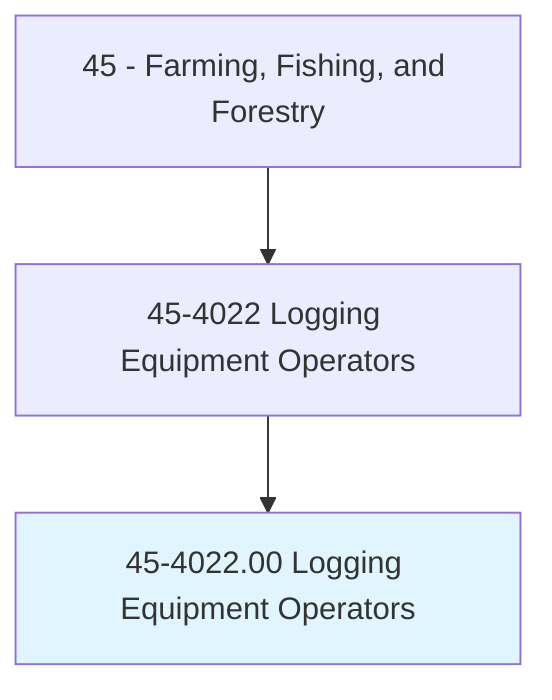
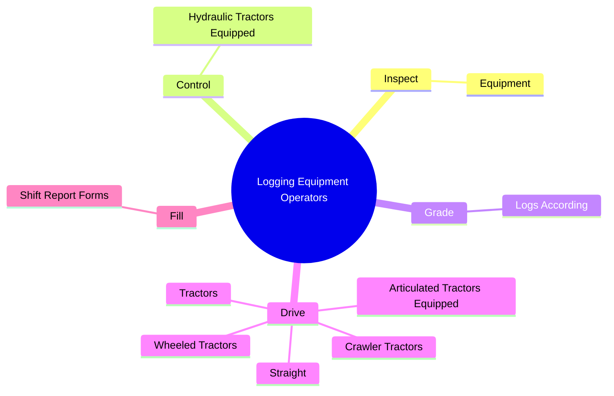
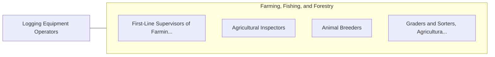

# Logging Equipment Operators

> Drive logging tractor or wheeled vehicle equipped with one or more accessories, such as bulldozer blade, frontal shear, grapple, logging arch, cable winches, hoisting rack, or crane boom, to fell tree; to skid, load, unload, or stack logs; or to pull stumps or clear brush. Includes operating stand-alone logging machines, such as log chippers.

## Overview

Logging Equipment Operators is an occupation within the Farming, Fishing, and Forestry category. Drive logging tractor or wheeled vehicle equipped with one or more accessories, such as bulldozer blade, frontal shear, grapple, logging arch, cable winches, hoisting rack, or crane boom, to fell tree; to skid, load, unload, or stack logs; or to pull stumps or clear brush. 

## Classification Hierarchy

## Key Statistics

| Metric | Value |
|--------|-------|
| SOC Code | 45-4022.00 |
| Category | [Farming, Fishing, and Forestry](/occupations/Agriculture) |
| Task Count | 62 |
| Source | O*NET |

## Core Tasks

### inspect.Equipment

Logging Equipment Operators inspect equipment as part of their core responsibilities.

**Actions:**
- `inspect.Equipment.for.SafetyPrior.to.Use`
- `inspect.Equipment.for.PerformNecessaryBasicMaintenanceTasks`

### control.HydraulicTractorsEquipped

Logging Equipment Operators control hydraulic tractors equipped as part of their core responsibilities.

**Actions:**
- `control.HydraulicTractorsEquipped.with.TreeClamps.to.Lift`
- `control.HydraulicTractorsEquipped.with.Booms.to.Lift`
- `control.HydraulicTractorsEquipped.with.Swing`
- `control.HydraulicTractorsEquipped.with.BunchShearedTrees`

### grade.LogsAccording

Logging Equipment Operators grade logs according as part of their core responsibilities.

**Actions:**
- `grade.LogsAccording.to.Characteristics`
- `grade.LogsAccording.to.KnotSize`
- `grade.LogsAccording.to.Straightness`
- `grade.LogsAccording.to.AccordingToEstablishedIndustry`

## Skills & Competencies

### Technical Skills
- **Agricultural Operations** - Advanced
- **Equipment Operation** - Advanced
- **Resource Management** - Advanced

### Soft Skills
- **Communication** - Essential
- **Problem Solving** - Essential
- **Critical Thinking** - Important
- **Teamwork** - Important
- **Adaptability** - Important

## Related Occupations

## Industries

This occupation is found across multiple industries. See [Industries](/industries) for sector-specific employment data.

## Career Progression

---

*Source: O*NET 45-4022.00 - ONETOccupation*
