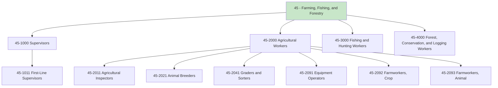
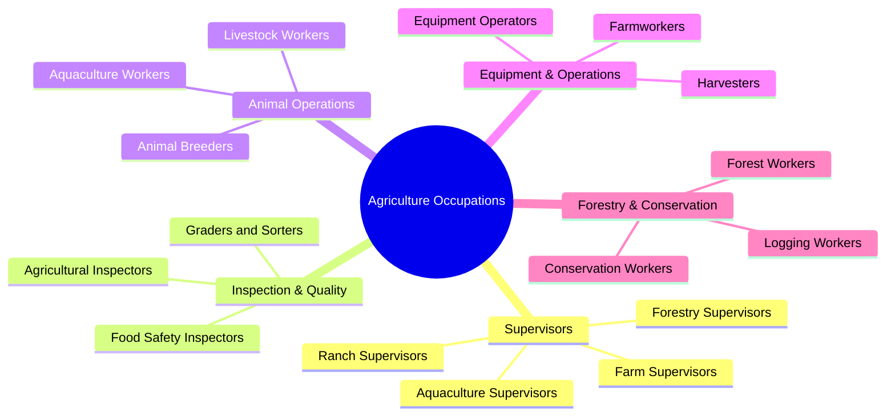
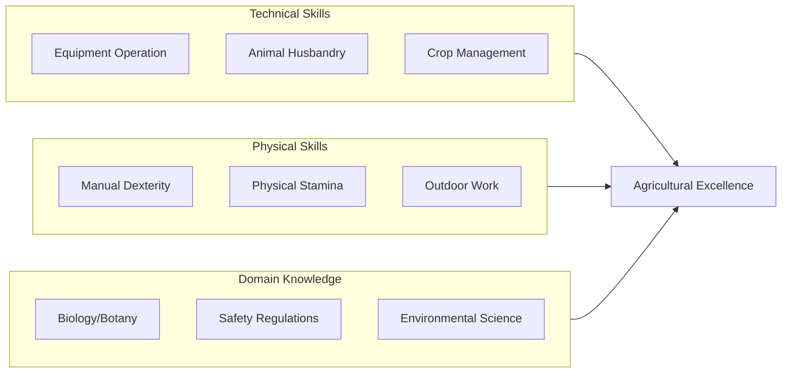
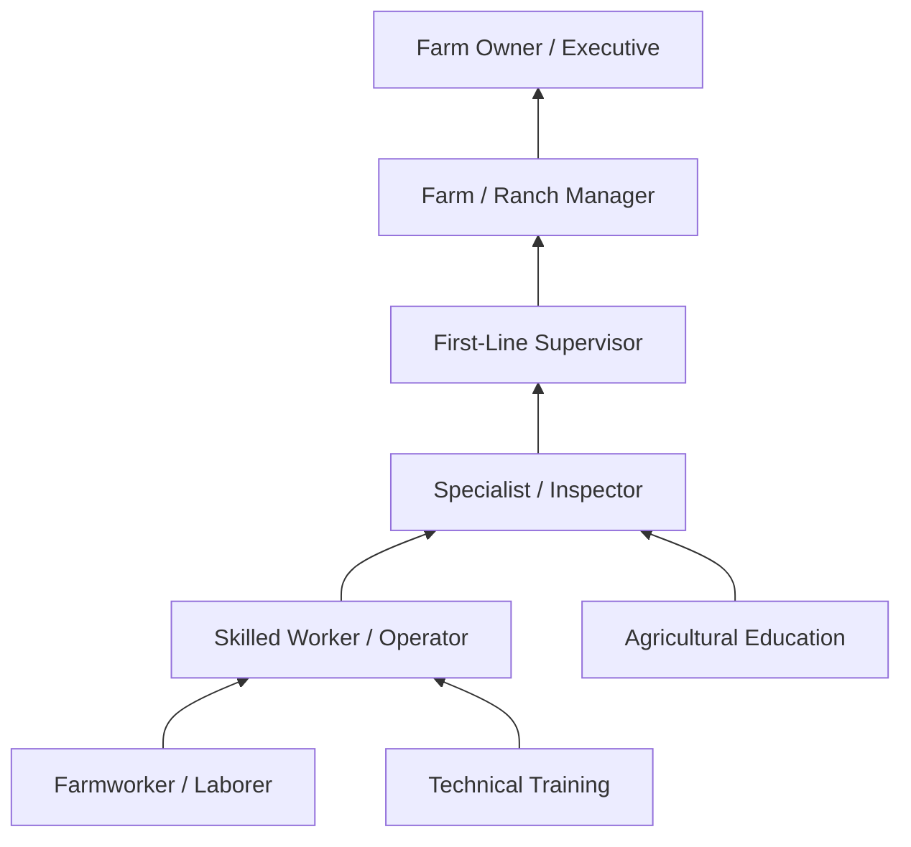

# Farming, Fishing, and Forestry Occupations

> Category 45 - Farming, Fishing, and Forestry occupations include workers involved in growing crops, raising animals, harvesting fish and other aquatic life, and cultivating forest products.

## Overview

Farming, Fishing, and Forestry Occupations encompass workers who grow crops, raise livestock, harvest timber, catch fish, and support agricultural operations. This category includes first-line supervisors who coordinate agricultural activities, inspectors who ensure compliance with health and safety regulations, equipment operators who run farm machinery, animal breeders who manage livestock genetics, and graders who sort agricultural products. These occupations are foundational to food systems, natural resource management, and the agricultural economy.

## Classification Hierarchy

## Key Statistics

| Metric | Value |
|--------|-------|
| SOC Category Code | 45 |
| Major Groups | 4 |
| Detailed Occupations | 15+ |
| Source | O*NET / BLS |

## Occupations in this Category

### Supervisors (45-1000)

| Occupation | Code | Description |
|------------|------|-------------|
| [First-Line Supervisors of Farming, Fishing, and Forestry Workers](./AgricultureSupervisors.mdx) | 45-1011.00 | Directly supervise and coordinate agricultural, forestry, and aquacultural workers |

### Agricultural Workers (45-2000)

| Occupation | Code | Description |
|------------|------|-------------|
| [Agricultural Inspectors](./AgriculturalInspectors.mdx) | 45-2011.00 | Inspect agricultural commodities and facilities for compliance |
| [Animal Breeders](./AnimalBreeders.mdx) | 45-2021.00 | Select and breed animals according to genetics and characteristics |
| [Graders and Sorters, Agricultural Products](./AgriculturalGraders.mdx) | 45-2041.00 | Grade, sort, or classify agricultural products |
| [Agricultural Equipment Operators](./AgriculturalEquipmentOperators.mdx) | 45-2091.00 | Operate farm equipment for planting, cultivating, and harvesting |

## Category Overview Diagram

## Skills Common to Agriculture Occupations

### Core Competencies

## Career Pathways

## Industries Employing Agriculture Occupations

- [Crop Production](/industries/Agriculture/CropProduction/index) - Highest concentration
- [Animal Production and Aquaculture](/industries/Agriculture/AnimalProduction/index) - High employment
- Support Activities for Agriculture - Growing sector
- [Food Manufacturing](/industries/Manufacturing/FoodManufacturing/index) - Processing and packaging
- [Government](/industries/PublicAdministration) - Inspection and regulation

## Education & Training Trends

| Level | Percentage of Workers |
|-------|----------------------|
| High School Diploma/GED | 50-60% |
| Some College/Vocational | 20-25% |
| Associate's Degree | 10-15% |
| Bachelor's Degree | 5-10% |

## Seasonal Considerations

Agriculture occupations often involve seasonal work patterns:

- **Planting Season**: High demand for operators and laborers
- **Growing Season**: Focus on cultivation, pest control, and irrigation
- **Harvest Season**: Peak employment across all categories
- **Off-Season**: Equipment maintenance, planning, and preparation

## Related Categories

- [Production Occupations](/occupations/Production/index) - Category 51
- [Transportation and Material Moving](/occupations/Transportation/index) - Category 53
- [Life, Physical, and Social Science](/occupations/Science/index) - Category 19
- [Installation, Maintenance, and Repair](/occupations/Maintenance/index) - Category 49

---

*Source: O*NET / Bureau of Labor Statistics - SOC Category 45*
