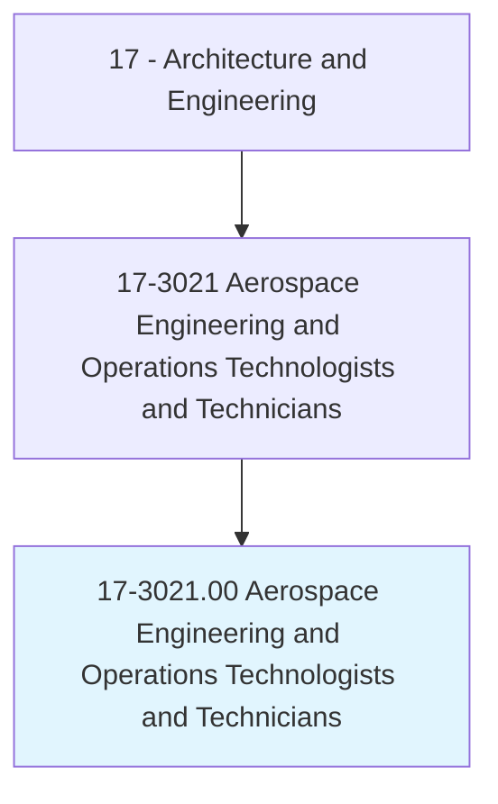
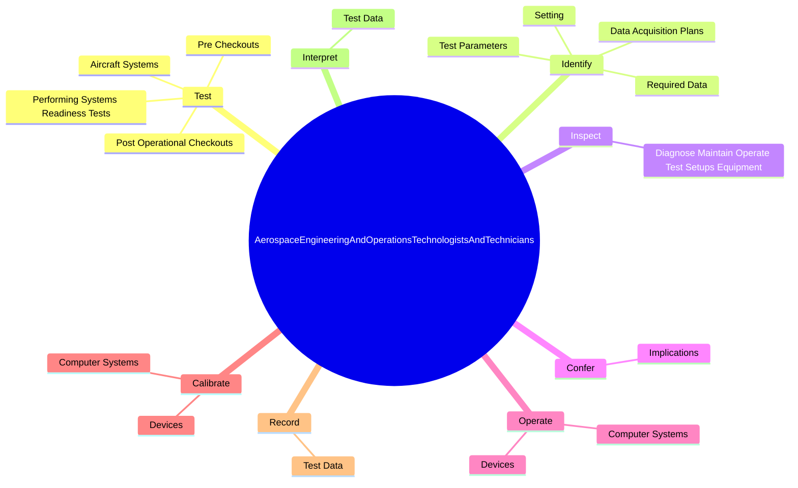
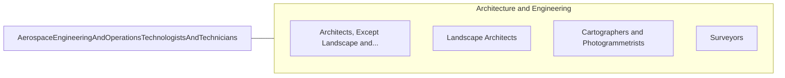

# Aerospace Engineering and Operations Technologists and Technicians

> Operate, install, adjust, and maintain integrated computer/communications systems, consoles, simulators, and other data acquisition, test, and measurement instruments and equipment, which are used to launch, track, position, and evaluate air and space vehicles. May record and interpret test data.

## Overview

Aerospace Engineering and Operations Technologists and Technicians is an occupation within the Architecture and Engineering category. Operate, install, adjust, and maintain integrated computer/communications systems, consoles, simulators, and other data acquisition, test, and measurement instruments and equipment, which are used to launch, track, position, and evaluate air and space vehicles. 

## Classification Hierarchy

## Key Statistics

| Metric | Value |
|--------|-------|
| SOC Code | 17-3021.00 |
| Category | [Architecture and Engineering](/occupations/Architecture) |
| Task Count | 63 |
| Source | O*NET |

## Core Tasks

### test.AircraftSystems

Aerospace Engineering and Operations Technologists and Technicians test aircraft systems as part of their core responsibilities.

**Actions:**
- `test.AircraftSystems.under.SimulatedOperationalConditions.to.establish.DesignParameters`
- `test.AircraftSystems.under.SimulatedOperationalConditionsToFabricationParameters`
- `test.PerformingSystemsReadinessTests.to.establish.DesignParameters`
- `test.PerformingSystemsReadinessTests.to.FabricationParameters`

### identify.RequiredData

Aerospace Engineering and Operations Technologists and Technicians identify required data as part of their core responsibilities.

**Actions:**
- `identify.RequiredData.to.conform.ToSpecifications`
- `identify.DataAcquisitionPlans.to.conform.ToSpecifications`
- `identify.TestParameters.to.conform.ToSpecifications`
- `identify.Setting.up.Equipment.to.conform.ToSpecifications`

### inspect.DiagnoseMaintainOperateTestSetupsEquipment

Aerospace Engineering and Operations Technologists and Technicians inspect diagnose maintain operate test setups equipment as part of their core responsibilities.

**Actions:**
- `inspect.DiagnoseMaintainOperateTestSetupsEquipment.to.detect.Malfunctions`

## Skills & Competencies

### Technical Skills
- **Engineering Design** - Advanced
- **CAD/CAM** - Advanced
- **Technical Analysis** - Advanced

### Soft Skills
- **Communication** - Essential
- **Problem Solving** - Essential
- **Critical Thinking** - Important
- **Teamwork** - Important
- **Adaptability** - Important

## Related Occupations

## Industries

This occupation is found across multiple industries. See [Industries](/industries) for sector-specific employment data.

## Career Progression

---

*Source: O*NET 17-3021.00 - ONETOccupation*
