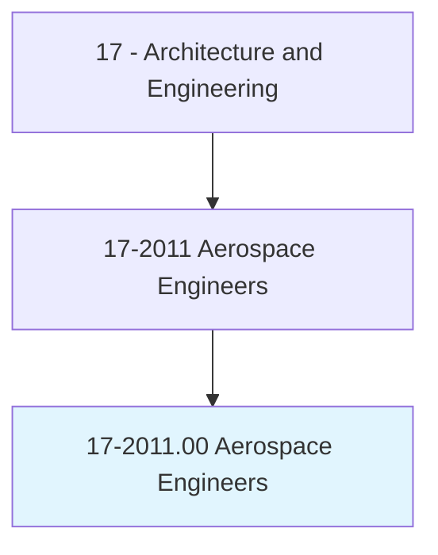
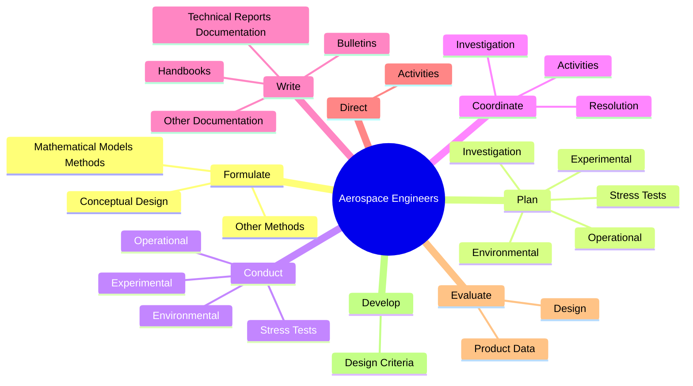
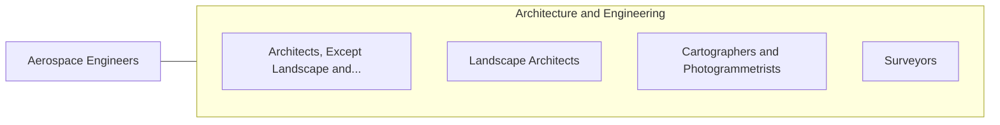

# Aerospace Engineers

> Perform engineering duties in designing, constructing, and testing aircraft, missiles, and spacecraft. May conduct basic and applied research to evaluate adaptability of materials and equipment to aircraft design and manufacture. May recommend improvements in testing equipment and techniques.

## Overview

Aerospace Engineers is an occupation within the Architecture and Engineering category. Perform engineering duties in designing, constructing, and testing aircraft, missiles, and spacecraft. May conduct basic and applied research to evaluate adaptability of materials and equipment to aircraft design and manufacture.

## Classification Hierarchy

## Key Statistics

| Metric | Value |
|--------|-------|
| SOC Code | 17-2011.00 |
| Category | [Architecture and Engineering](/occupations/Architecture/index) |
| Task Count | 114 |
| Source | O*NET |

## Core Tasks

### formulate.MathematicalModelsMethods

Aerospace Engineers formulate mathematical models methods as part of their core responsibilities.

**Actions:**
- `formulate.MathematicalModelsMethods.of.ComputerAnalysis.to.Develop`
- `formulate.MathematicalModelsMethods.of.Evaluate`
- `formulate.MathematicalModelsMethods.of.ModifyDesign`
- `formulate.MathematicalModelsMethods.of.AccordingToCustomerEngineeringRequirements`

### plan.Experimental

Aerospace Engineers plan experimental as part of their core responsibilities.

**Actions:**
- `plan.Experimental.on.Models.of.AircraftAerospaceSystemsEquipment`
- `plan.Experimental.on.Prototypes.of.AircraftAerospaceSystemsEquipment`
- `plan.Environmental.on.Models.of.AircraftAerospaceSystemsEquipment`
- `plan.Environmental.on.Prototypes.of.AircraftAerospaceSystemsEquipment`

### conduct.Experimental

Aerospace Engineers conduct experimental as part of their core responsibilities.

**Actions:**
- `conduct.Experimental.on.Models.of.AircraftAerospaceSystemsEquipment`
- `conduct.Experimental.on.Prototypes.of.AircraftAerospaceSystemsEquipment`
- `conduct.Environmental.on.Models.of.AircraftAerospaceSystemsEquipment`
- `conduct.Environmental.on.Prototypes.of.AircraftAerospaceSystemsEquipment`

## Skills & Competencies

### Technical Skills
- **Engineering Design** - Advanced
- **CAD/CAM** - Advanced
- **Technical Analysis** - Advanced

### Soft Skills
- **Communication** - Essential
- **Problem Solving** - Essential
- **Critical Thinking** - Important
- **Teamwork** - Important
- **Adaptability** - Important

## Related Occupations

## Industries

This occupation is found across multiple industries. See [Industries](/industries) for sector-specific employment data.

## Career Progression

---

*Source: O*NET 17-2011.00 - ONETOccupation*
