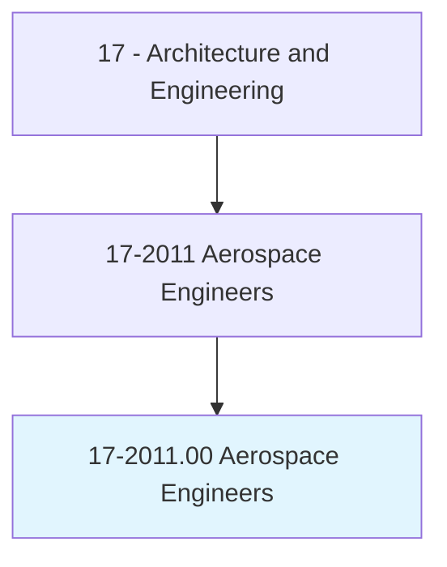
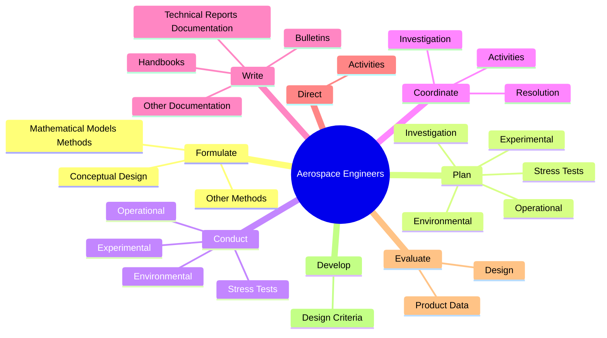
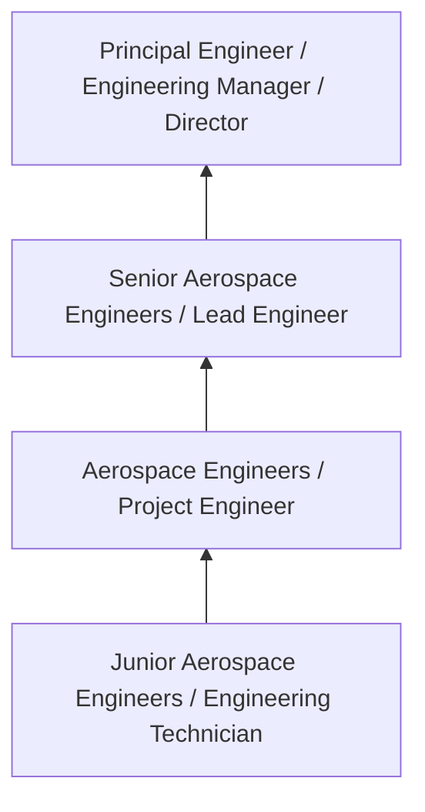
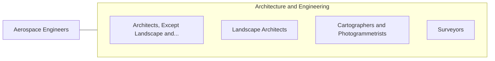

# Aerospace Engineers

> Perform engineering duties in designing, constructing, and testing aircraft, missiles, and spacecraft. May conduct basic and applied research to evaluate adaptability of materials and equipment to aircraft design and manufacture. May recommend improvements in testing equipment and techniques.

## Overview

Aerospace Engineers professionals perform engineering duties in designing, constructing, and testing aircraft, missiles, and spacecraft. This occupation falls within the Architecture and Engineering category and requires a combination of specialized knowledge, technical skills, and practical experience.

These professionals work across diverse settings and organizational contexts, applying their expertise to meet the demands of their field. They must stay current with industry standards, emerging practices, and regulatory requirements that affect their work. The role demands both independent judgment and collaborative skills, as practitioners regularly interact with colleagues, stakeholders, and the public.

As the field continues to evolve, Aerospace Engineers professionals increasingly leverage technology and data-driven approaches to enhance their effectiveness. Career opportunities span the public and private sectors, with demand influenced by economic conditions, demographic shifts, and technological advancement.

## Classification Hierarchy



## Key Statistics

| Metric | Value |
|--------|-------|
| SOC Code | 17-2011.00 |
| Job Zone | N/A |
| Category | [Architecture and Engineering](/occupations/Architecture/index) |
| Core Tasks | 114+ |
| Salary Range | $55,000 - $140,000 |
| Median Salary | $85,000 |
| Growth Outlook | 4% (As fast as average) |
| Source | O*NET |

## Core Tasks



### analyze.ProjectRequests

Aerospace Engineers analyze project requests as part of their core responsibilities.

**Actions:**
- `analyze.ProjectRequests.to.determine.Feasibility` - Analyze project requests, proposals, or engineering data to determine feasibi...
- `analyze.ProjectRequests.to.Productibility` - Analyze project requests, proposals, or engineering data to determine feasibi...
- `analyze.ProjectRequests.to.Cost` - Analyze project requests, proposals, or engineering data to determine feasibi...
- `analyze.ProjectRequests.to.production.TimeOfAerospaceProducts` - Analyze project requests, proposals, or engineering data to determine feasibi...
- `analyze.ProjectRequests.to.AeronauticalProducts` - Analyze project requests, proposals, or engineering data to determine feasibi...

### evaluate.ProductData

Aerospace Engineers evaluate product data as part of their core responsibilities.

**Actions:**
- `evaluate.ProductData.from.Inspections` - Evaluate product data or design from inspections or reports for conformance t...
- `evaluate.ProductData.from.ReportsForConformanceToEngineeringPrinciples` - Evaluate product data or design from inspections or reports for conformance t...
- `evaluate.ProductData.from.CustomerRequirements` - Evaluate product data or design from inspections or reports for conformance t...
- `evaluate.ProductData.from.EnvironmentalRegulations` - Evaluate product data or design from inspections or reports for conformance t...
- `evaluate.ProductData.from.QualityStandards` - Evaluate product data or design from inspections or reports for conformance t...

### plan.Experimental

Aerospace Engineers plan experimental as part of their core responsibilities.

**Actions:**
- `plan.Experimental.on.Models.of.AircraftAerospaceSystemsEquipment` - Plan or conduct experimental, environmental, operational, or stress tests on ...
- `plan.Experimental.on.Prototypes.of.AircraftAerospaceSystemsEquipment` - Plan or conduct experimental, environmental, operational, or stress tests on ...
- `plan.Environmental.on.Models.of.AircraftAerospaceSystemsEquipment` - Plan or conduct experimental, environmental, operational, or stress tests on ...
- `plan.Environmental.on.Prototypes.of.AircraftAerospaceSystemsEquipment` - Plan or conduct experimental, environmental, operational, or stress tests on ...
- `plan.Operational.on.Models.of.AircraftAerospaceSystemsEquipment` - Plan or conduct experimental, environmental, operational, or stress tests on ...

### coordinate.Investigation

Aerospace Engineers coordinate investigation as part of their core responsibilities.

**Actions:**
- `coordinate.Investigation.of.CustomersReports.of.TechnicalProblemsWithAircraftVehicles` - Plan or coordinate investigation and resolution of customers' reports of tech...
- `coordinate.Investigation.of.Aerospacevehicles` - Plan or coordinate investigation and resolution of customers' reports of tech...
- `coordinate.Resolution.of.CustomersReports.of.TechnicalProblemsWithAircraftVehicles` - Plan or coordinate investigation and resolution of customers' reports of tech...
- `coordinate.Resolution.of.Aerospacevehicles` - Plan or coordinate investigation and resolution of customers' reports of tech...
- `coordinate.Activities.of.Engineering.involved.in.Designing` - Direct or coordinate activities of engineering or technical personnel involve...


## Skills & Competencies

### Technical Skills
- **Technical Design** - Expert
- **Engineering Analysis** - Advanced
- **CAD/BIM Software** - Advanced
- **Project Management** - Advanced
- **Code Compliance** - Advanced
- **Quality Assurance** - Proficient

### Soft Skills
- **Analytical Thinking** - Critical
- **Problem Solving** - Critical
- **Attention to Detail** - Essential
- **Teamwork** - Essential
- **Communication** - Essential

## Education & Certifications

| Requirement | Details |
|-------------|---------|
| Typical Education | Bachelor's degree in engineering, architecture, or related field |
| Work Experience | 2-4 years professional experience |
| On-the-Job Training | Moderate - technical specialization required |
| Certifications | Professional Engineer (PE), Architect License, or field-specific certifications |

## Career Progression



## Industry Variations

### Private Sector Engineering
Design and development work for commercial clients. Aerospace Engineers professionals focus on product development, system design, and project delivery.

### Government and Infrastructure
Public works and infrastructure projects with emphasis on regulatory compliance and long-term sustainability.

### Construction and Field Engineering
On-site implementation and oversight of engineering designs. Strong focus on quality control and safety compliance.

### Consulting
Advisory services for diverse clients. Requires strong project management skills and ability to work across multiple simultaneous projects.

## Technology & Tools

- **Computer-Aided Design (CAD) software**
- **Building Information Modeling (BIM)**
- **Geographic Information Systems (GIS)**
- **Structural analysis software**
- **Project management tools**

## Related Occupations



## Industries

- [Engineering Services](/industries/Engineering) - High Employment
- [Construction](/industries/Construction) - High Employment
- [Manufacturing](/industries/Manufacturing) - Moderate Employment
- [Government](/industries/Government) - Moderate Employment

## Departments

This occupation typically works in:
- [Engineering](/departments/Engineering/index)
- [Design](/departments/Design)
- [Project Management](/departments/ProjectManagement)

## GraphDL Semantic Structure

```
Aerospace Engineers perform:
- formulate.MathematicalModelsMethods.of.ComputerAnalysis.to.Develop
- formulate.MathematicalModelsMethods.of.Evaluate
- formulate.MathematicalModelsMethods.of.ModifyDesign
- formulate.MathematicalModelsMethods.of.AccordingToCustomerEngineeringRequirements
- formulate.OtherMethods.of.ComputerAnalysis.to.Develop
- formulate.OtherMethods.of.Evaluate
```

---

*Source: O*NET 17-2011.00 - ONETOccupation*
