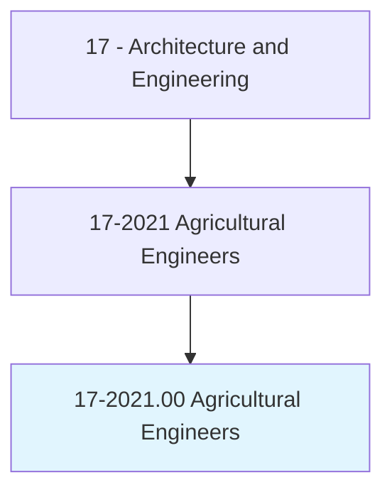
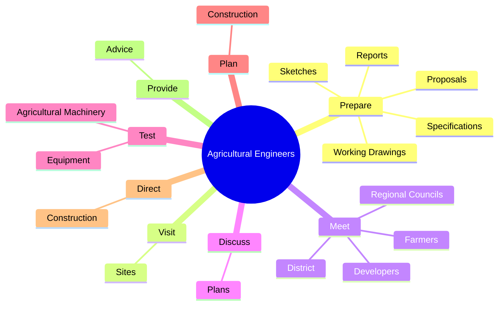
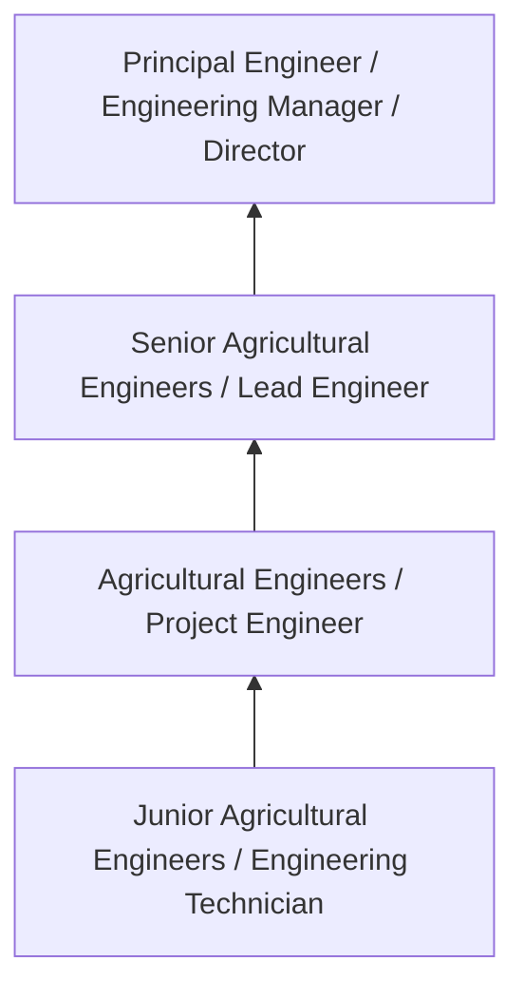
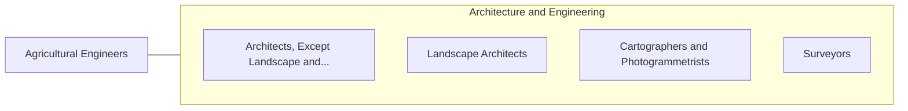

# Agricultural Engineers

> Apply knowledge of engineering technology and biological science to agricultural problems concerned with power and machinery, electrification, structures, soil and water conservation, and processing of agricultural products.

## Overview

Agricultural Engineers professionals apply knowledge of engineering technology and biological science to agricultural problems concerned with power and machinery, electrification, structures, soil and water conservation, and processing of agricultural products.. This occupation falls within the Architecture and Engineering category and requires a combination of specialized knowledge, technical skills, and practical experience.

These professionals work across diverse settings and organizational contexts, applying their expertise to meet the demands of their field. They must stay current with industry standards, emerging practices, and regulatory requirements that affect their work. The role demands both independent judgment and collaborative skills, as practitioners regularly interact with colleagues, stakeholders, and the public.

As the field continues to evolve, Agricultural Engineers professionals increasingly leverage technology and data-driven approaches to enhance their effectiveness. Career opportunities span the public and private sectors, with demand influenced by economic conditions, demographic shifts, and technological advancement.

## Classification Hierarchy



## Key Statistics

| Metric | Value |
|--------|-------|
| SOC Code | 17-2021.00 |
| Job Zone | N/A |
| Category | [Architecture and Engineering](/occupations/Architecture/index) |
| Core Tasks | 72+ |
| Salary Range | $55,000 - $140,000 |
| Median Salary | $85,000 |
| Growth Outlook | 4% (As fast as average) |
| Source | O*NET |

## Core Tasks



### design.Structures

Agricultural Engineers design structures as part of their core responsibilities.

**Actions:**
- `design.Structures.for.CropStorage` - Design structures for crop storage, animal shelter and loading, and animal an...
- `design.Structures.for.AnimalShelter` - Design structures for crop storage, animal shelter and loading, and animal an...
- `design.Structures.for.Loading` - Design structures for crop storage, animal shelter and loading, and animal an...
- `design.Structures.for.Animal` - Design structures for crop storage, animal shelter and loading, and animal an...
- `design.Structures.for.CropProcessing` - Design structures for crop storage, animal shelter and loading, and animal an...

### prepare.Reports

Agricultural Engineers prepare reports as part of their core responsibilities.

**Actions:**
- `prepare.Reports.for.ProposedSites` - Prepare reports, sketches, working drawings, specifications, proposals, and b...
- `prepare.Reports.for.Systems` - Prepare reports, sketches, working drawings, specifications, proposals, and b...
- `prepare.Sketches.for.ProposedSites` - Prepare reports, sketches, working drawings, specifications, proposals, and b...
- `prepare.Sketches.for.Systems` - Prepare reports, sketches, working drawings, specifications, proposals, and b...
- `prepare.WorkingDrawings.for.ProposedSites` - Prepare reports, sketches, working drawings, specifications, proposals, and b...

### provide.Advice

Agricultural Engineers provide advice as part of their core responsibilities.

**Actions:**
- `provide.Advice.on.WaterQualityRelatedToPollutionManagement` - Provide advice on water quality and issues related to pollution management, r...
- `provide.Advice.on.WaterQualityRelatedToRiverControl` - Provide advice on water quality and issues related to pollution management, r...
- `provide.Advice.on.WaterQualityRelatedToGroundSurfaceWaterResources` - Provide advice on water quality and issues related to pollution management, r...
- `provide.Advice.on.IssuesRelatedToPollutionManagement` - Provide advice on water quality and issues related to pollution management, r...
- `provide.Advice.on.IssuesRelatedToRiverControl` - Provide advice on water quality and issues related to pollution management, r...

### supervise.EnvironmentalReclamationProjects

Agricultural Engineers supervise environmental reclamation projects as part of their core responsibilities.

**Actions:**
- `supervise.EnvironmentalReclamationProjects.in.Agriculture` - Design and supervise environmental and land reclamation projects in agricultu...
- `supervise.EnvironmentalReclamationProjects.in.RelatedIndustries` - Design and supervise environmental and land reclamation projects in agricultu...
- `supervise.LandReclamationProjects.in.Agriculture` - Design and supervise environmental and land reclamation projects in agricultu...
- `supervise.LandReclamationProjects.in.RelatedIndustries` - Design and supervise environmental and land reclamation projects in agricultu...
- `supervise.FoodProcessing` - Supervise food processing or manufacturing plant operations.


## Skills & Competencies

### Technical Skills
- **Technical Design** - Expert
- **Engineering Analysis** - Advanced
- **CAD/BIM Software** - Advanced
- **Project Management** - Advanced
- **Code Compliance** - Advanced
- **Quality Assurance** - Proficient

### Soft Skills
- **Analytical Thinking** - Critical
- **Problem Solving** - Critical
- **Attention to Detail** - Essential
- **Teamwork** - Essential
- **Communication** - Essential

## Education & Certifications

| Requirement | Details |
|-------------|---------|
| Typical Education | Bachelor's degree in engineering, architecture, or related field |
| Work Experience | 2-4 years professional experience |
| On-the-Job Training | Moderate - technical specialization required |
| Certifications | Professional Engineer (PE), Architect License, or field-specific certifications |

## Career Progression



## Industry Variations

### Private Sector Engineering
Design and development work for commercial clients. Agricultural Engineers professionals focus on product development, system design, and project delivery.

### Government and Infrastructure
Public works and infrastructure projects with emphasis on regulatory compliance and long-term sustainability.

### Construction and Field Engineering
On-site implementation and oversight of engineering designs. Strong focus on quality control and safety compliance.

### Consulting
Advisory services for diverse clients. Requires strong project management skills and ability to work across multiple simultaneous projects.

## Technology & Tools

- **Computer-Aided Design (CAD) software**
- **Building Information Modeling (BIM)**
- **Geographic Information Systems (GIS)**
- **Structural analysis software**
- **Project management tools**

## Related Occupations



## Industries

- [Engineering Services](/industries/Engineering) - High Employment
- [Construction](/industries/Construction) - High Employment
- [Manufacturing](/industries/Manufacturing) - Moderate Employment
- [Government](/industries/Government) - Moderate Employment

## Departments

This occupation typically works in:
- [Engineering](/departments/Engineering/index)
- [Design](/departments/Design)
- [Project Management](/departments/ProjectManagement)

## GraphDL Semantic Structure

```
Agricultural Engineers perform:
- prepare.Reports.for.ProposedSites
- prepare.Reports.for.Systems
- prepare.Sketches.for.ProposedSites
- prepare.Sketches.for.Systems
- prepare.WorkingDrawings.for.ProposedSites
- prepare.WorkingDrawings.for.Systems
```

---

*Source: O*NET 17-2021.00 - ONETOccupation*
