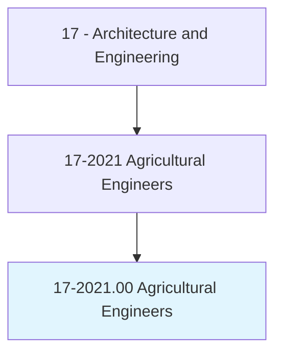
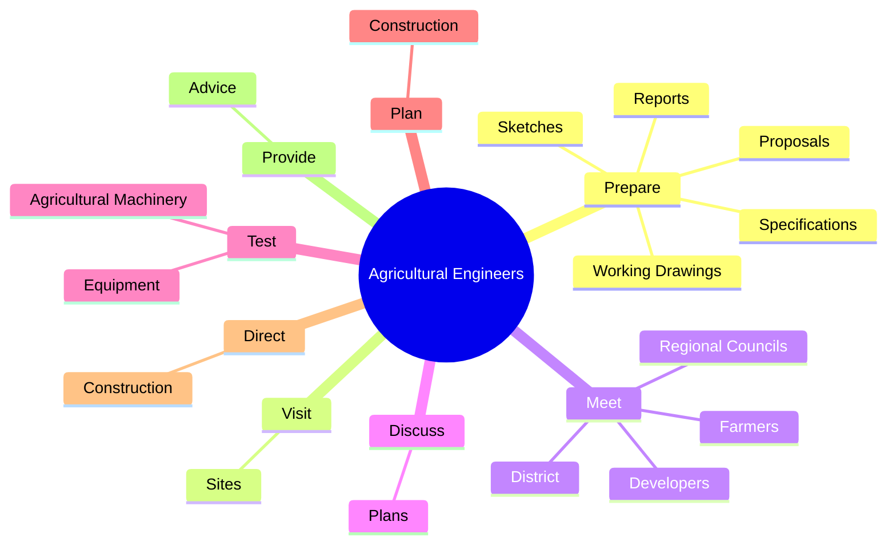
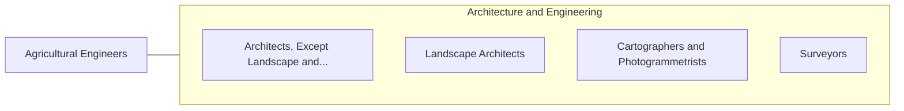

# Agricultural Engineers

> Apply knowledge of engineering technology and biological science to agricultural problems concerned with power and machinery, electrification, structures, soil and water conservation, and processing of agricultural products.

## Overview

Agricultural Engineers is classified under Architecture and Engineering (SOC 17). Apply knowledge of engineering technology and biological science to agricultural problems concerned with power and machinery, electrification, structures, soil and water conservation, and processing of agricultural products.

## Classification Hierarchy

## Key Statistics

| Metric | Value |
|--------|-------|
| SOC Code | 17-2021.00 |
| Category | [Architecture and Engineering](/occupations/Architecture/index) |
| Task Count | 72 |
| Source | O*NET |

## Core Tasks

### prepare.Reports

Agricultural Engineers prepare reports as part of their core responsibilities.

**Actions:**
- `prepare.Reports.for.ProposedSites`
- `prepare.Reports.for.Systems`
- `prepare.Sketches.for.ProposedSites`
- `prepare.Sketches.for.Systems`

### visit.Sites

Agricultural Engineers visit sites as part of their core responsibilities.

**Actions:**
- `visit.Sites.to.observe.EnvironmentalProblems`
- `visit.Sites.to.ToConsultWithContractors`
- `visit.Sites.to.ToMonitorConstructionActivities`

### meet.District

Agricultural Engineers meet district as part of their core responsibilities.

**Actions:**
- `meet.District.to.discuss.Needs`
- `meet.RegionalCouncils.to.discuss.Needs`
- `meet.Farmers.to.discuss.Needs`
- `meet.Developers.to.discuss.Needs`

## Skills & Competencies

### Technical Skills
- **Engineering Design** - Advanced
- **CAD/CAM** - Advanced
- **Technical Analysis** - Advanced

### Soft Skills
- **Communication** - Essential
- **Problem Solving** - Essential
- **Critical Thinking** - Important
- **Teamwork** - Important
- **Adaptability** - Important

## Related Occupations

## Industries

This occupation is found across multiple industries. See [Industries](/industries) for sector-specific employment data.

## Career Progression

---

*Source: O*NET 17-2021.00 - ONETOccupation*
