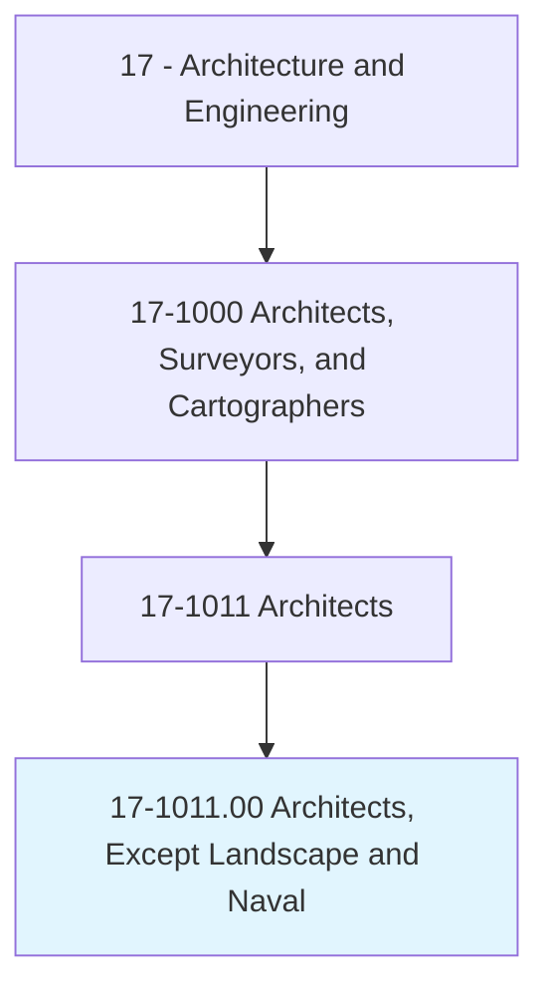
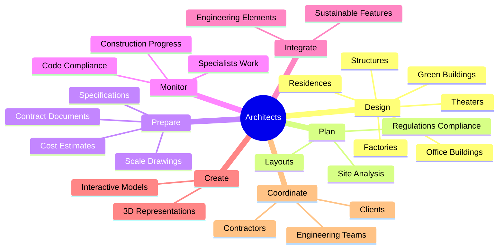
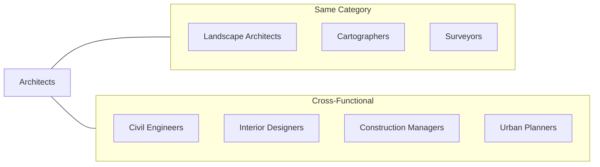
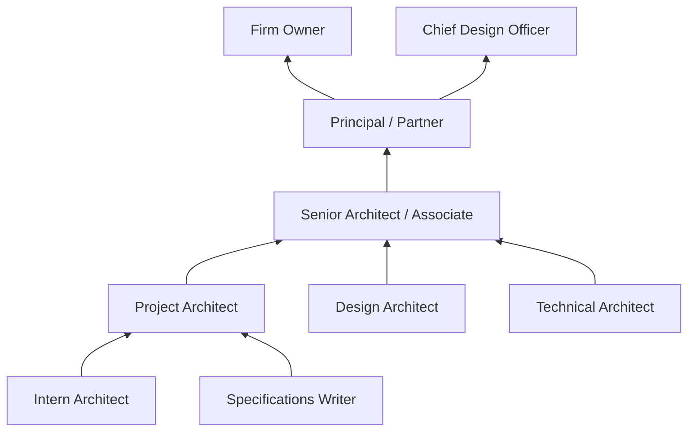

# Architects, Except Landscape and Naval

> Plan and design structures, such as private residences, office buildings, theaters, factories, and other structural property.

## Overview

Architects are licensed professionals who transform client visions into functional, safe, and aesthetically pleasing buildings. They combine artistic creativity with technical expertise to design structures that meet building codes, environmental regulations, and client requirements. From concept sketches to final construction documents, architects oversee every phase of the design process, coordinating with engineers, contractors, and other specialists to bring their visions to life. Modern architects increasingly focus on sustainable design principles, incorporating green building practices and energy-efficient technologies into their work.

## Classification Hierarchy

## Key Statistics

| Metric | Value |
|--------|-------|
| SOC Code | 17-1011.00 |
| Job Zone | 5 (Extensive Preparation) |
| Category | [Architecture and Engineering](/occupations/Architecture/index) |
| Core Tasks | 20+ |
| Source | O*NET |

## Core Tasks

### design.Structures

Architects design buildings and structures that comply with environmental, safety, and regulatory requirements while meeting client aesthetic and functional needs.

**Actions:**
- `design.Structures.in.Accordance.with.Environmental` - Ensure designs meet environmental regulations
- `design.Structures.in.Safety` - Incorporate safety standards into all designs
- `design.Structures.in.OtherRegulations` - Comply with zoning and building codes
- `design.StructuresIncorporateEnvironmentallyFriendlyBuildingPractices.in.EnergyDesignLeed` - Create LEED-certified sustainable designs

### prepare.ScaleDrawings

Architects create detailed drawings and specifications that communicate design intent to construction teams.

**Actions:**
- `prepare.ScaleDrawingsDesigns` - Create precise architectural drawings
- `prepare.ArchitecturalDesigns` - Develop comprehensive design documentation
- `prepare.UsingComputerAidedDesign` - Utilize CAD software for precision drafting
- `prepare.Information.regarding.Design` - Document design decisions and rationale
- `prepare.StructureSpecifications` - Detail materials and construction methods

### monitor.Work

Architects oversee the work of specialists and contractors to ensure design integrity throughout construction.

**Actions:**
- `monitor.Work.of.Specialists` - Coordinate with technical experts
- `monitor.Work.of.ElectricalEngineers` - Review electrical system integration
- `monitor.Work.of.MechanicalEngineers` - Oversee HVAC and mechanical systems
- `monitor.Work.of.InteriorDesigners` - Ensure interior design alignment
- `monitor.Work.of.SoundSpecialists.to.ensure.OptimalForm` - Integrate acoustic considerations

### plan.Layouts

Architects plan the spatial organization of structural and architectural projects.

**Actions:**
- `plan.Layouts.of.StructuralArchitecturalProjects` - Organize building spaces effectively
- `plan.Structures.in.Accordance.with.Environmental` - Consider environmental impact
- `plan.Construction.of.GreenBuildingProjects.to.minimize.AdverseEnvironmentalImpact` - Design for sustainability

### conduct.SiteObservations

Architects perform regular site visits to monitor construction progress and compliance.

**Actions:**
- `conduct.Periodic.on.SiteObservationsOfConstructionWork.to.monitor.ComplianceWithPlans` - Verify construction matches design intent
- `inspect.ProposedBuildingSites.to.determine.SuitabilityForConstruction` - Evaluate site conditions

### create.Representations

Architects develop visual representations to communicate designs to clients and stakeholders.

**Actions:**
- `create.ThreeDimensionalRepresentations.of.Designs` - Build 3D models for visualization
- `create.ThreeDimensionalRepresentations.of.UsingComputerAssistedDesignSoftware` - Leverage BIM and 3D modeling tools
- `create.InteractiveRepresentations.of.Designs` - Develop virtual walkthroughs

## Skills & Competencies

### Technical Skills
- **Computer-Aided Design (CAD)** - Expert
- **Building Information Modeling (BIM)** - Expert
- **Structural Analysis** - Advanced
- **Building Codes and Regulations** - Expert
- **Sustainable Design (LEED)** - Advanced
- **Construction Documentation** - Expert
- **3D Visualization** - Advanced

### Soft Skills
- **Creativity** - Critical
- **Spatial Reasoning** - Critical
- **Communication** - Essential
- **Problem Solving** - Essential
- **Project Management** - Essential
- **Client Relations** - Essential
- **Team Leadership** - Important

## Related Occupations

## Industries

- [Architectural Services](/industries/ArchitecturalServices) - High Employment
- [Construction](/industries/Construction/index) - High Employment
- [Government](/industries/PublicAdministration) - Moderate Employment
- [Real Estate Development](/industries/RealEstate/index) - Moderate Employment
- [Educational Services](/industries/Education) - Moderate Employment

## Industry Variations

### Commercial Architecture
Focus on office buildings, retail spaces, and commercial developments. Emphasizes efficiency, branding, and large-scale project management.

### Residential Architecture
Specializes in homes, apartments, and residential communities. Requires strong client communication and understanding of living space needs.

### Healthcare Architecture
Designs hospitals, clinics, and medical facilities. Requires specialized knowledge of healthcare workflows, infection control, and medical equipment integration.

### Sustainable/Green Architecture
Focuses on environmentally responsible design, energy efficiency, and LEED certification. Growing specialization with increasing demand.

### Historic Preservation
Works on restoration and adaptive reuse of historic structures. Requires knowledge of historical building techniques and preservation standards.

## Career Progression

## Education & Training

| Requirement | Details |
|-------------|---------|
| Typical Education | Bachelor's or Master's degree in Architecture (B.Arch or M.Arch from NAAB-accredited program) |
| Work Experience | 3-5 years under licensed architect supervision (varies by state) |
| On-the-Job Training | Internship Development Program (IDP) / Architectural Experience Program (AXP) |
| Licensure | Required in all 50 states - pass ARE (Architect Registration Examination) |
| Common Certifications | LEED AP, NCARB Certificate, AIA membership |

## Departments

This occupation typically works in:
- Architecture
- Design
- Project Management
- Business Development

## Tools & Technologies

### Design Software
- AutoCAD
- Revit (BIM)
- SketchUp
- Rhino
- ArchiCAD

### Visualization
- Lumion
- V-Ray
- Enscape
- Blender

### Project Management
- Microsoft Project
- Procore
- Newforma

---

*Source: O*NET 17-1011.00 - ONETOccupation*
