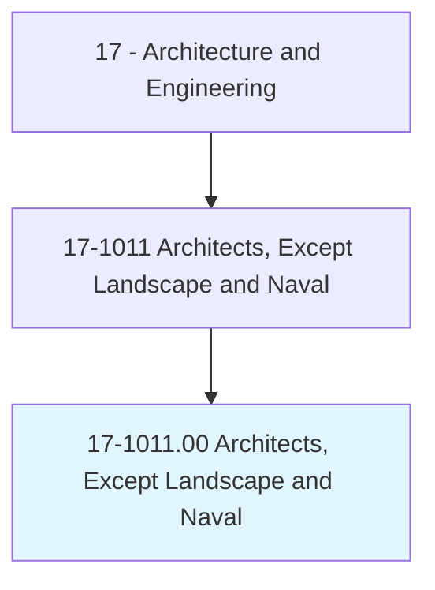
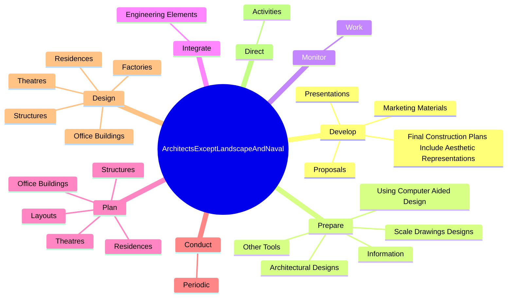
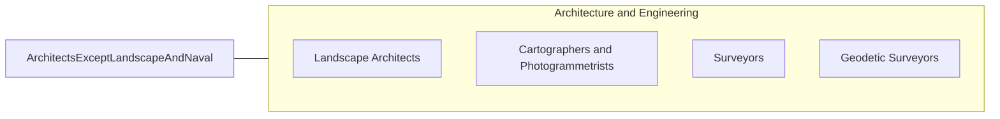

# Architects, Except Landscape and Naval

> Plan and design structures, such as private residences, office buildings, theaters, factories, and other structural property.

## Overview

Architects, Except Landscape and Naval is classified under Architecture and Engineering (SOC 17). Plan and design structures, such as private residences, office buildings, theaters, factories, and other structural property.

## Classification Hierarchy

## Key Statistics

| Metric | Value |
|--------|-------|
| SOC Code | 17-1011.00 |
| Category | [Architecture and Engineering](/occupations/Architecture/index) |
| Task Count | 96 |
| Source | O*NET |

## Core Tasks

### develop.FinalConstructionPlansIncludeAestheticRepresentations

Architects, Except Landscape and Naval develop final construction plans include aesthetic representations as part of their core responsibilities.

**Actions:**
- `develop.FinalConstructionPlansIncludeAestheticRepresentations.of.Structure`
- `develop.FinalConstructionPlansIncludeAestheticRepresentations.of.Details.for.Construction`
- `develop.MarketingMaterials.to.generate.NewWorkOpportunities`
- `develop.Proposals.to.generate.NewWorkOpportunities`

### prepare.ScaleDrawingsDesigns

Architects, Except Landscape and Naval prepare scale drawings designs as part of their core responsibilities.

**Actions:**
- `prepare.ScaleDrawingsDesigns`
- `prepare.ArchitecturalDesigns`
- `prepare.UsingComputerAidedDesign`
- `prepare.OtherTools`

### monitor.Work

Architects, Except Landscape and Naval monitor work as part of their core responsibilities.

**Actions:**
- `monitor.Work.of.Specialists`
- `monitor.Work.of.ElectricalEngineers`
- `monitor.Work.of.MechanicalEngineers`
- `monitor.Work.of.InteriorDesigners`

## Skills & Competencies

### Technical Skills
- **Engineering Design** - Advanced
- **CAD/CAM** - Advanced
- **Technical Analysis** - Advanced

### Soft Skills
- **Communication** - Essential
- **Problem Solving** - Essential
- **Critical Thinking** - Important
- **Teamwork** - Important
- **Adaptability** - Important

## Related Occupations

## Industries

This occupation is found across multiple industries. See [Industries](/industries) for sector-specific employment data.

## Career Progression

---

*Source: O*NET 17-1011.00 - ONETOccupation*
