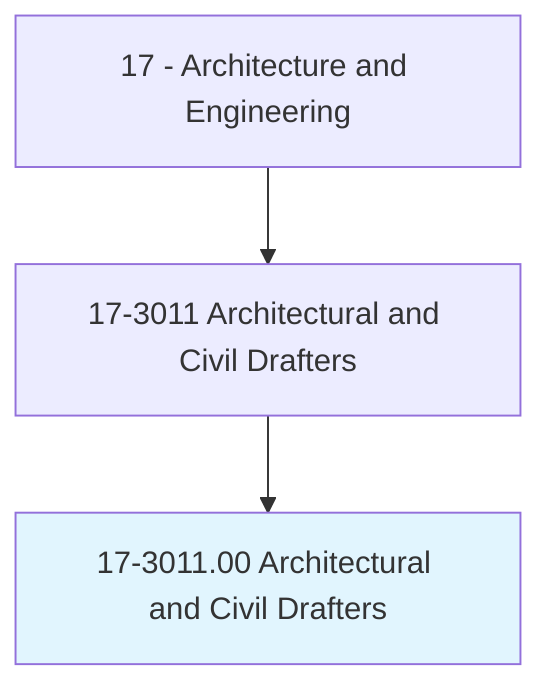
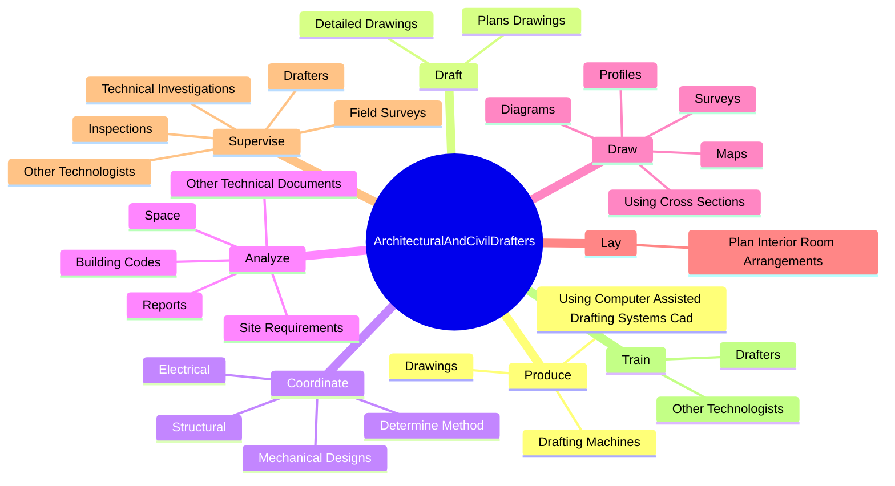
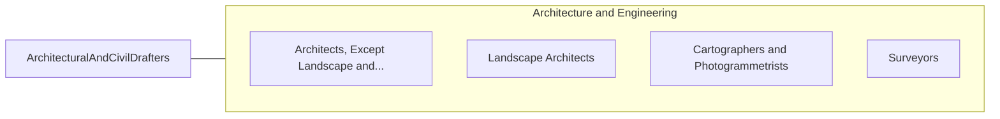

# Architectural and Civil Drafters

> Prepare detailed drawings of architectural and structural features of buildings or drawings and topographical relief maps used in civil engineering projects, such as highways, bridges, and public works. Use knowledge of building materials, engineering practices, and mathematics to complete drawings.

## Overview

Architectural and Civil Drafters is an occupation within the Architecture and Engineering category. Prepare detailed drawings of architectural and structural features of buildings or drawings and topographical relief maps used in civil engineering projects, such as highways, bridges, and public works. 

## Classification Hierarchy

## Key Statistics

| Metric | Value |
|--------|-------|
| SOC Code | 17-3011.00 |
| Category | [Architecture and Engineering](/occupations/Architecture/index) |
| Task Count | 196 |
| Source | O*NET |

## Core Tasks

### produce.Drawings

Architectural and Civil Drafters produce drawings as part of their core responsibilities.

**Actions:**
- `produce.Drawings.by.Hand`
- `produce.Drawings.by.UsingCompasses`
- `produce.Drawings.by.Dividers`
- `produce.Drawings.by.Protractors`

### draft.PlansDrawings

Architectural and Civil Drafters draft plans drawings as part of their core responsibilities.

**Actions:**
- `draft.PlansDrawings.for.Structures`
- `draft.PlansDrawings.for.Installations`
- `draft.PlansDrawings.for.ConstructionProjects`
- `draft.PlansDrawings.for.Highways`

### coordinate.Structural

Architectural and Civil Drafters coordinate structural as part of their core responsibilities.

**Actions:**
- `coordinate.Structural.of.PresentationToGraphicallyRepresentBuildingPlans`
- `coordinate.Electrical.of.PresentationToGraphicallyRepresentBuildingPlans`
- `coordinate.MechanicalDesigns.of.PresentationToGraphicallyRepresentBuildingPlans`
- `coordinate.DetermineMethod.of.PresentationToGraphicallyRepresentBuildingPlans`

## Skills & Competencies

### Technical Skills
- **Engineering Design** - Advanced
- **CAD/CAM** - Advanced
- **Technical Analysis** - Advanced

### Soft Skills
- **Communication** - Essential
- **Problem Solving** - Essential
- **Critical Thinking** - Important
- **Teamwork** - Important
- **Adaptability** - Important

## Related Occupations

## Industries

This occupation is found across multiple industries. See [Industries](/industries) for sector-specific employment data.

## Career Progression

---

*Source: O*NET 17-3011.00 - ONETOccupation*
