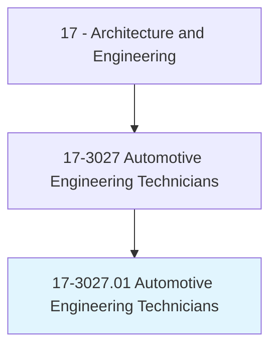
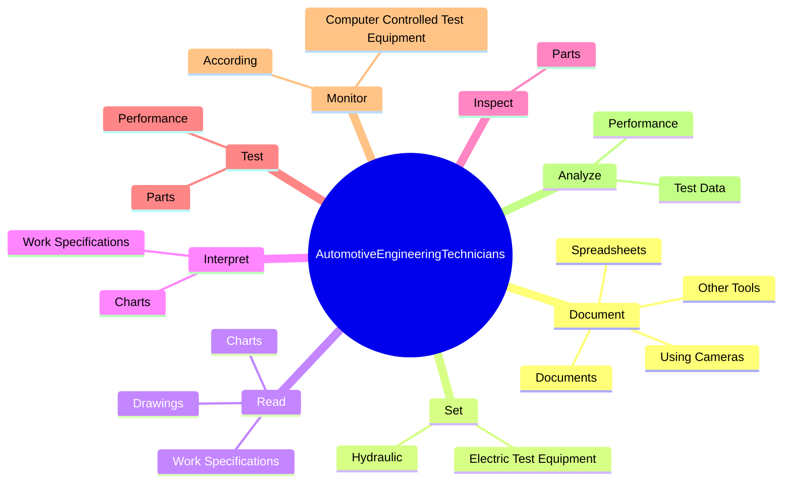
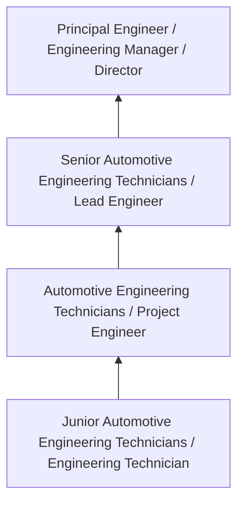
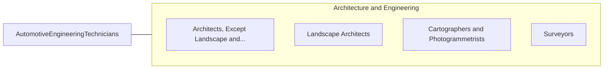

# Automotive Engineering Technicians

> Assist engineers in determining the practicality of proposed product design changes and plan and carry out tests on experimental test devices or equipment for performance, durability, or efficiency.

## Overview

Automotive Engineering Technicians professionals assist engineers in determining the practicality of proposed product design changes and plan and carry out tests on experimental test devices or equipment for performance, durability, or efficiency.. This occupation falls within the Architecture and Engineering category and requires a combination of specialized knowledge, technical skills, and practical experience.

These professionals work across diverse settings and organizational contexts, applying their expertise to meet the demands of their field. They must stay current with industry standards, emerging practices, and regulatory requirements that affect their work. The role demands both independent judgment and collaborative skills, as practitioners regularly interact with colleagues, stakeholders, and the public.

As the field continues to evolve, Automotive Engineering Technicians professionals increasingly leverage technology and data-driven approaches to enhance their effectiveness. Career opportunities span the public and private sectors, with demand influenced by economic conditions, demographic shifts, and technological advancement.

## Classification Hierarchy



## Key Statistics

| Metric | Value |
|--------|-------|
| SOC Code | 17-3027.01 |
| Job Zone | N/A |
| Category | [Architecture and Engineering](/occupations/Architecture/index) |
| Core Tasks | 90+ |
| Salary Range | $55,000 - $140,000 |
| Median Salary | $85,000 |
| Growth Outlook | 4% (As fast as average) |
| Source | O*NET |

## Core Tasks



### test.Parts

Automotive Engineering Technicians test parts as part of their core responsibilities.

**Actions:**
- `test.Parts.to.determine.NatureOfDefectsMalfunctions` - Inspect or test parts to determine nature or cause of defects or malfunctions.
- `test.Parts.to.CauseOfDefectsMalfunctions` - Inspect or test parts to determine nature or cause of defects or malfunctions.
- `test.Performance.of.VehiclesUseAlternativeFuels` - Test performance of vehicles that use alternative fuels, such as alcohol blen...
- `test.Performance.of.AlcoholBlends` - Test performance of vehicles that use alternative fuels, such as alcohol blen...
- `test.Performance.of.NaturalGas` - Test performance of vehicles that use alternative fuels, such as alcohol blen...

### recommend.ProductDesignImprovementsBased

Automotive Engineering Technicians recommend product design improvements based as part of their core responsibilities.

**Actions:**
- `recommend.ProductDesignImprovementsBased.on.TestData` - Recommend product or component design improvements, based on test data or obs...
- `recommend.ProductDesignImprovementsBased.on.Observations` - Recommend product or component design improvements, based on test data or obs...
- `recommend.ComponentDesignImprovementsBased.on.TestData` - Recommend product or component design improvements, based on test data or obs...
- `recommend.ComponentDesignImprovementsBased.on.Observations` - Recommend product or component design improvements, based on test data or obs...
- `recommend.TestsConditions.in.Accordance.with.Designs` - Recommend tests or testing conditions in accordance with designs, customer re...

### analyze.TestData

Automotive Engineering Technicians analyze test data as part of their core responsibilities.

**Actions:**
- `analyze.TestData.for.AutomotiveSystems` - Analyze test data for automotive systems, subsystems, or component parts.
- `analyze.TestData.for.Subsystems` - Analyze test data for automotive systems, subsystems, or component parts.
- `analyze.TestData.for.ComponentParts` - Analyze test data for automotive systems, subsystems, or component parts.
- `analyze.Performance.of.VehiclesHaveBeenRedesigned.to.increase.FuelEfficiency` - Analyze performance of vehicles or components that have been redesigned to in...
- `analyze.Performance.of.ComponentsHaveBeenRedesigned.to.increase.FuelEfficiency` - Analyze performance of vehicles or components that have been redesigned to in...

### perform.Manual

Automotive Engineering Technicians perform manual as part of their core responsibilities.

**Actions:**
- `perform.Manual.of.AutomotiveSystemPerformance` - Perform or execute manual or automated tests of automotive system or componen...
- `perform.Manual.of.ComponentPerformance` - Perform or execute manual or automated tests of automotive system or componen...
- `perform.Manual.of.Efficiency` - Perform or execute manual or automated tests of automotive system or componen...
- `perform.Manual.of.Durability` - Perform or execute manual or automated tests of automotive system or componen...
- `perform.AutomatedTests.of.AutomotiveSystemPerformance` - Perform or execute manual or automated tests of automotive system or componen...


## Skills & Competencies

### Technical Skills
- **Technical Design** - Expert
- **Engineering Analysis** - Advanced
- **CAD/BIM Software** - Advanced
- **Project Management** - Advanced
- **Code Compliance** - Advanced
- **Quality Assurance** - Proficient

### Soft Skills
- **Analytical Thinking** - Critical
- **Problem Solving** - Critical
- **Attention to Detail** - Essential
- **Teamwork** - Essential
- **Communication** - Essential

## Education & Certifications

| Requirement | Details |
|-------------|---------|
| Typical Education | Bachelor's degree in engineering, architecture, or related field |
| Work Experience | 2-4 years professional experience |
| On-the-Job Training | Moderate - technical specialization required |
| Certifications | Professional Engineer (PE), Architect License, or field-specific certifications |

## Career Progression



## Industry Variations

### Private Sector Engineering
Design and development work for commercial clients. Automotive Engineering Technicians professionals focus on product development, system design, and project delivery.

### Government and Infrastructure
Public works and infrastructure projects with emphasis on regulatory compliance and long-term sustainability.

### Construction and Field Engineering
On-site implementation and oversight of engineering designs. Strong focus on quality control and safety compliance.

### Consulting
Advisory services for diverse clients. Requires strong project management skills and ability to work across multiple simultaneous projects.

## Technology & Tools

- **Computer-Aided Design (CAD) software**
- **Building Information Modeling (BIM)**
- **Geographic Information Systems (GIS)**
- **Structural analysis software**
- **Project management tools**

## Related Occupations



## Industries

- [Engineering Services](/industries/Engineering) - High Employment
- [Construction](/industries/Construction) - High Employment
- [Manufacturing](/industries/Manufacturing) - Moderate Employment
- [Government](/industries/Government) - Moderate Employment

## Departments

This occupation typically works in:
- [Engineering](/departments/Engineering/index)
- [Design](/departments/Design)
- [Project Management](/departments/ProjectManagement)

## GraphDL Semantic Structure

```
Automotive Engineering Technicians perform:
- document.UsingCameras
- document.Spreadsheets
- document.Documents
- document.OtherTools
- set.Hydraulic.in.Accordance.with.EngineeringSpecifications
- set.Hydraulic.in.Standards
```

---

*Source: O*NET 17-3027.01 - ONETOccupation*
