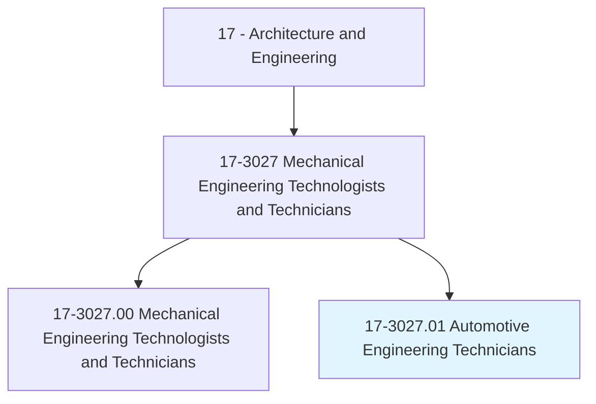
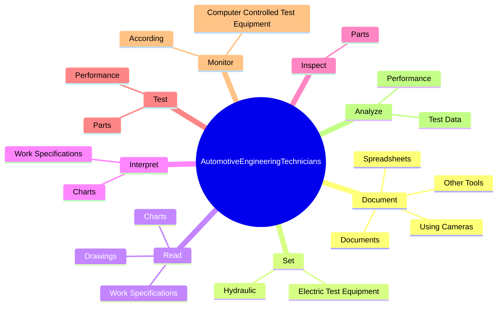
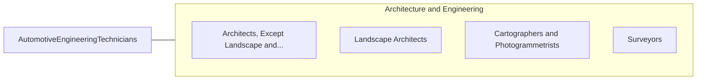

# Automotive Engineering Technicians

> Assist engineers in determining the practicality of proposed product design changes and plan and carry out tests on experimental test devices or equipment for performance, durability, or efficiency.

## Overview

Automotive Engineering Technicians is classified under Architecture and Engineering (SOC 17). Assist engineers in determining the practicality of proposed product design changes and plan and carry out tests on experimental test devices or equipment for performance, durability, or efficiency.

## Classification Hierarchy

## Key Statistics

| Metric | Value |
|--------|-------|
| SOC Code | 17-3027.01 |
| Category | [Architecture and Engineering](/occupations/Architecture/index) |
| Task Count | 90 |
| Source | O*NET |

## Core Tasks

### document.UsingCameras

Automotive Engineering Technicians document using cameras as part of their core responsibilities.

**Actions:**
- `document.UsingCameras`
- `document.Spreadsheets`
- `document.Documents`
- `document.OtherTools`

### set.Hydraulic

Automotive Engineering Technicians set hydraulic as part of their core responsibilities.

**Actions:**
- `set.Hydraulic.in.Accordance.with.EngineeringSpecifications`
- `set.Hydraulic.in.Standards`
- `set.Hydraulic.in.TestProcedures`
- `set.ElectricTestEquipment.in.Accordance.with.EngineeringSpecifications`

### read.WorkSpecifications

Automotive Engineering Technicians read work specifications as part of their core responsibilities.

**Actions:**
- `read.WorkSpecifications`
- `read.Drawings`
- `read.Charts`

## Skills & Competencies

### Technical Skills
- **Engineering Design** - Advanced
- **CAD/CAM** - Advanced
- **Technical Analysis** - Advanced

### Soft Skills
- **Communication** - Essential
- **Problem Solving** - Essential
- **Critical Thinking** - Important
- **Teamwork** - Important
- **Adaptability** - Important

## Related Occupations

## Industries

This occupation is found across multiple industries. See [Industries](/industries) for sector-specific employment data.

## Career Progression

---

*Source: O*NET 17-3027.01 - ONETOccupation*
