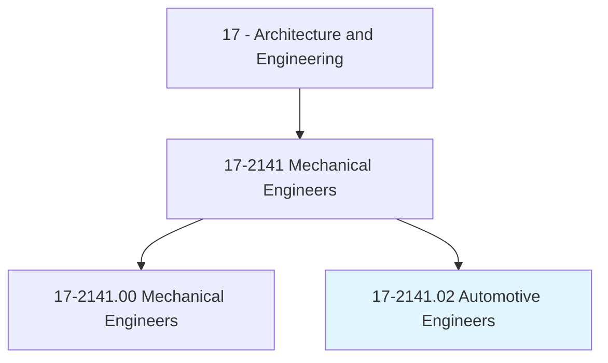
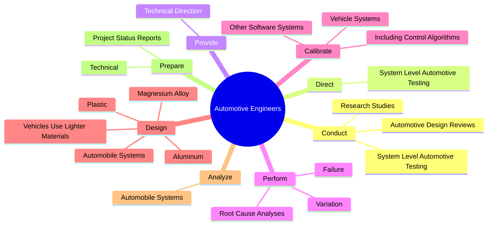
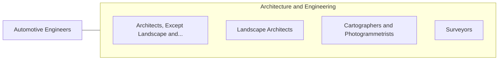

# Automotive Engineers

> Develop new or improved designs for vehicle structural members, engines, transmissions, or other vehicle systems, using computer-assisted design technology. Direct building, modification, or testing of vehicle or components.

## Overview

Automotive Engineers is a specialized variant within the Architecture and Engineering category. Develop new or improved designs for vehicle structural members, engines, transmissions, or other vehicle systems, using computer-assisted design technology. 

## Classification Hierarchy

## Key Statistics

| Metric | Value |
|--------|-------|
| SOC Code | 17-2141.02 |
| Category | [Architecture and Engineering](/occupations/Architecture/index) |
| Task Count | 104 |
| Source | O*NET |

## Core Tasks

### conduct.SystemLevelAutomotiveTesting

Automotive Engineers conduct system level automotive testing as part of their core responsibilities.

**Actions:**
- `conduct.SystemLevelAutomotiveTesting`
- `conduct.ResearchStudies.to.develop.NewConceptsInFieldOfAutomotiveEngineering`
- `conduct.AutomotiveDesignReviews`

### direct.SystemLevelAutomotiveTesting

Automotive Engineers direct system level automotive testing as part of their core responsibilities.

**Actions:**
- `direct.SystemLevelAutomotiveTesting`

### provide.TechnicalDirection

Automotive Engineers provide technical direction as part of their core responsibilities.

**Actions:**
- `provide.TechnicalDirection.to.OtherEngineers`
- `provide.TechnicalDirection.to.EngineeringSupportPersonnel`

## Skills & Competencies

### Technical Skills
- **Engineering Design** - Advanced
- **CAD/CAM** - Advanced
- **Technical Analysis** - Advanced

### Soft Skills
- **Communication** - Essential
- **Problem Solving** - Essential
- **Critical Thinking** - Important
- **Teamwork** - Important
- **Adaptability** - Important

## Related Occupations

## Industries

This occupation is found across multiple industries. See [Industries](/industries) for sector-specific employment data.

## Career Progression

---

*Source: O*NET 17-2141.02 - ONETOccupation*
