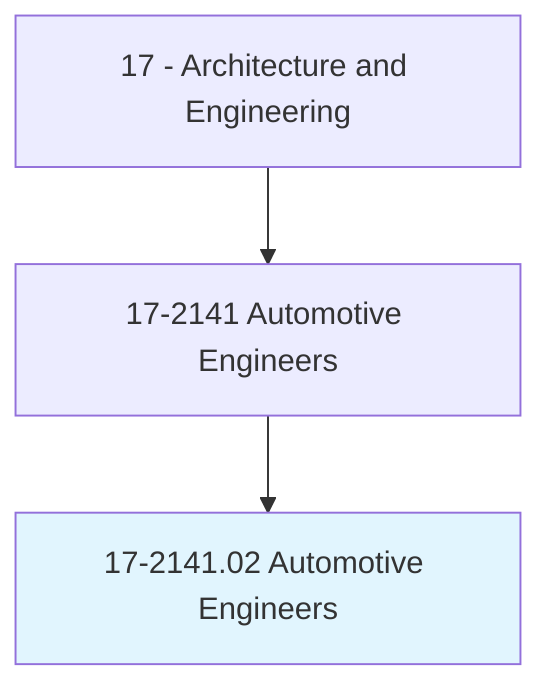
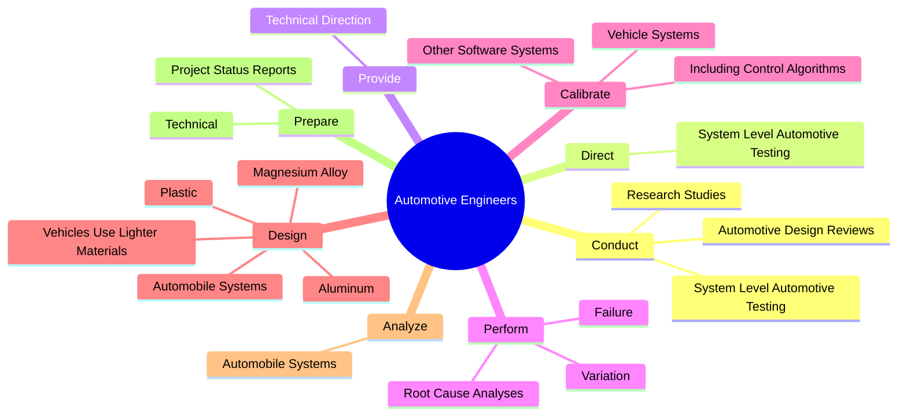
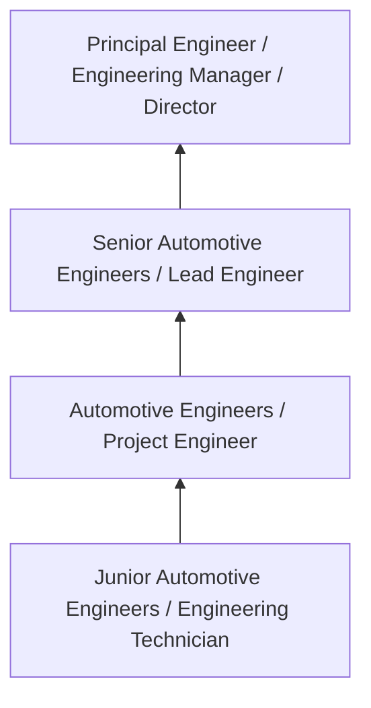
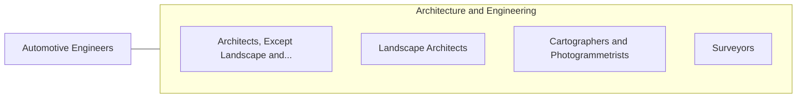

# Automotive Engineers

> Develop new or improved designs for vehicle structural members, engines, transmissions, or other vehicle systems, using computer-assisted design technology. Direct building, modification, or testing of vehicle or components.

## Overview

Automotive Engineers professionals develop new or improved designs for vehicle structural members, engines, transmissions, or other vehicle systems, using computer-assisted design technology. This occupation falls within the Architecture and Engineering category and requires a combination of specialized knowledge, technical skills, and practical experience.

These professionals work across diverse settings and organizational contexts, applying their expertise to meet the demands of their field. They must stay current with industry standards, emerging practices, and regulatory requirements that affect their work. The role demands both independent judgment and collaborative skills, as practitioners regularly interact with colleagues, stakeholders, and the public.

As the field continues to evolve, Automotive Engineers professionals increasingly leverage technology and data-driven approaches to enhance their effectiveness. Career opportunities span the public and private sectors, with demand influenced by economic conditions, demographic shifts, and technological advancement.

## Classification Hierarchy



## Key Statistics

| Metric | Value |
|--------|-------|
| SOC Code | 17-2141.02 |
| Job Zone | N/A |
| Category | [Architecture and Engineering](/occupations/Architecture/index) |
| Core Tasks | 104+ |
| Salary Range | $55,000 - $140,000 |
| Median Salary | $85,000 |
| Growth Outlook | 4% (As fast as average) |
| Source | O*NET |

## Core Tasks



### design.AutomobileSystems

Automotive Engineers design automobile systems as part of their core responsibilities.

**Actions:**
- `design.AutomobileSystems.in.Areas` - Design or analyze automobile systems in areas such as aerodynamics, alternate...
- `design.AutomobileSystems.in.Aerodynamics` - Design or analyze automobile systems in areas such as aerodynamics, alternate...
- `design.AutomobileSystems.in.AlternateFuels` - Design or analyze automobile systems in areas such as aerodynamics, alternate...
- `design.AutomobileSystems.in.Ergonomics` - Design or analyze automobile systems in areas such as aerodynamics, alternate...
- `design.AutomobileSystems.in.HybridPower` - Design or analyze automobile systems in areas such as aerodynamics, alternate...

### analyze.AutomobileSystems

Automotive Engineers analyze automobile systems as part of their core responsibilities.

**Actions:**
- `analyze.AutomobileSystems.in.Areas` - Design or analyze automobile systems in areas such as aerodynamics, alternate...
- `analyze.AutomobileSystems.in.Aerodynamics` - Design or analyze automobile systems in areas such as aerodynamics, alternate...
- `analyze.AutomobileSystems.in.AlternateFuels` - Design or analyze automobile systems in areas such as aerodynamics, alternate...
- `analyze.AutomobileSystems.in.Ergonomics` - Design or analyze automobile systems in areas such as aerodynamics, alternate...
- `analyze.AutomobileSystems.in.HybridPower` - Design or analyze automobile systems in areas such as aerodynamics, alternate...

### research.GreenAutomotiveTechnologiesInvolvingAlternativeFuels

Automotive Engineers research green automotive technologies involving alternative fuels as part of their core responsibilities.

**Actions:**
- `research.GreenAutomotiveTechnologiesInvolvingAlternativeFuels` - Research or implement green automotive technologies involving alternative fue...
- `research.Electric` - Research or implement green automotive technologies involving alternative fue...
- `research.HybridCars` - Research or implement green automotive technologies involving alternative fue...
- `research.Lighter` - Research or implement green automotive technologies involving alternative fue...
- `research.FuelEfficientVehicles` - Research or implement green automotive technologies involving alternative fue...

### develop.CalibrationMethodologies

Automotive Engineers develop calibration methodologies as part of their core responsibilities.

**Actions:**
- `develop.CalibrationMethodologies` - Develop calibration methodologies, test methodologies, or tools.
- `develop.TestMethodologies` - Develop calibration methodologies, test methodologies, or tools.
- `develop.Tools` - Develop calibration methodologies, test methodologies, or tools.
- `develop.OperatingMethods` - Develop or implement operating methods or procedures.
- `develop.EngineeringSpecificationsEstimates.for.AutomotiveDesignConcepts` - Develop engineering specifications or cost estimates for automotive design co...


## Skills & Competencies

### Technical Skills
- **Technical Design** - Expert
- **Engineering Analysis** - Advanced
- **CAD/BIM Software** - Advanced
- **Project Management** - Advanced
- **Code Compliance** - Advanced
- **Quality Assurance** - Proficient

### Soft Skills
- **Analytical Thinking** - Critical
- **Problem Solving** - Critical
- **Attention to Detail** - Essential
- **Teamwork** - Essential
- **Communication** - Essential

## Education & Certifications

| Requirement | Details |
|-------------|---------|
| Typical Education | Bachelor's degree in engineering, architecture, or related field |
| Work Experience | 2-4 years professional experience |
| On-the-Job Training | Moderate - technical specialization required |
| Certifications | Professional Engineer (PE), Architect License, or field-specific certifications |

## Career Progression



## Industry Variations

### Private Sector Engineering
Design and development work for commercial clients. Automotive Engineers professionals focus on product development, system design, and project delivery.

### Government and Infrastructure
Public works and infrastructure projects with emphasis on regulatory compliance and long-term sustainability.

### Construction and Field Engineering
On-site implementation and oversight of engineering designs. Strong focus on quality control and safety compliance.

### Consulting
Advisory services for diverse clients. Requires strong project management skills and ability to work across multiple simultaneous projects.

## Technology & Tools

- **Computer-Aided Design (CAD) software**
- **Building Information Modeling (BIM)**
- **Geographic Information Systems (GIS)**
- **Structural analysis software**
- **Project management tools**

## Related Occupations



## Industries

- [Engineering Services](/industries/Engineering) - High Employment
- [Construction](/industries/Construction) - High Employment
- [Manufacturing](/industries/Manufacturing) - Moderate Employment
- [Government](/industries/PublicAdministration) - Moderate Employment

## Departments

This occupation typically works in:
- [Engineering](/departments/Engineering/index)
- Design
- Project Management

## GraphDL Semantic Structure

```graphdl
Automotive Engineers perform:
- conduct.SystemLevelAutomotiveTesting
- direct.SystemLevelAutomotiveTesting
- provide.TechnicalDirection.to.OtherEngineers
- provide.TechnicalDirection.to.EngineeringSupportPersonnel
- perform.Failure
- perform.Variation
```

---

*Source: O*NET 17-2141.02 - ONETOccupation*
