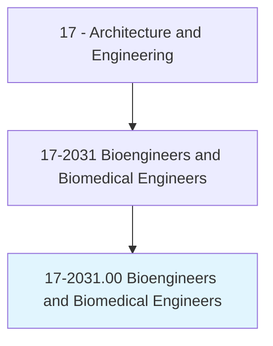
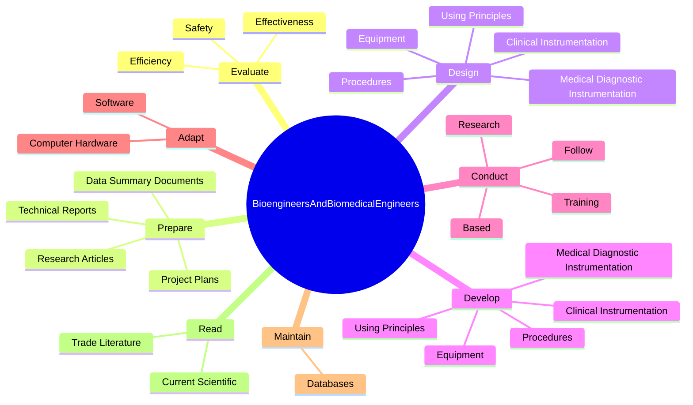
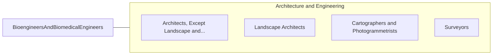

# Bioengineers and Biomedical Engineers

> Apply knowledge of engineering, biology, chemistry, computer science, and biomechanical principles to the design, development, and evaluation of biological, agricultural, and health systems and products, such as artificial organs, prostheses, instrumentation, medical information systems, and health management and care delivery systems.

## Overview

Bioengineers and Biomedical Engineers is classified under Architecture and Engineering (SOC 17). Apply knowledge of engineering, biology, chemistry, computer science, and biomechanical principles to the design, development, and evaluation of biological, agricultural, and health systems and products, such as artificial organs, prostheses, instrumentation, medical information systems, and health management and care delivery systems.

## Classification Hierarchy

## Key Statistics

| Metric | Value |
|--------|-------|
| SOC Code | 17-2031.00 |
| Category | [Architecture and Engineering](/occupations/Architecture/index) |
| Task Count | 139 |
| Source | O*NET |

## Core Tasks

### evaluate.Safety

Bioengineers and Biomedical Engineers evaluate safety as part of their core responsibilities.

**Actions:**
- `evaluate.Safety.of.BiomedicalEquipment`
- `evaluate.Efficiency.of.BiomedicalEquipment`
- `evaluate.Effectiveness.of.BiomedicalEquipment`

### prepare.TechnicalReports

Bioengineers and Biomedical Engineers prepare technical reports as part of their core responsibilities.

**Actions:**
- `prepare.TechnicalReports.for.ScientificPublication`
- `prepare.TechnicalReports.for.RegulatorySubmissions`
- `prepare.TechnicalReports.for.PatentApplications`
- `prepare.DataSummaryDocuments.for.ScientificPublication`

### design.MedicalDiagnosticInstrumentation

Bioengineers and Biomedical Engineers design medical diagnostic instrumentation as part of their core responsibilities.

**Actions:**
- `design.MedicalDiagnosticInstrumentation.of.EngineeringSciences`
- `design.MedicalDiagnosticInstrumentation.of.BiobehavioralSciences`
- `design.ClinicalInstrumentation.of.EngineeringSciences`
- `design.ClinicalInstrumentation.of.BiobehavioralSciences`

## Skills & Competencies

### Technical Skills
- **Engineering Design** - Advanced
- **CAD/CAM** - Advanced
- **Technical Analysis** - Advanced

### Soft Skills
- **Communication** - Essential
- **Problem Solving** - Essential
- **Critical Thinking** - Important
- **Teamwork** - Important
- **Adaptability** - Important

## Related Occupations

## Industries

This occupation is found across multiple industries. See [Industries](/industries) for sector-specific employment data.

## Career Progression

---

*Source: O*NET 17-2031.00 - ONETOccupation*
