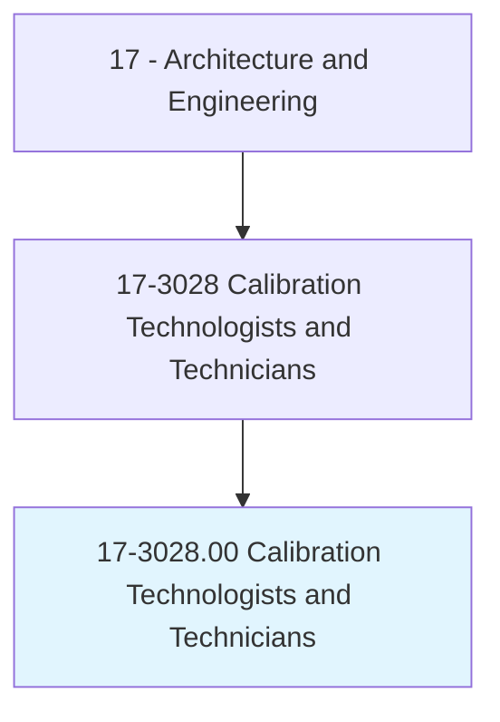
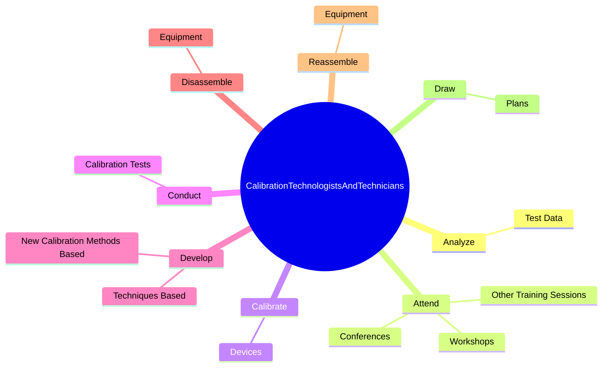
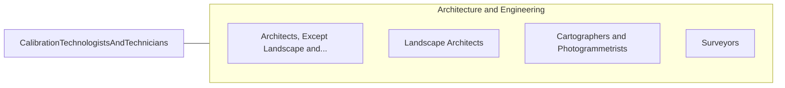

# Calibration Technologists and Technicians

> Execute or adapt procedures and techniques for calibrating measurement devices, by applying knowledge of measurement science, mathematics, physics, chemistry, and electronics, sometimes under the direction of engineering staff. Determine measurement standard suitability for calibrating measurement devices. May perform preventive maintenance on equipment. May perform corrective actions to address identified calibration problems.

## Overview

Calibration Technologists and Technicians is an occupation within the Architecture and Engineering category. Execute or adapt procedures and techniques for calibrating measurement devices, by applying knowledge of measurement science, mathematics, physics, chemistry, and electronics, sometimes under the direction of engineering staff. Determine measurement standard suitability for calibrating measurement devices.

## Classification Hierarchy

## Key Statistics

| Metric | Value |
|--------|-------|
| SOC Code | 17-3028.00 |
| Category | [Architecture and Engineering](/occupations/Architecture/index) |
| Task Count | 42 |
| Source | O*NET |

## Core Tasks

### analyze.TestData

Calibration Technologists and Technicians analyze test data as part of their core responsibilities.

**Actions:**
- `analyze.TestData.to.identify.Defects`
- `analyze.TestData.to.determine.CalibrationRequirements`

### attend.Conferences

Calibration Technologists and Technicians attend conferences as part of their core responsibilities.

**Actions:**
- `attend.Conferences.to.learn.AboutNewTools`
- `attend.Conferences.to.Methods`
- `attend.Workshops.to.learn.AboutNewTools`
- `attend.Workshops.to.Methods`

### calibrate.Devices

Calibration Technologists and Technicians calibrate devices as part of their core responsibilities.

**Actions:**
- `calibrate.Devices.by.ComparingMeasurements.of.Pressure`
- `calibrate.Devices.by.Temperature`
- `calibrate.Devices.by.Humidity`
- `calibrate.Devices.by.OtherEnvironmentalConditionsToKnownStandards`

## Skills & Competencies

### Technical Skills
- **Engineering Design** - Advanced
- **CAD/CAM** - Advanced
- **Technical Analysis** - Advanced

### Soft Skills
- **Communication** - Essential
- **Problem Solving** - Essential
- **Critical Thinking** - Important
- **Teamwork** - Important
- **Adaptability** - Important

## Related Occupations

## Industries

This occupation is found across multiple industries. See [Industries](/industries) for sector-specific employment data.

## Career Progression

---

*Source: O*NET 17-3028.00 - ONETOccupation*
