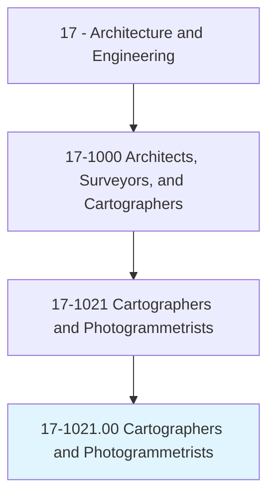
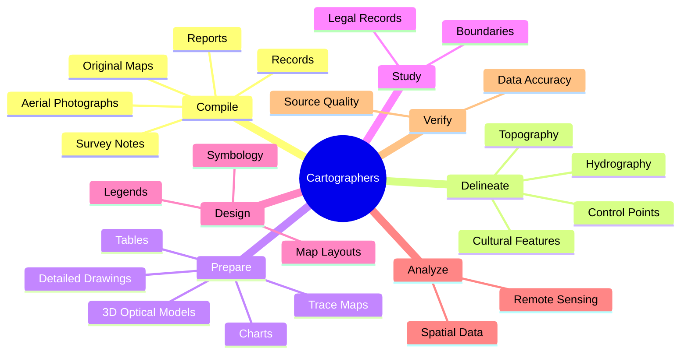
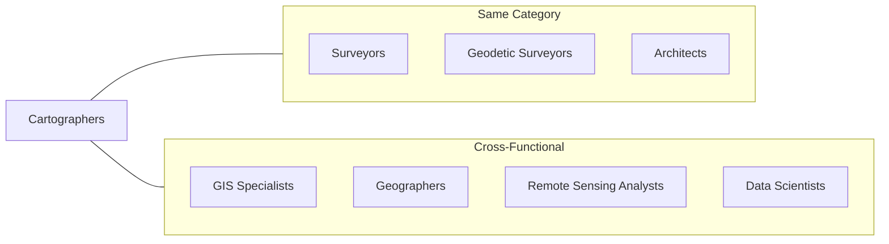
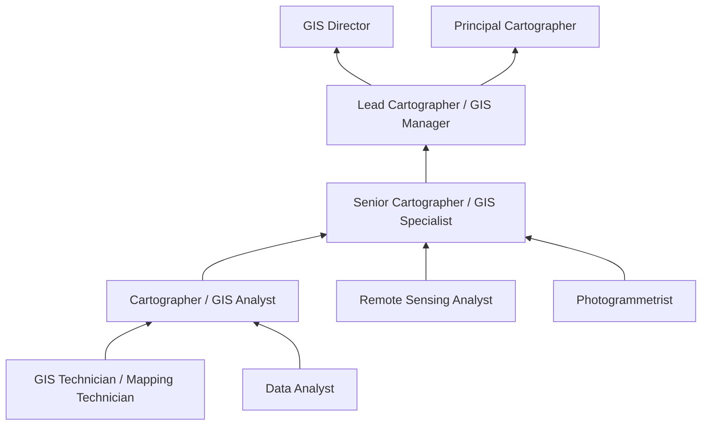

# Cartographers and Photogrammetrists

> Research, study, and prepare maps and other spatial data in digital or graphic form for one or more purposes, such as legal, social, political, educational, and design purposes. May work with Geographic Information Systems (GIS). May design and evaluate algorithms, data structures, and user interfaces for GIS and mapping systems.

## Overview

Cartographers and Photogrammetrists are geospatial professionals who collect, analyze, and interpret geographic information to create maps and spatial data products. They combine technical skills in data processing, geographic information systems (GIS), and remote sensing with artistic abilities to produce clear, accurate visual representations of spatial information. These professionals work with aerial photographs, satellite imagery, survey data, and other sources to create maps used for navigation, urban planning, environmental management, emergency response, and countless other applications. The field has evolved dramatically with digital technology, now encompassing interactive web maps, 3D terrain models, and real-time geospatial analytics.

## Classification Hierarchy

## Key Statistics

| Metric | Value |
|--------|-------|
| SOC Code | 17-1021.00 |
| Job Zone | 4 (Considerable Preparation) |
| Category | [Architecture and Engineering](/occupations/Architecture) |
| Core Tasks | 15+ |
| Source | O*NET |

## Core Tasks

### compile.DataRequired

Cartographers gather and organize the data necessary for creating accurate maps and spatial products.

**Actions:**
- `compile.DataRequired.for.MapPreparation` - Collect all necessary source materials
- `compile.DataRequired.for.IncludingAerialPhotographs` - Process aerial imagery
- `compile.DataRequired.for.SurveyNotes` - Integrate field survey data
- `compile.DataRequired.for.Records` - Research historical and administrative records
- `compile.DataRequired.for.Reports` - Synthesize technical reports
- `compile.DataRequired.for.OriginalMaps` - Reference existing cartographic sources

### delineate.AerialPhotographicDetail

Cartographers extract and interpret features from aerial photography and remote sensing imagery.

**Actions:**
- `delineate.AerialPhotographicDetail` - Identify and mark features in imagery
- `delineate.ControlPoints` - Establish reference points for georeferencing
- `delineate.Hydrography` - Map water features and drainage networks
- `delineate.Topography` - Represent terrain and elevation
- `delineate.CulturalFeatures` - Identify human-made features
- `delineate.UsingPrecisionStereoplottingApparatus` - Use specialized equipment for 3D interpretation

### prepare.TraceMaps

Cartographers create various types of maps and spatial visualizations using multiple techniques and technologies.

**Actions:**
- `prepare.TraceMaps.of.TerrainUsingStereoscopicPlottingGraphicsEquipment` - Create terrain maps using stereo imagery
- `prepare.Charts.of.TerrainUsingStereoscopicPlottingGraphicsEquipment` - Develop navigational and reference charts
- `prepare.Tables.of.TerrainUsingStereoscopicPlottingGraphicsEquipment` - Compile data tables with spatial attributes
- `prepare.DetailedDrawings.of.TerrainUsingStereoscopicPlottingGraphicsEquipment` - Create detailed technical drawings
- `prepare.ThreeDimensionalOpticalModels.of.TerrainUsingStereoscopicPlottingGraphicsEquipment` - Build 3D terrain models
- `prepare.TraceMaps.of.ComputerGraphicsEquipment` - Utilize GIS and digital mapping tools

### study.LegalRecords

Cartographers research legal and historical records to accurately represent boundaries and jurisdictions.

**Actions:**
- `study.LegalRecords.to.establish.BoundariesOfLocal` - Research local boundary definitions
- Define national and international property boundaries

### alter.Maps

Cartographers update and modify existing maps to reflect changes or corrections.

**Actions:**
- `alter.TraceMaps.of.TerrainUsingStereoscopicPlottingGraphicsEquipment` - Update terrain maps
- `alter.Charts.of.ComputerGraphicsEquipment` - Revise digital charts
- `alter.DetailedDrawings.of.TerrainUsingStereoscopicPlottingGraphicsEquipment` - Modify technical drawings

## Skills & Competencies

### Technical Skills
- **Geographic Information Systems (GIS)** - Expert
- **Remote Sensing** - Expert
- **Photogrammetry** - Expert
- **Digital Cartography** - Expert
- **Data Analysis** - Advanced
- **Geodesy** - Advanced
- **Programming (Python, SQL)** - Advanced
- **CAD Software** - Advanced

### Soft Skills
- **Attention to Detail** - Critical
- **Spatial Reasoning** - Critical
- **Analytical Thinking** - Essential
- **Visual Communication** - Essential
- **Problem Solving** - Essential
- **Research Skills** - Essential

## Related Occupations

## Industries

- [Government](/industries/Government) - High Employment (Federal mapping agencies, local planning)
- [Professional, Scientific, and Technical Services](/industries/ProfessionalServices) - High Employment
- [Mining, Quarrying, and Oil and Gas Extraction](/industries/Mining) - Moderate Employment
- [Utilities](/industries/Utilities) - Moderate Employment
- [Transportation](/industries/Transportation) - Moderate Employment

## Industry Variations

### Government Mapping
Work for federal agencies like USGS, NOAA, or Census Bureau creating official maps and maintaining national spatial data infrastructure.

### Defense and Intelligence
Create tactical maps, terrain analysis, and geospatial intelligence products for military and national security applications.

### Commercial Mapping
Develop consumer mapping products, navigation systems, and location-based services for technology companies.

### Environmental and Natural Resources
Create maps for environmental assessment, natural resource management, and conservation planning.

### Urban Planning and Development
Produce maps for city planning, zoning, transportation planning, and infrastructure development.

### Web and Mobile Mapping
Design and develop interactive web maps, mobile applications, and real-time location services.

## Career Progression

## Education & Training

| Requirement | Details |
|-------------|---------|
| Typical Education | Bachelor's degree in Cartography, Geography, GIS, or related field |
| Work Experience | Entry-level positions available; 2-5 years for senior roles |
| On-the-Job Training | Moderate - specific software and methodology training |
| Licensure | Generally not required (unlike surveyors) |
| Common Certifications | GISP (GIS Professional), ASPRS certifications |

## Departments

This occupation typically works in:
- [GIS/Geospatial Services](/departments/GIS)
- [Mapping](/departments/Mapping)
- [Planning](/departments/Planning)
- [Research and Development](/departments/RandD)
- [Information Technology](/departments/IT)

## Tools & Technologies

### GIS Software
- Esri ArcGIS Pro
- QGIS
- Google Earth Engine
- Mapbox
- CARTO

### Remote Sensing
- ENVI
- ERDAS IMAGINE
- PCI Geomatics
- Pix4D

### Photogrammetry
- Agisoft Metashape
- Trimble Inpho
- Bentley ContextCapture

### Programming
- Python (with GeoPandas, Rasterio)
- R (spatial packages)
- JavaScript (Leaflet, OpenLayers)
- SQL/PostGIS

### Design
- Adobe Illustrator
- Adobe Photoshop
- Avenza MAPublisher

---

*Source: O*NET 17-1021.00 - ONETOccupation*
