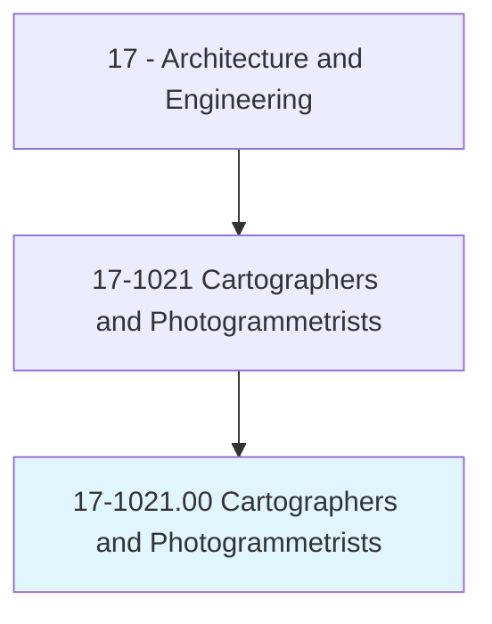
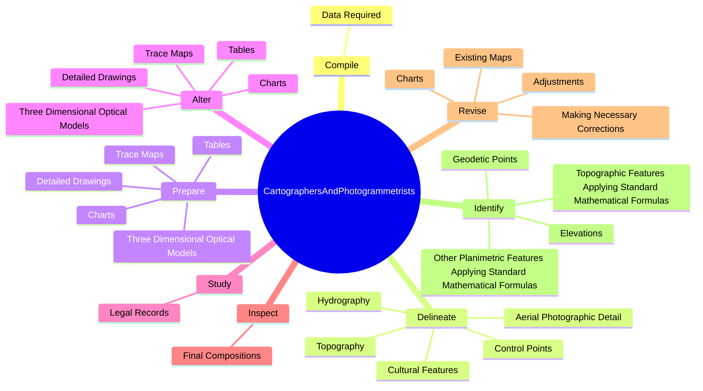
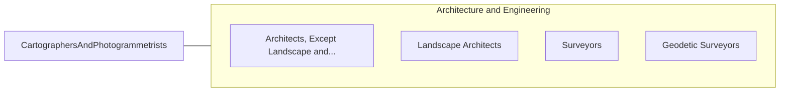

# Cartographers and Photogrammetrists

> Research, study, and prepare maps and other spatial data in digital or graphic form for one or more purposes, such as legal, social, political, educational, and design purposes. May work with Geographic Information Systems (GIS). May design and evaluate algorithms, data structures, and user interfaces for GIS and mapping systems. May collect, analyze, and interpret geographic information provided by geodetic surveys, aerial photographs, and satellite data.

## Overview

Cartographers and Photogrammetrists is an occupation within the Architecture and Engineering category. Research, study, and prepare maps and other spatial data in digital or graphic form for one or more purposes, such as legal, social, political, educational, and design purposes. May work with Geographic Information Systems (GIS).

## Classification Hierarchy

## Key Statistics

| Metric | Value |
|--------|-------|
| SOC Code | 17-1021.00 |
| Category | [Architecture and Engineering](/occupations/Architecture) |
| Task Count | 81 |
| Source | O*NET |

## Core Tasks

### compile.DataRequired

Cartographers and Photogrammetrists compile data required as part of their core responsibilities.

**Actions:**
- `compile.DataRequired.for.MapPreparation`
- `compile.DataRequired.for.IncludingAerialPhotographs`
- `compile.DataRequired.for.SurveyNotes`
- `compile.DataRequired.for.Records`

### delineate.AerialPhotographicDetail

Cartographers and Photogrammetrists delineate aerial photographic detail as part of their core responsibilities.

**Actions:**
- `delineate.AerialPhotographicDetail`
- `delineate.ControlPoints`
- `delineate.Hydrography`
- `delineate.Topography`

### prepare.TraceMaps

Cartographers and Photogrammetrists prepare trace maps as part of their core responsibilities.

**Actions:**
- `prepare.TraceMaps.of.TerrainUsingStereoscopicPlottingGraphicsEquipment`
- `prepare.TraceMaps.of.ComputerGraphicsEquipment`
- `prepare.Charts.of.TerrainUsingStereoscopicPlottingGraphicsEquipment`
- `prepare.Charts.of.ComputerGraphicsEquipment`

## Skills & Competencies

### Technical Skills
- **Engineering Design** - Advanced
- **CAD/CAM** - Advanced
- **Technical Analysis** - Advanced

### Soft Skills
- **Communication** - Essential
- **Problem Solving** - Essential
- **Critical Thinking** - Important
- **Teamwork** - Important
- **Adaptability** - Important

## Related Occupations

## Industries

This occupation is found across multiple industries. See [Industries](/industries) for sector-specific employment data.

## Career Progression

---

*Source: O*NET 17-1021.00 - ONETOccupation*
