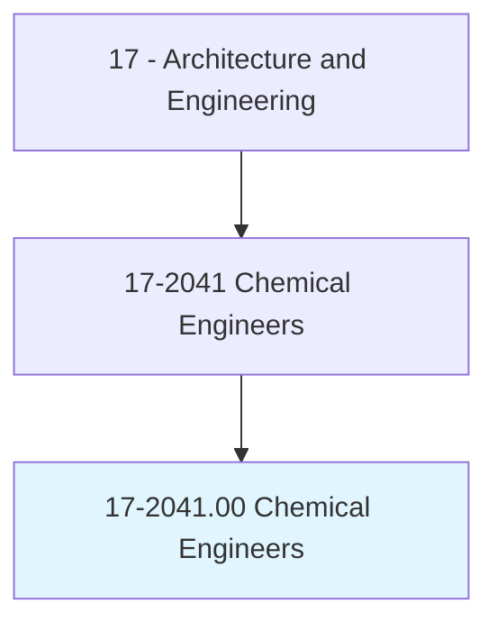
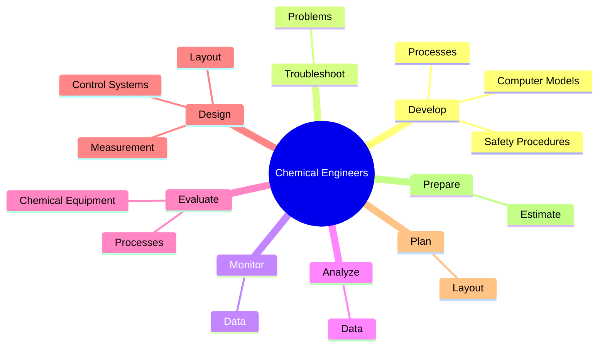
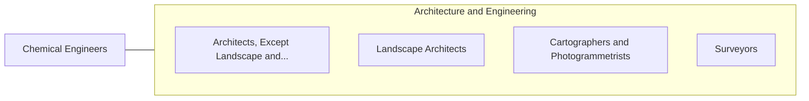

# Chemical Engineers

> Design chemical plant equipment and devise processes for manufacturing chemicals and products, such as gasoline, synthetic rubber, plastics, detergents, cement, paper, and pulp, by applying principles and technology of chemistry, physics, and engineering.

## Overview

Chemical Engineers is classified under Architecture and Engineering (SOC 17). Design chemical plant equipment and devise processes for manufacturing chemicals and products, such as gasoline, synthetic rubber, plastics, detergents, cement, paper, and pulp, by applying principles and technology of chemistry, physics, and engineering.

## Classification Hierarchy

## Key Statistics

| Metric | Value |
|--------|-------|
| SOC Code | 17-2041.00 |
| Category | [Architecture and Engineering](/occupations/Architecture/index) |
| Task Count | 49 |
| Source | O*NET |

## Core Tasks

### develop.SafetyProcedures

Chemical Engineers develop safety procedures as part of their core responsibilities.

**Actions:**
- `develop.SafetyProcedures.to.BeEmployedByWorkersOperatingEquipment`
- `develop.SafetyProcedures.to.WorkingInCloseProximityToOngoingChemicalReactions`
- `develop.Processes.to.separate.ComponentsOfLiquidsGenerateElectricalCurrentsUsingControlledChemicalProcesses`
- `develop.Processes.to.GasesGenerateElectricalCurrentsUsingControlledChemicalProcesses`

### troubleshoot.Problems

Chemical Engineers troubleshoot problems as part of their core responsibilities.

**Actions:**
- `troubleshoot.Problems.with.ChemicalManufacturingProcesses`

### monitor.Data

Chemical Engineers monitor data as part of their core responsibilities.

**Actions:**
- `monitor.Data.from.Processes`
- `monitor.Data.from.Experiments`

## Skills & Competencies

### Technical Skills
- **Engineering Design** - Advanced
- **CAD/CAM** - Advanced
- **Technical Analysis** - Advanced

### Soft Skills
- **Communication** - Essential
- **Problem Solving** - Essential
- **Critical Thinking** - Important
- **Teamwork** - Important
- **Adaptability** - Important

## Related Occupations

## Industries

This occupation is found across multiple industries. See [Industries](/industries) for sector-specific employment data.

## Career Progression

---

*Source: O*NET 17-2041.00 - ONETOccupation*
