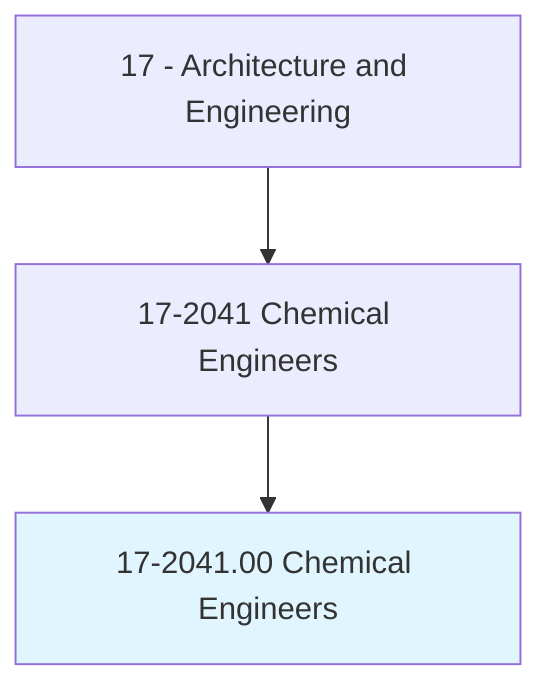
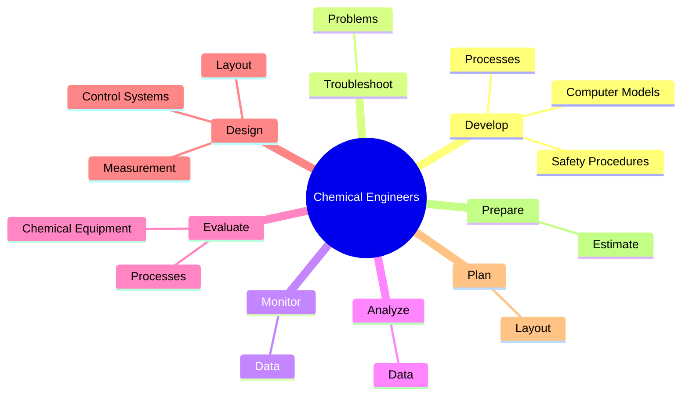
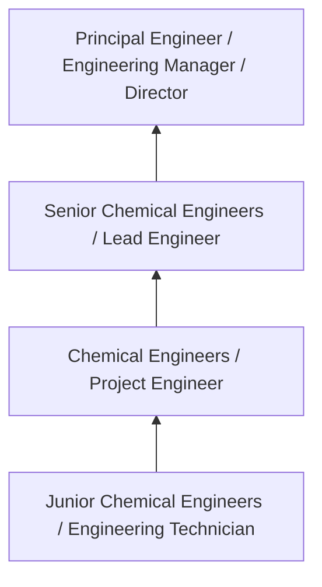
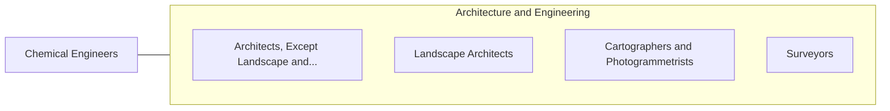

# Chemical Engineers

> Design chemical plant equipment and devise processes for manufacturing chemicals and products, such as gasoline, synthetic rubber, plastics, detergents, cement, paper, and pulp, by applying principles and technology of chemistry, physics, and engineering.

## Overview

Chemical Engineers professionals design chemical plant equipment and devise processes for manufacturing chemicals and products, such as gasoline, synthetic rubber, plastics, detergents, cement, paper, and pulp, by applying principles and technology of chemistry, physics, and engineering.. This occupation falls within the Architecture and Engineering category and requires a combination of specialized knowledge, technical skills, and practical experience.

These professionals work across diverse settings and organizational contexts, applying their expertise to meet the demands of their field. They must stay current with industry standards, emerging practices, and regulatory requirements that affect their work. The role demands both independent judgment and collaborative skills, as practitioners regularly interact with colleagues, stakeholders, and the public.

As the field continues to evolve, Chemical Engineers professionals increasingly leverage technology and data-driven approaches to enhance their effectiveness. Career opportunities span the public and private sectors, with demand influenced by economic conditions, demographic shifts, and technological advancement.

## Classification Hierarchy



## Key Statistics

| Metric | Value |
|--------|-------|
| SOC Code | 17-2041.00 |
| Job Zone | N/A |
| Category | [Architecture and Engineering](/occupations/Architecture/index) |
| Core Tasks | 49+ |
| Salary Range | $55,000 - $140,000 |
| Median Salary | $85,000 |
| Growth Outlook | 4% (As fast as average) |
| Source | O*NET |

## Core Tasks



### perform.TestsPerformance

Chemical Engineers perform tests performance as part of their core responsibilities.

**Actions:**
- `perform.TestsPerformance.of.ProcessesThroughoutStagesOfProduction.to.determine.DegreeOfControlOverVariables` - Perform tests and monitor performance of processes throughout stages of produ...
- `perform.TestsPerformance.of.Temperature` - Perform tests and monitor performance of processes throughout stages of produ...
- `perform.TestsPerformance.of.Density` - Perform tests and monitor performance of processes throughout stages of produ...
- `perform.TestsPerformance.of.SpecificGravity` - Perform tests and monitor performance of processes throughout stages of produ...
- `perform.TestsPerformance.of.Pressure` - Perform tests and monitor performance of processes throughout stages of produ...

### determine.EffectiveArrangement

Chemical Engineers determine effective arrangement as part of their core responsibilities.

**Actions:**
- `determine.EffectiveArrangement.of.Operations` - Determine most effective arrangement of operations such as mixing, crushing, ...
- `determine.EffectiveArrangement.of.Mixing` - Determine most effective arrangement of operations such as mixing, crushing, ...
- `determine.EffectiveArrangement.of.Crushing` - Determine most effective arrangement of operations such as mixing, crushing, ...
- `determine.EffectiveArrangement.of.HeatTransfer` - Determine most effective arrangement of operations such as mixing, crushing, ...
- `determine.EffectiveArrangement.of.Distillation` - Determine most effective arrangement of operations such as mixing, crushing, ...

### direct.Activities

Chemical Engineers direct activities as part of their core responsibilities.

**Actions:**
- `direct.Activities.of.WorkersWhoOperate.engaged.in.ConstructingImprovingAbsorption` - Direct activities of workers who operate or are engaged in constructing and i...
- `direct.Activities.of.WorkersWhoOperate.engaged.in.Evaporation` - Direct activities of workers who operate or are engaged in constructing and i...
- `direct.Activities.of.WorkersWhoOperate.engaged.in.ElectromagneticEquipment` - Direct activities of workers who operate or are engaged in constructing and i...
- `direct.Activities.of.Are.engaged.in.ConstructingImprovingAbsorption` - Direct activities of workers who operate or are engaged in constructing and i...
- `direct.Activities.of.Are.engaged.in.Evaporation` - Direct activities of workers who operate or are engaged in constructing and i...

### develop.SafetyProcedures

Chemical Engineers develop safety procedures as part of their core responsibilities.

**Actions:**
- `develop.SafetyProcedures.to.BeEmployedByWorkersOperatingEquipment` - Develop safety procedures to be employed by workers operating equipment or wo...
- `develop.SafetyProcedures.to.WorkingInCloseProximityToOngoingChemicalReactions` - Develop safety procedures to be employed by workers operating equipment or wo...
- `develop.Processes.to.separate.ComponentsOfLiquidsGenerateElectricalCurrentsUsingControlledChemicalProcesses` - Develop processes to separate components of liquids or gases or generate elec...
- `develop.Processes.to.GasesGenerateElectricalCurrentsUsingControlledChemicalProcesses` - Develop processes to separate components of liquids or gases or generate elec...
- `develop.ComputerModels.of.ChemicalProcesses` - Develop computer models of chemical processes.


## Skills & Competencies

### Technical Skills
- **Technical Design** - Expert
- **Engineering Analysis** - Advanced
- **CAD/BIM Software** - Advanced
- **Project Management** - Advanced
- **Code Compliance** - Advanced
- **Quality Assurance** - Proficient

### Soft Skills
- **Analytical Thinking** - Critical
- **Problem Solving** - Critical
- **Attention to Detail** - Essential
- **Teamwork** - Essential
- **Communication** - Essential

## Education & Certifications

| Requirement | Details |
|-------------|---------|
| Typical Education | Bachelor's degree in engineering, architecture, or related field |
| Work Experience | 2-4 years professional experience |
| On-the-Job Training | Moderate - technical specialization required |
| Certifications | Professional Engineer (PE), Architect License, or field-specific certifications |

## Career Progression



## Industry Variations

### Private Sector Engineering
Design and development work for commercial clients. Chemical Engineers professionals focus on product development, system design, and project delivery.

### Government and Infrastructure
Public works and infrastructure projects with emphasis on regulatory compliance and long-term sustainability.

### Construction and Field Engineering
On-site implementation and oversight of engineering designs. Strong focus on quality control and safety compliance.

### Consulting
Advisory services for diverse clients. Requires strong project management skills and ability to work across multiple simultaneous projects.

## Technology & Tools

- **Computer-Aided Design (CAD) software**
- **Building Information Modeling (BIM)**
- **Geographic Information Systems (GIS)**
- **Structural analysis software**
- **Project management tools**

## Related Occupations



## Industries

- [Engineering Services](/industries/Engineering) - High Employment
- [Construction](/industries/Construction) - High Employment
- [Manufacturing](/industries/Manufacturing) - Moderate Employment
- [Government](/industries/PublicAdministration) - Moderate Employment

## Departments

This occupation typically works in:
- [Engineering](/departments/Engineering/index)
- Design
- Project Management

## GraphDL Semantic Structure

```graphdl
Chemical Engineers perform:
- develop.SafetyProcedures.to.BeEmployedByWorkersOperatingEquipment
- develop.SafetyProcedures.to.WorkingInCloseProximityToOngoingChemicalReactions
- troubleshoot.Problems.with.ChemicalManufacturingProcesses
- monitor.Data.from.Processes
- monitor.Data.from.Experiments
- analyze.Data.from.Processes
```

---

*Source: O*NET 17-2041.00 - ONETOccupation*
