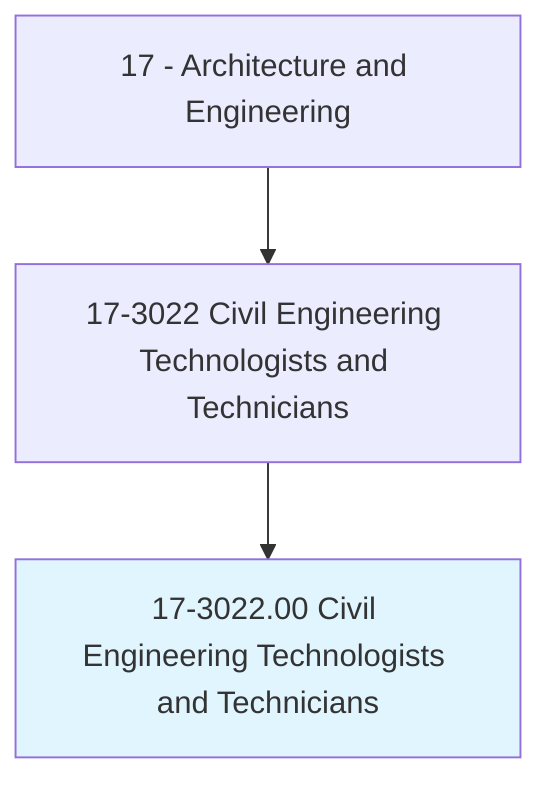
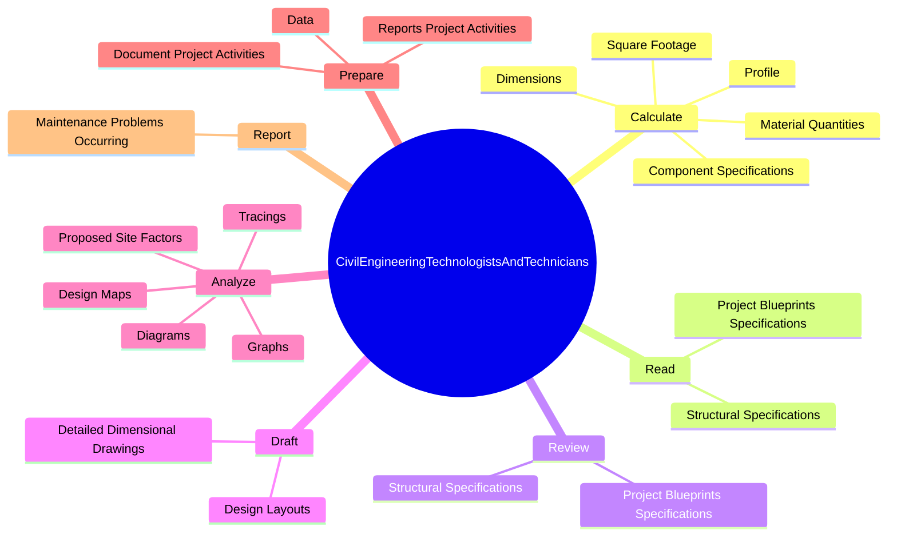
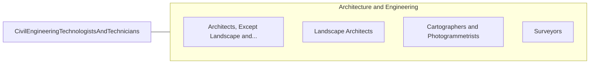

# Civil Engineering Technologists and Technicians

> Apply theory and principles of civil engineering in planning, designing, and overseeing construction and maintenance of structures and facilities under the direction of engineering staff or physical scientists.

## Overview

Civil Engineering Technologists and Technicians is classified under Architecture and Engineering (SOC 17). Apply theory and principles of civil engineering in planning, designing, and overseeing construction and maintenance of structures and facilities under the direction of engineering staff or physical scientists.

## Classification Hierarchy

## Key Statistics

| Metric | Value |
|--------|-------|
| SOC Code | 17-3022.00 |
| Category | [Architecture and Engineering](/occupations/Architecture/index) |
| Task Count | 49 |
| Source | O*NET |

## Core Tasks

### calculate.Dimensions

Civil Engineering Technologists and Technicians calculate dimensions as part of their core responsibilities.

**Actions:**
- `calculate.Dimensions`
- `calculate.SquareFootage`
- `calculate.Profile`
- `calculate.ComponentSpecifications`

### read.ProjectBlueprintsSpecifications

Civil Engineering Technologists and Technicians read project blueprints specifications as part of their core responsibilities.

**Actions:**
- `read.ProjectBlueprintsSpecifications.to.determine.DimensionsOfStructureMaterialRequirements`
- `read.ProjectBlueprintsSpecifications.to.SystemMaterialRequirements`
- `read.StructuralSpecifications.to.determine.DimensionsOfStructureMaterialRequirements`
- `read.StructuralSpecifications.to.SystemMaterialRequirements`

### review.ProjectBlueprintsSpecifications

Civil Engineering Technologists and Technicians review project blueprints specifications as part of their core responsibilities.

**Actions:**
- `review.ProjectBlueprintsSpecifications.to.determine.DimensionsOfStructureMaterialRequirements`
- `review.ProjectBlueprintsSpecifications.to.SystemMaterialRequirements`
- `review.StructuralSpecifications.to.determine.DimensionsOfStructureMaterialRequirements`
- `review.StructuralSpecifications.to.SystemMaterialRequirements`

## Skills & Competencies

### Technical Skills
- **Engineering Design** - Advanced
- **CAD/CAM** - Advanced
- **Technical Analysis** - Advanced

### Soft Skills
- **Communication** - Essential
- **Problem Solving** - Essential
- **Critical Thinking** - Important
- **Teamwork** - Important
- **Adaptability** - Important

## Related Occupations

## Industries

This occupation is found across multiple industries. See [Industries](/industries) for sector-specific employment data.

## Career Progression

---

*Source: O*NET 17-3022.00 - ONETOccupation*
