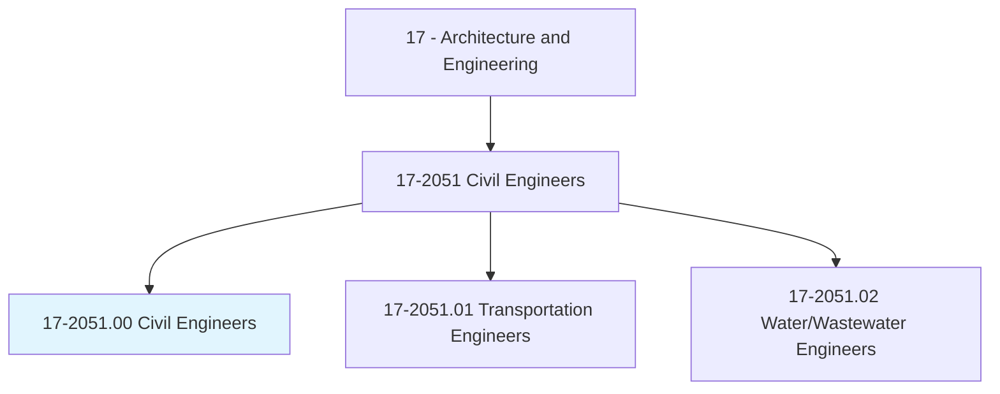
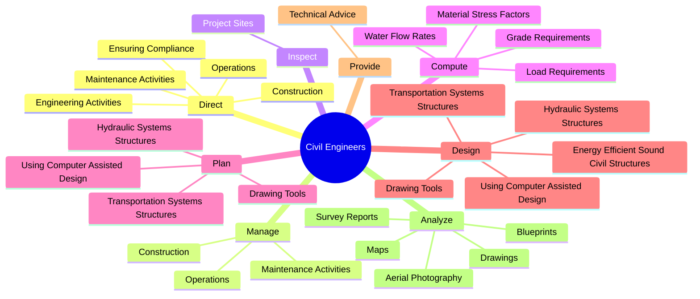
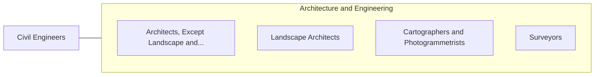

# Civil Engineers

> Perform engineering duties in planning, designing, and overseeing construction and maintenance of building structures and facilities, such as roads, railroads, airports, bridges, harbors, channels, dams, irrigation projects, pipelines, power plants, and water and sewage systems.

## Overview

Civil Engineers is classified under Architecture and Engineering (SOC 17). Perform engineering duties in planning, designing, and overseeing construction and maintenance of building structures and facilities, such as roads, railroads, airports, bridges, harbors, channels, dams, irrigation projects, pipelines, power plants, and water and sewage systems.

## Classification Hierarchy

## Key Statistics

| Metric | Value |
|--------|-------|
| SOC Code | 17-2051.00 |
| Category | [Architecture and Engineering](/occupations/Architecture) |
| Task Count | 86 |
| Source | O*NET |

## Core Tasks

### direct.EngineeringActivities

Civil Engineers direct engineering activities as part of their core responsibilities.

**Actions:**
- `direct.EngineeringActivities.with.Environmental`
- `direct.EngineeringActivities.with.Safety`
- `direct.EngineeringActivities.with.OtherGovernmentalRegulations`
- `direct.EnsuringCompliance.with.Environmental`

### manage.Construction

Civil Engineers manage construction as part of their core responsibilities.

**Actions:**
- `manage.Construction.at.ProjectSite`
- `manage.Operations.at.ProjectSite`
- `manage.MaintenanceActivities.at.ProjectSite`

### inspect.ProjectSites

Civil Engineers inspect project sites as part of their core responsibilities.

**Actions:**
- `inspect.ProjectSites.to.monitor.Progress`
- `inspect.ProjectSites.to.ensure.ConformanceToDesignSpecificationsSanitationStandards`
- `inspect.ProjectSites.to.SafetySanitationStandards`

## Skills & Competencies

### Technical Skills
- **Engineering Design** - Advanced
- **CAD/CAM** - Advanced
- **Technical Analysis** - Advanced

### Soft Skills
- **Communication** - Essential
- **Problem Solving** - Essential
- **Critical Thinking** - Important
- **Teamwork** - Important
- **Adaptability** - Important

## Related Occupations

## Industries

This occupation is found across multiple industries. See [Industries](/industries) for sector-specific employment data.

## Career Progression

---

*Source: O*NET 17-2051.00 - ONETOccupation*
