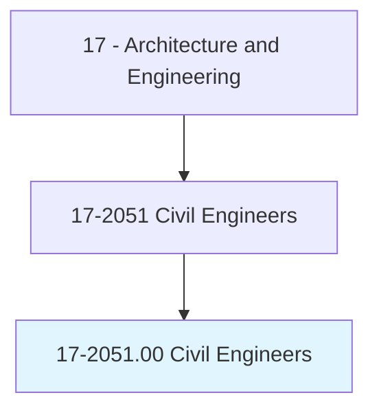
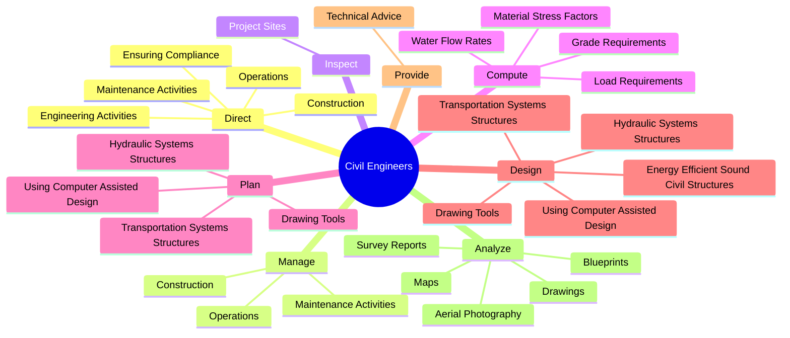
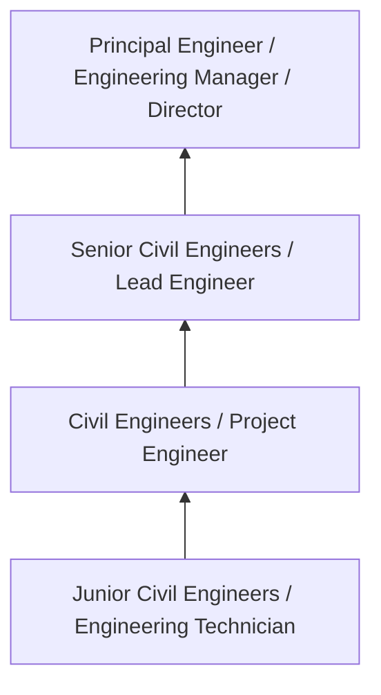
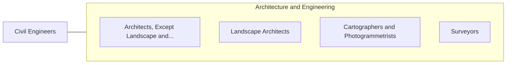

# Civil Engineers

> Perform engineering duties in planning, designing, and overseeing construction and maintenance of building structures and facilities, such as roads, railroads, airports, bridges, harbors, channels, dams, irrigation projects, pipelines, power plants, and water and sewage systems.

## Overview

Civil Engineers professionals perform engineering duties in planning, designing, and overseeing construction and maintenance of building structures and facilities, such as roads, railroads, airports, bridges, harbors, channels, dams, irrigation projects, pipelines, power plants, and water and sewage systems.. This occupation falls within the Architecture and Engineering category and requires a combination of specialized knowledge, technical skills, and practical experience.

These professionals work across diverse settings and organizational contexts, applying their expertise to meet the demands of their field. They must stay current with industry standards, emerging practices, and regulatory requirements that affect their work. The role demands both independent judgment and collaborative skills, as practitioners regularly interact with colleagues, stakeholders, and the public.

As the field continues to evolve, Civil Engineers professionals increasingly leverage technology and data-driven approaches to enhance their effectiveness. Career opportunities span the public and private sectors, with demand influenced by economic conditions, demographic shifts, and technological advancement.

## Classification Hierarchy



## Key Statistics

| Metric | Value |
|--------|-------|
| SOC Code | 17-2051.00 |
| Job Zone | N/A |
| Category | [Architecture and Engineering](/occupations/Architecture/index) |
| Core Tasks | 86+ |
| Salary Range | $55,000 - $140,000 |
| Median Salary | $85,000 |
| Growth Outlook | 4% (As fast as average) |
| Source | O*NET |

## Core Tasks



### test.Soils

Civil Engineers test soils as part of their core responsibilities.

**Actions:**
- `test.Soils.to.determine.AdequacyOfFoundations` - Test soils or materials to determine the adequacy and strength of foundations...
- `test.Soils.to.StrengthOfFoundations` - Test soils or materials to determine the adequacy and strength of foundations...
- `test.Soils.to.Concrete` - Test soils or materials to determine the adequacy and strength of foundations...
- `test.Soils.to.Asphalt` - Test soils or materials to determine the adequacy and strength of foundations...
- `test.Soils.to.Steel` - Test soils or materials to determine the adequacy and strength of foundations...

### direct.EngineeringActivities

Civil Engineers direct engineering activities as part of their core responsibilities.

**Actions:**
- `direct.EngineeringActivities.with.Environmental` - Direct engineering activities, ensuring compliance with environmental, safety...
- `direct.EngineeringActivities.with.Safety` - Direct engineering activities, ensuring compliance with environmental, safety...
- `direct.EngineeringActivities.with.OtherGovernmentalRegulations` - Direct engineering activities, ensuring compliance with environmental, safety...
- `direct.EnsuringCompliance.with.Environmental` - Direct engineering activities, ensuring compliance with environmental, safety...
- `direct.EnsuringCompliance.with.Safety` - Direct engineering activities, ensuring compliance with environmental, safety...

### design.TransportationSystemsStructures

Civil Engineers design transportation systems structures as part of their core responsibilities.

**Actions:**
- `design.TransportationSystemsStructures` - Plan and design transportation or hydraulic systems or structures, using comp...
- `design.HydraulicSystemsStructures` - Plan and design transportation or hydraulic systems or structures, using comp...
- `design.UsingComputerAssistedDesign` - Plan and design transportation or hydraulic systems or structures, using comp...
- `design.DrawingTools` - Plan and design transportation or hydraulic systems or structures, using comp...
- `design.EnergyEfficientSoundCivilStructures` - Design energy-efficient or environmentally sound civil structures.

### provide.TechnicalAdvice

Civil Engineers provide technical advice as part of their core responsibilities.

**Actions:**
- `provide.TechnicalAdvice.to.IndustrialRegardingDesign` - Provide technical advice to industrial or managerial personnel regarding desi...
- `provide.TechnicalAdvice.to.IndustrialRegardingConstruction` - Provide technical advice to industrial or managerial personnel regarding desi...
- `provide.TechnicalAdvice.to.IndustrialRegardingProgramModifications` - Provide technical advice to industrial or managerial personnel regarding desi...
- `provide.TechnicalAdvice.to.IndustrialRegardingStructuralRepairs` - Provide technical advice to industrial or managerial personnel regarding desi...
- `provide.TechnicalAdvice.to.ManagerialPersonnelRegardingDesign` - Provide technical advice to industrial or managerial personnel regarding desi...


## Skills & Competencies

### Technical Skills
- **Technical Design** - Expert
- **Engineering Analysis** - Advanced
- **CAD/BIM Software** - Advanced
- **Project Management** - Advanced
- **Code Compliance** - Advanced
- **Quality Assurance** - Proficient

### Soft Skills
- **Analytical Thinking** - Critical
- **Problem Solving** - Critical
- **Attention to Detail** - Essential
- **Teamwork** - Essential
- **Communication** - Essential

## Education & Certifications

| Requirement | Details |
|-------------|---------|
| Typical Education | Bachelor's degree in engineering, architecture, or related field |
| Work Experience | 2-4 years professional experience |
| On-the-Job Training | Moderate - technical specialization required |
| Certifications | Professional Engineer (PE), Architect License, or field-specific certifications |

## Career Progression



## Industry Variations

### Private Sector Engineering
Design and development work for commercial clients. Civil Engineers professionals focus on product development, system design, and project delivery.

### Government and Infrastructure
Public works and infrastructure projects with emphasis on regulatory compliance and long-term sustainability.

### Construction and Field Engineering
On-site implementation and oversight of engineering designs. Strong focus on quality control and safety compliance.

### Consulting
Advisory services for diverse clients. Requires strong project management skills and ability to work across multiple simultaneous projects.

## Technology & Tools

- **Computer-Aided Design (CAD) software**
- **Building Information Modeling (BIM)**
- **Geographic Information Systems (GIS)**
- **Structural analysis software**
- **Project management tools**

## Related Occupations



## Industries

- [Engineering Services](/industries/Engineering) - High Employment
- [Construction](/industries/Construction) - High Employment
- [Manufacturing](/industries/Manufacturing) - Moderate Employment
- [Government](/industries/Government) - Moderate Employment

## Departments

This occupation typically works in:
- [Engineering](/departments/Engineering/index)
- [Design](/departments/Design)
- [Project Management](/departments/ProjectManagement)

## GraphDL Semantic Structure

```
Civil Engineers perform:
- direct.EngineeringActivities.with.Environmental
- direct.EngineeringActivities.with.Safety
- direct.EngineeringActivities.with.OtherGovernmentalRegulations
- direct.EnsuringCompliance.with.Environmental
- direct.EnsuringCompliance.with.Safety
- direct.EnsuringCompliance.with.OtherGovernmentalRegulations
```

---

*Source: O*NET 17-2051.00 - ONETOccupation*
