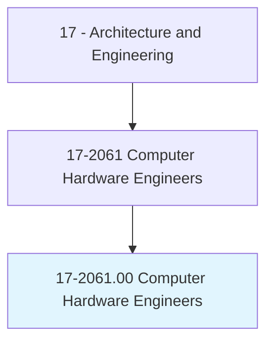
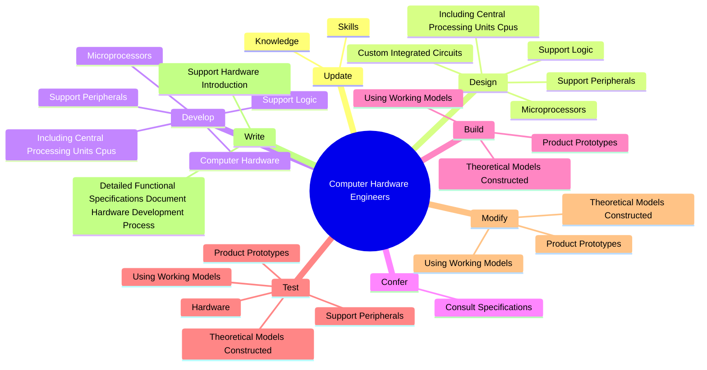
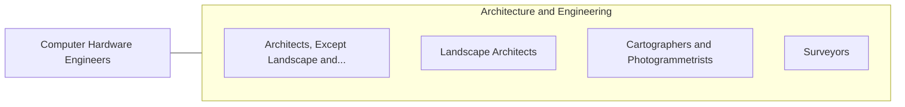

# Computer Hardware Engineers

> Research, design, develop, or test computer or computer-related equipment for commercial, industrial, military, or scientific use. May supervise the manufacturing and installation of computer or computer-related equipment and components.

## Overview

Computer Hardware Engineers is an occupation within the Architecture and Engineering category. Research, design, develop, or test computer or computer-related equipment for commercial, industrial, military, or scientific use. 

## Classification Hierarchy

## Key Statistics

| Metric | Value |
|--------|-------|
| SOC Code | 17-2061.00 |
| Category | [Architecture and Engineering](/occupations/Architecture) |
| Task Count | 83 |
| Source | O*NET |

## Core Tasks

### update.Knowledge

Computer Hardware Engineers update knowledge as part of their core responsibilities.

**Actions:**
- `update.Knowledge.to.keep.UpWithRapidAdvancementsInComputerTechnology`
- `update.Skills.to.keep.UpWithRapidAdvancementsInComputerTechnology`

### design.SupportPeripherals

Computer Hardware Engineers design support peripherals as part of their core responsibilities.

**Actions:**
- `design.SupportPeripherals`
- `design.IncludingCentralProcessingUnitsCpus`
- `design.SupportLogic`
- `design.Microprocessors`

### develop.ComputerHardware

Computer Hardware Engineers develop computer hardware as part of their core responsibilities.

**Actions:**
- `develop.ComputerHardware`
- `develop.SupportPeripherals`
- `develop.IncludingCentralProcessingUnitsCpus`
- `develop.SupportLogic`

## Skills & Competencies

### Technical Skills
- **Engineering Design** - Advanced
- **CAD/CAM** - Advanced
- **Technical Analysis** - Advanced

### Soft Skills
- **Communication** - Essential
- **Problem Solving** - Essential
- **Critical Thinking** - Important
- **Teamwork** - Important
- **Adaptability** - Important

## Related Occupations

## Industries

This occupation is found across multiple industries. See [Industries](/industries) for sector-specific employment data.

## Career Progression

---

*Source: O*NET 17-2061.00 - ONETOccupation*
