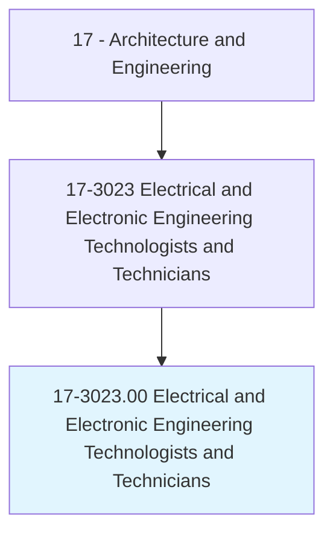
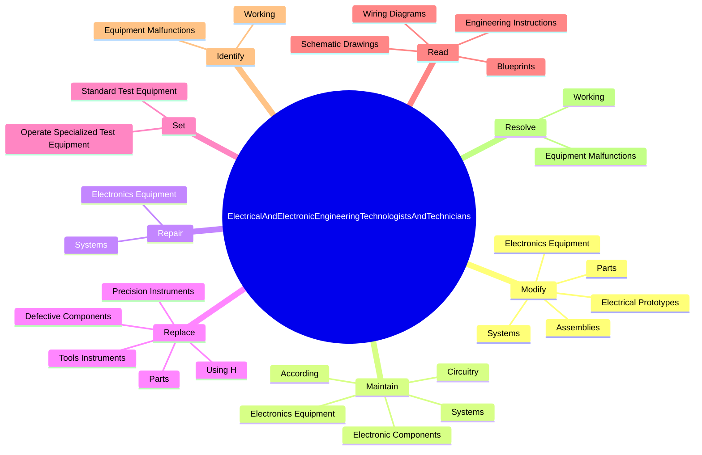
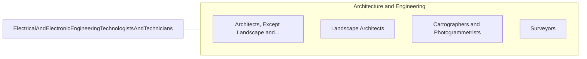

# Electrical and Electronic Engineering Technologists and Technicians

> Apply electrical and electronic theory and related knowledge, usually under the direction of engineering staff, to design, build, repair, adjust, and modify electrical components, circuitry, controls, and machinery for subsequent evaluation and use by engineering staff in making engineering design decisions.

## Overview

Electrical and Electronic Engineering Technologists and Technicians is classified under Architecture and Engineering (SOC 17). Apply electrical and electronic theory and related knowledge, usually under the direction of engineering staff, to design, build, repair, adjust, and modify electrical components, circuitry, controls, and machinery for subsequent evaluation and use by engineering staff in making engineering design decisions.

## Classification Hierarchy

## Key Statistics

| Metric | Value |
|--------|-------|
| SOC Code | 17-3023.00 |
| Category | [Architecture and Engineering](/occupations/Architecture) |
| Task Count | 216 |
| Source | O*NET |

## Core Tasks

### modify.ElectronicsEquipment

Electrical and Electronic Engineering Technologists and Technicians modify electronics equipment as part of their core responsibilities.

**Actions:**
- `modify.ElectronicsEquipment.to.ensure.ProperFunctioning`
- `modify.Systems.to.ensure.ProperFunctioning`
- `modify.ElectricalPrototypes.to.correct.FunctionalDeviations`
- `modify.Parts.to.correct.FunctionalDeviations`

### maintain.ElectronicsEquipment

Electrical and Electronic Engineering Technologists and Technicians maintain electronics equipment as part of their core responsibilities.

**Actions:**
- `maintain.ElectronicsEquipment.to.ensure.ProperFunctioning`
- `maintain.Systems.to.ensure.ProperFunctioning`
- `maintain.Circuitry.to.EngineeringInstructions`
- `maintain.Circuitry.to.TechnicalManuals`

### repair.ElectronicsEquipment

Electrical and Electronic Engineering Technologists and Technicians repair electronics equipment as part of their core responsibilities.

**Actions:**
- `repair.ElectronicsEquipment.to.ensure.ProperFunctioning`
- `repair.Systems.to.ensure.ProperFunctioning`

## Skills & Competencies

### Technical Skills
- **Engineering Design** - Advanced
- **CAD/CAM** - Advanced
- **Technical Analysis** - Advanced

### Soft Skills
- **Communication** - Essential
- **Problem Solving** - Essential
- **Critical Thinking** - Important
- **Teamwork** - Important
- **Adaptability** - Important

## Related Occupations

## Industries

This occupation is found across multiple industries. See [Industries](/industries) for sector-specific employment data.

## Career Progression

---

*Source: O*NET 17-3023.00 - ONETOccupation*
