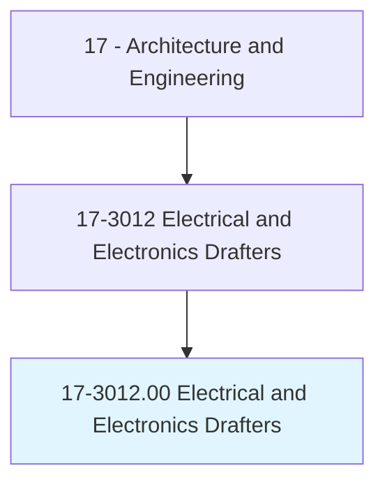
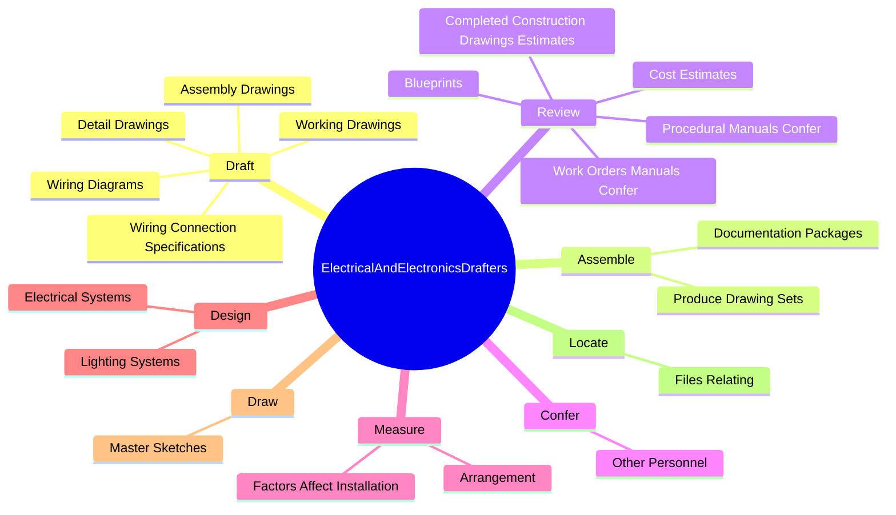
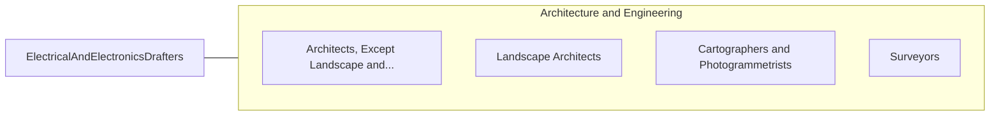

# Electrical and Electronics Drafters

> Prepare wiring diagrams, circuit board assembly diagrams, and layout drawings used for the manufacture, installation, or repair of electrical equipment.

## Overview

Electrical and Electronics Drafters is classified under Architecture and Engineering (SOC 17). Prepare wiring diagrams, circuit board assembly diagrams, and layout drawings used for the manufacture, installation, or repair of electrical equipment.

## Classification Hierarchy

## Key Statistics

| Metric | Value |
|--------|-------|
| SOC Code | 17-3012.00 |
| Category | [Architecture and Engineering](/occupations/Architecture/index) |
| Task Count | 137 |
| Source | O*NET |

## Core Tasks

### draft.DetailDrawings

Electrical and Electronics Drafters draft detail drawings as part of their core responsibilities.

**Actions:**
- `draft.DetailDrawings.of.DesignComponents`
- `draft.DetailDrawings.of.Circuitry`
- `draft.DetailDrawings.of.PrintedCircuitBoards`
- `draft.DetailDrawings.of.UsingComputerAssistedEquipment`

### assemble.DocumentationPackages

Electrical and Electronics Drafters assemble documentation packages as part of their core responsibilities.

**Actions:**
- `assemble.DocumentationPackages.to.BeCheckedByEngineer`
- `assemble.DocumentationPackages.to.Architect`
- `assemble.ProduceDrawingSets.to.BeCheckedByEngineer`
- `assemble.ProduceDrawingSets.to.Architect`

### review.CompletedConstructionDrawingsEstimates

Electrical and Electronics Drafters review completed construction drawings estimates as part of their core responsibilities.

**Actions:**
- `review.CompletedConstructionDrawingsEstimates.for.AccuracyToStandardsRegulations`
- `review.CompletedConstructionDrawingsEstimates.for.ConformityToStandardsRegulations`
- `review.CostEstimates.for.AccuracyToStandardsRegulations`
- `review.CostEstimates.for.ConformityToStandardsRegulations`

## Skills & Competencies

### Technical Skills
- **Engineering Design** - Advanced
- **CAD/CAM** - Advanced
- **Technical Analysis** - Advanced

### Soft Skills
- **Communication** - Essential
- **Problem Solving** - Essential
- **Critical Thinking** - Important
- **Teamwork** - Important
- **Adaptability** - Important

## Related Occupations

## Industries

This occupation is found across multiple industries. See [Industries](/industries) for sector-specific employment data.

## Career Progression

---

*Source: O*NET 17-3012.00 - ONETOccupation*
