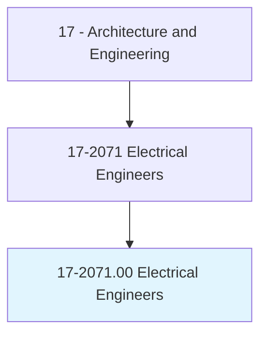
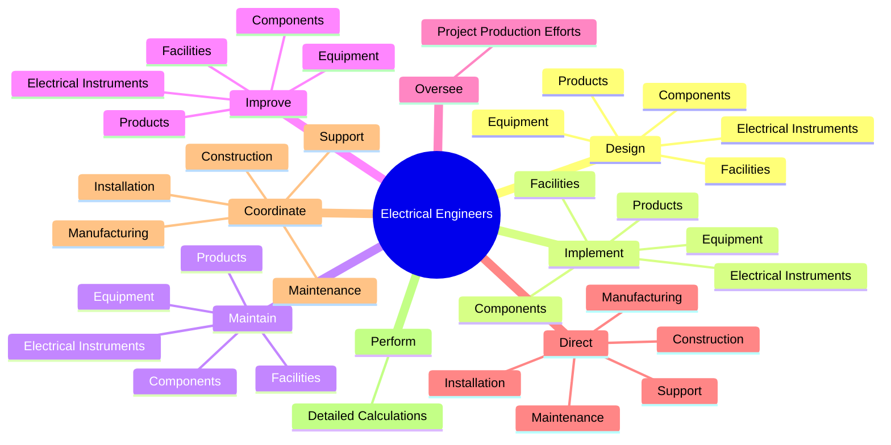
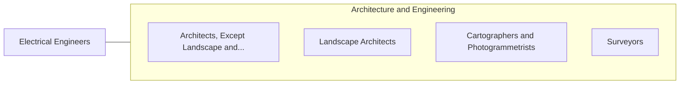

# Electrical Engineers

> Research, design, develop, test, or supervise the manufacturing and installation of electrical equipment, components, or systems for commercial, industrial, military, or scientific use.

## Overview

Electrical Engineers is classified under Architecture and Engineering (SOC 17). Research, design, develop, test, or supervise the manufacturing and installation of electrical equipment, components, or systems for commercial, industrial, military, or scientific use.

## Classification Hierarchy

## Key Statistics

| Metric | Value |
|--------|-------|
| SOC Code | 17-2071.00 |
| Category | [Architecture and Engineering](/occupations/Architecture/index) |
| Task Count | 191 |
| Source | O*NET |

## Core Tasks

### design.ElectricalInstruments

Electrical Engineers design electrical instruments as part of their core responsibilities.

**Actions:**
- `design.ElectricalInstruments.for.Commercial`
- `design.ElectricalInstruments.for.Industrial`
- `design.ElectricalInstruments.for.DomesticPurposes`
- `design.Equipment.for.Commercial`

### implement.ElectricalInstruments

Electrical Engineers implement electrical instruments as part of their core responsibilities.

**Actions:**
- `implement.ElectricalInstruments.for.Commercial`
- `implement.ElectricalInstruments.for.Industrial`
- `implement.ElectricalInstruments.for.DomesticPurposes`
- `implement.Equipment.for.Commercial`

### maintain.ElectricalInstruments

Electrical Engineers maintain electrical instruments as part of their core responsibilities.

**Actions:**
- `maintain.ElectricalInstruments.for.Commercial`
- `maintain.ElectricalInstruments.for.Industrial`
- `maintain.ElectricalInstruments.for.DomesticPurposes`
- `maintain.Equipment.for.Commercial`

## Skills & Competencies

### Technical Skills
- **Engineering Design** - Advanced
- **CAD/CAM** - Advanced
- **Technical Analysis** - Advanced

### Soft Skills
- **Communication** - Essential
- **Problem Solving** - Essential
- **Critical Thinking** - Important
- **Teamwork** - Important
- **Adaptability** - Important

## Related Occupations

## Industries

This occupation is found across multiple industries. See [Industries](/industries) for sector-specific employment data.

## Career Progression

---

*Source: O*NET 17-2071.00 - ONETOccupation*
