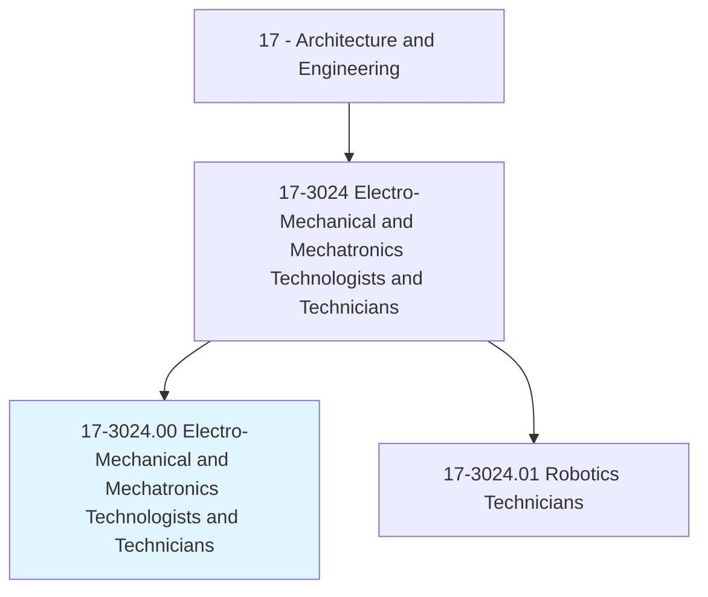
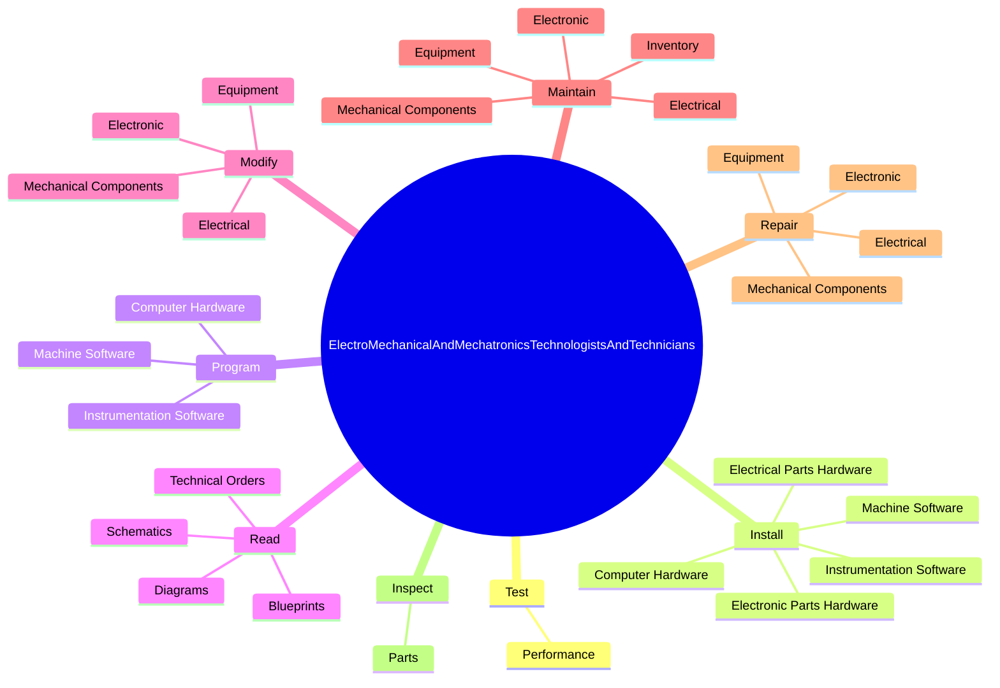
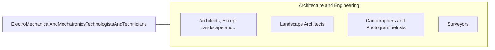

# Electro-Mechanical and Mechatronics Technologists and Technicians

> Operate, test, maintain, or adjust unmanned, automated, servomechanical, or electromechanical equipment. May operate unmanned submarines, aircraft, or other equipment to observe or record visual information at sites such as oil rigs, crop fields, buildings, or for similar infrastructure, deep ocean exploration, or hazardous waste removal. May assist engineers in testing and designing robotics equipment.

## Overview

Electro-Mechanical and Mechatronics Technologists and Technicians is an occupation within the Architecture and Engineering category. Operate, test, maintain, or adjust unmanned, automated, servomechanical, or electromechanical equipment. May operate unmanned submarines, aircraft, or other equipment to observe or record visual information at sites such as oil rigs, crop fields, buildings, or for similar infrastructure, deep ocean exploration, or hazardous waste removal.

## Classification Hierarchy

## Key Statistics

| Metric | Value |
|--------|-------|
| SOC Code | 17-3024.00 |
| Category | [Architecture and Engineering](/occupations/Architecture) |
| Task Count | 193 |
| Source | O*NET |

## Core Tasks

### test.Performance

Electro-Mechanical and Mechatronics Technologists and Technicians test performance as part of their core responsibilities.

**Actions:**
- `test.Performance.of.ElectromechanicalAssemblies`
- `test.Performance.of.UsingTestInstruments`
- `test.Performance.of.Oscilloscopes`
- `test.Performance.of.ElectronicVoltmeters`

### install.ComputerHardware

Electro-Mechanical and Mechatronics Technologists and Technicians install computer hardware as part of their core responsibilities.

**Actions:**
- `install.ComputerHardware.in.MicroprocessorBasedSystems`
- `install.MachineSoftware.in.MicroprocessorBasedSystems`
- `install.InstrumentationSoftware.in.MicroprocessorBasedSystems`
- `install.ElectricalPartsHardware.in.Housings`

### program.ComputerHardware

Electro-Mechanical and Mechatronics Technologists and Technicians program computer hardware as part of their core responsibilities.

**Actions:**
- `program.ComputerHardware.in.MicroprocessorBasedSystems`
- `program.MachineSoftware.in.MicroprocessorBasedSystems`
- `program.InstrumentationSoftware.in.MicroprocessorBasedSystems`

## Skills & Competencies

### Technical Skills
- **Engineering Design** - Advanced
- **CAD/CAM** - Advanced
- **Technical Analysis** - Advanced

### Soft Skills
- **Communication** - Essential
- **Problem Solving** - Essential
- **Critical Thinking** - Important
- **Teamwork** - Important
- **Adaptability** - Important

## Related Occupations

## Industries

This occupation is found across multiple industries. See [Industries](/industries) for sector-specific employment data.

## Career Progression

---

*Source: O*NET 17-3024.00 - ONETOccupation*
