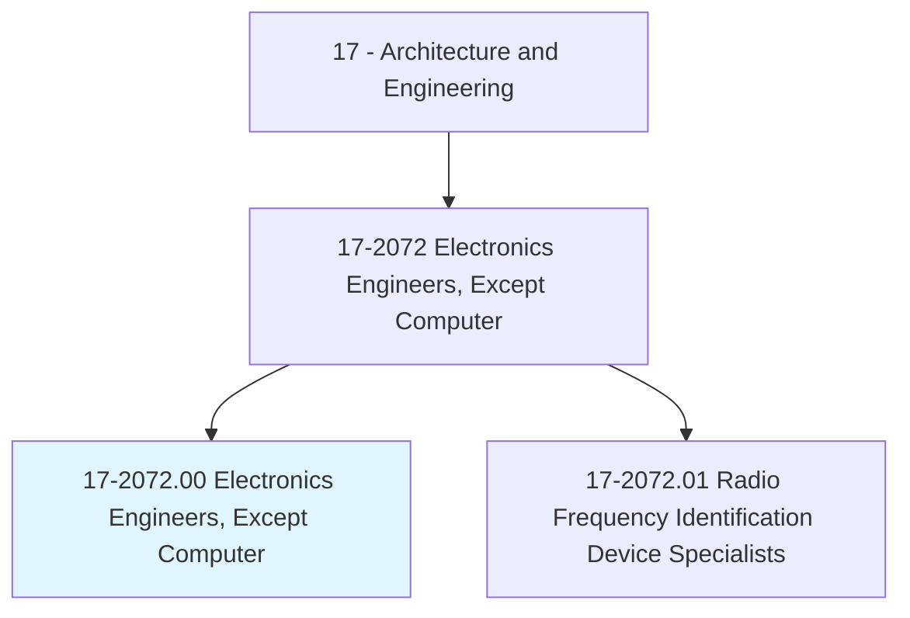
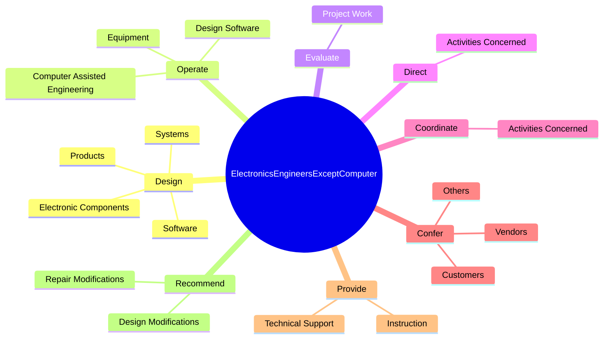
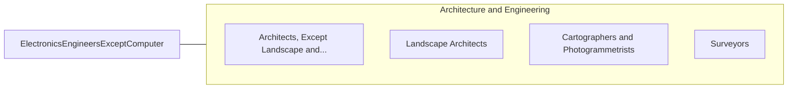

# Electronics Engineers, Except Computer

> Research, design, develop, or test electronic components and systems for commercial, industrial, military, or scientific use employing knowledge of electronic theory and materials properties. Design electronic circuits and components for use in fields such as telecommunications, aerospace guidance and propulsion control, acoustics, or instruments and controls.

## Overview

Electronics Engineers, Except Computer is an occupation within the Architecture and Engineering category. Research, design, develop, or test electronic components and systems for commercial, industrial, military, or scientific use employing knowledge of electronic theory and materials properties. 

## Classification Hierarchy

## Key Statistics

| Metric | Value |
|--------|-------|
| SOC Code | 17-2072.00 |
| Category | [Architecture and Engineering](/occupations/Architecture) |
| Task Count | 208 |
| Source | O*NET |

## Core Tasks

### design.ElectronicComponents

Electronics Engineers, Except Computer design electronic components as part of their core responsibilities.

**Actions:**
- `design.ElectronicComponents.for.Commercial`
- `design.ElectronicComponents.for.Industrial`
- `design.ElectronicComponents.for.Medical`
- `design.ElectronicComponents.for.Military`

### operate.ComputerAssistedEngineering

Electronics Engineers, Except Computer operate computer assisted engineering as part of their core responsibilities.

**Actions:**
- `operate.ComputerAssistedEngineering.to.perform.ElectronicsEngineeringTasks`
- `operate.DesignSoftware.to.perform.ElectronicsEngineeringTasks`
- `operate.Equipment.to.perform.ElectronicsEngineeringTasks`

### evaluate.ProjectWork

Electronics Engineers, Except Computer evaluate project work as part of their core responsibilities.

**Actions:**
- `evaluate.ProjectWork.to.ensure.Effectiveness`
- `evaluate.ProjectWork.to.TechnicalAdequacy`
- `evaluate.ProjectWork.to.CompatibilityInResolutionOfComplexElectronicsEngineeringProblems`

## Skills & Competencies

### Technical Skills
- **Engineering Design** - Advanced
- **CAD/CAM** - Advanced
- **Technical Analysis** - Advanced

### Soft Skills
- **Communication** - Essential
- **Problem Solving** - Essential
- **Critical Thinking** - Important
- **Teamwork** - Important
- **Adaptability** - Important

## Related Occupations

## Industries

This occupation is found across multiple industries. See [Industries](/industries) for sector-specific employment data.

## Career Progression

---

*Source: O*NET 17-2072.00 - ONETOccupation*
