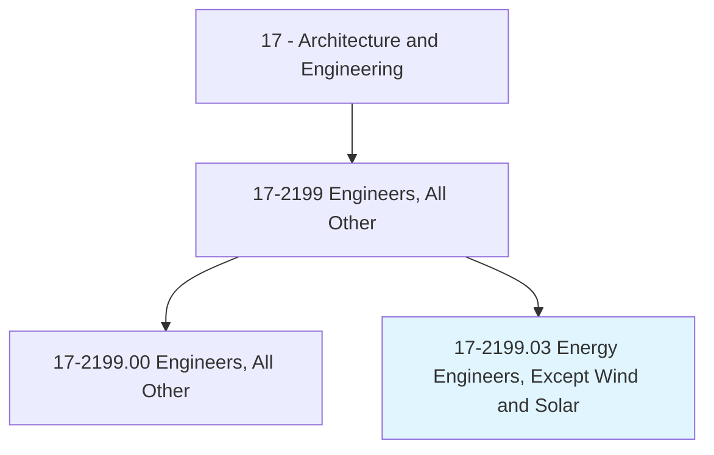
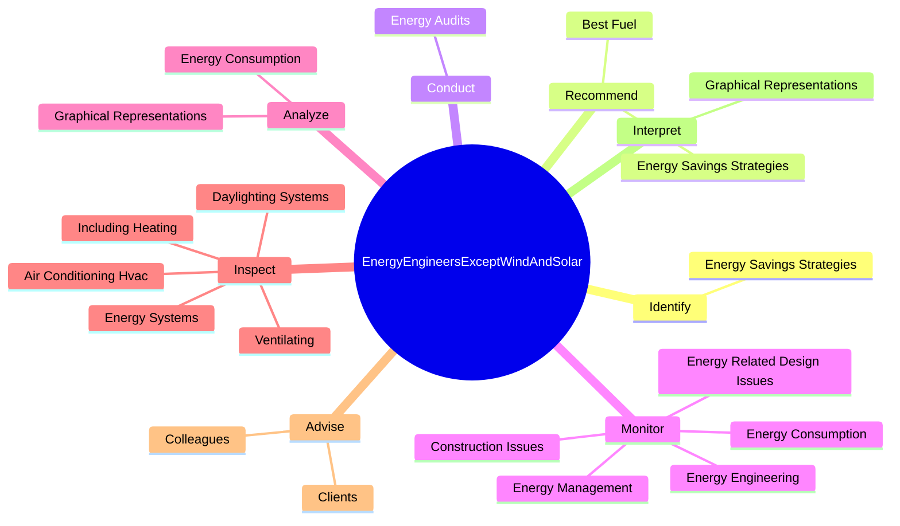
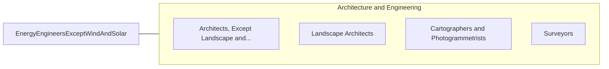

# Energy Engineers, Except Wind and Solar

> Design, develop, or evaluate energy-related projects or programs to reduce energy costs or improve energy efficiency during the designing, building, or remodeling stages of construction. May specialize in electrical systems; heating, ventilation, and air-conditioning (HVAC) systems; green buildings; lighting; air quality; or energy procurement.

## Overview

Energy Engineers, Except Wind and Solar is a specialized variant within the Architecture and Engineering category. Design, develop, or evaluate energy-related projects or programs to reduce energy costs or improve energy efficiency during the designing, building, or remodeling stages of construction. 

## Classification Hierarchy

## Key Statistics

| Metric | Value |
|--------|-------|
| SOC Code | 17-2199.03 |
| Category | [Architecture and Engineering](/occupations/Architecture) |
| Task Count | 101 |
| Source | O*NET |

## Core Tasks

### identify.EnergySavingsStrategies

Energy Engineers, Except Wind and Solar identify energy savings strategies as part of their core responsibilities.

**Actions:**
- `identify.EnergySavingsStrategies.to.achieve.EnergyEfficientOperation`

### recommend.EnergySavingsStrategies

Energy Engineers, Except Wind and Solar recommend energy savings strategies as part of their core responsibilities.

**Actions:**
- `recommend.EnergySavingsStrategies.to.achieve.EnergyEfficientOperation`
- `recommend.BestFuel.for.SpecificSites`
- `recommend.BestFuel.for.Circumstances`

### conduct.EnergyAudits

Energy Engineers, Except Wind and Solar conduct energy audits as part of their core responsibilities.

**Actions:**
- `conduct.EnergyAudits.to.evaluate.EnergyUseIdentifyConservationCostReductionMeasures`
- `conduct.EnergyAudits.to.ToIdentifyConservationCostReductionMeasures`

## Skills & Competencies

### Technical Skills
- **Engineering Design** - Advanced
- **CAD/CAM** - Advanced
- **Technical Analysis** - Advanced

### Soft Skills
- **Communication** - Essential
- **Problem Solving** - Essential
- **Critical Thinking** - Important
- **Teamwork** - Important
- **Adaptability** - Important

## Related Occupations

## Industries

This occupation is found across multiple industries. See [Industries](/industries) for sector-specific employment data.

## Career Progression

---

*Source: O*NET 17-2199.03 - ONETOccupation*
