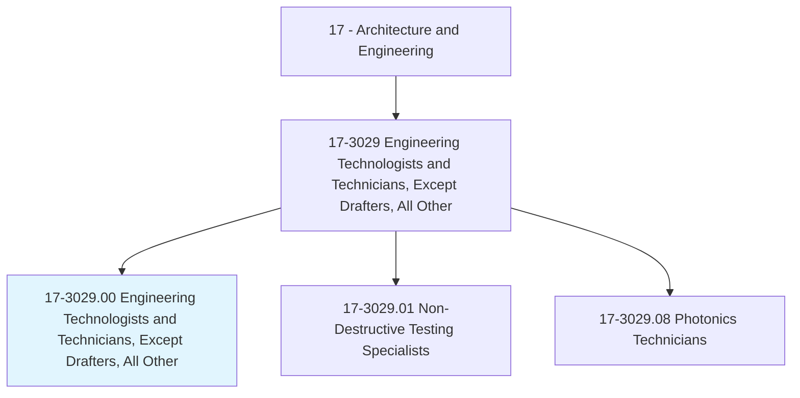
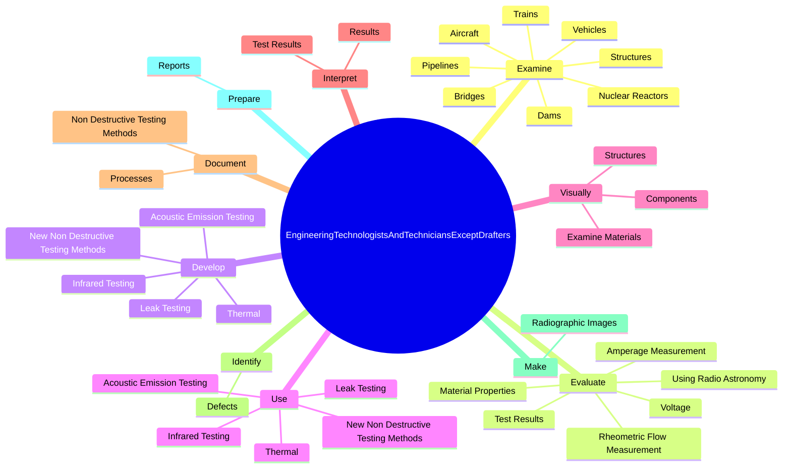
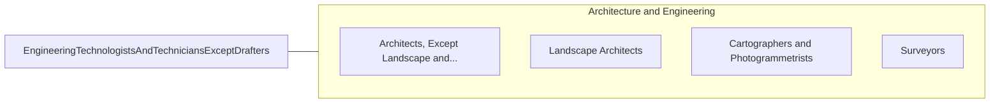

# Engineering Technologists and Technicians, Except Drafters, All Other

> All engineering technologists and technicians, except drafters, not listed separately.

## Overview

Engineering Technologists and Technicians, Except Drafters, All Other is classified under Architecture and Engineering (SOC 17). All engineering technologists and technicians, except drafters, not listed separately.

## Classification Hierarchy

## Key Statistics

| Metric | Value |
|--------|-------|
| SOC Code | 17-3029.00 |
| Category | [Architecture and Engineering](/occupations/Architecture) |
| Task Count | 99 |
| Source | O*NET |

## Core Tasks

### examine.Structures

Engineering Technologists and Technicians, Except Drafters, All Other examine structures as part of their core responsibilities.

**Actions:**
- `examine.Structures`
- `examine.Vehicles`
- `examine.Aircraft`
- `examine.Trains`

### evaluate.TestResults

Engineering Technologists and Technicians, Except Drafters, All Other evaluate test results as part of their core responsibilities.

**Actions:**
- `evaluate.TestResults.in.Accordance`
- `evaluate.TestResults.in.Standards`
- `evaluate.TestResults.in.Specifications`
- `evaluate.TestResults.in.Procedures`

### develop.NewNonDestructiveTestingMethods

Engineering Technologists and Technicians, Except Drafters, All Other develop new non destructive testing methods as part of their core responsibilities.

**Actions:**
- `develop.NewNonDestructiveTestingMethods`
- `develop.AcousticEmissionTesting`
- `develop.LeakTesting`
- `develop.Thermal`

## Skills & Competencies

### Technical Skills
- **Engineering Design** - Advanced
- **CAD/CAM** - Advanced
- **Technical Analysis** - Advanced

### Soft Skills
- **Communication** - Essential
- **Problem Solving** - Essential
- **Critical Thinking** - Important
- **Teamwork** - Important
- **Adaptability** - Important

## Related Occupations

## Industries

This occupation is found across multiple industries. See [Industries](/industries) for sector-specific employment data.

## Career Progression

---

*Source: O*NET 17-3029.00 - ONETOccupation*
