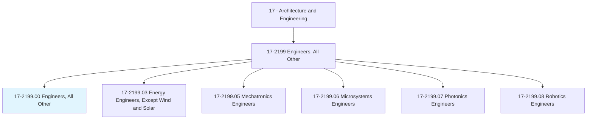
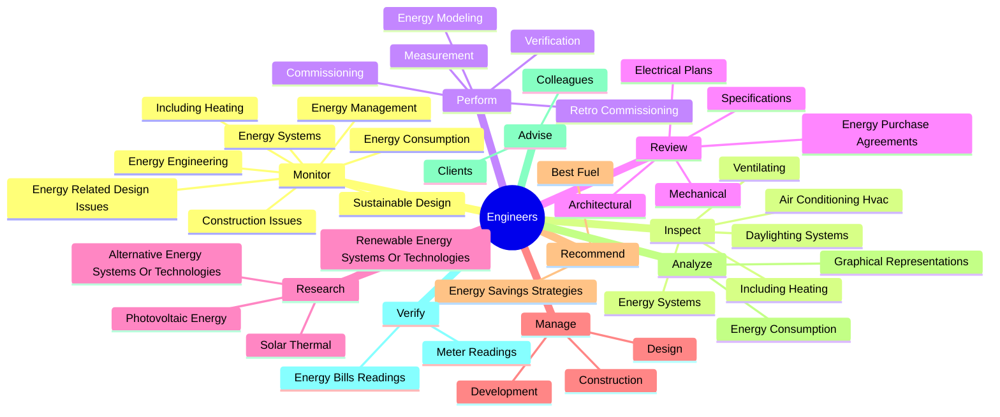
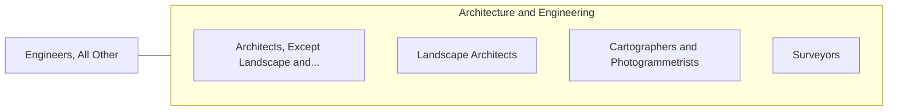

# Engineers, All Other

> All engineers not listed separately.

## Overview

Engineers, All Other is classified under Architecture and Engineering (SOC 17). All engineers not listed separately.

## Classification Hierarchy

## Key Statistics

| Metric | Value |
|--------|-------|
| SOC Code | 17-2199.00 |
| Category | [Architecture and Engineering](/occupations/Architecture) |
| Task Count | 101 |
| Source | O*NET |

## Core Tasks

### monitor.EnergyConsumption

Engineers, All Other monitor energy consumption as part of their core responsibilities.

**Actions:**
- `monitor.EnergyConsumption`
- `monitor.EnergyRelatedDesignIssues`
- `monitor.ConstructionIssues`
- `monitor.EnergyEngineering`

### inspect.EnergySystems

Engineers, All Other inspect energy systems as part of their core responsibilities.

**Actions:**
- `inspect.EnergySystems.to.DetermineEnergyUseEnergySavings`
- `inspect.EnergySystems.to.PotentialEnergySavings`
- `inspect.IncludingHeating.to.DetermineEnergyUseEnergySavings`
- `inspect.IncludingHeating.to.PotentialEnergySavings`

### perform.EnergyModeling

Engineers, All Other perform energy modeling as part of their core responsibilities.

**Actions:**
- `perform.EnergyModeling`
- `perform.Measurement`
- `perform.Verification`
- `perform.Commissioning`

## Skills & Competencies

### Technical Skills
- **Engineering Design** - Advanced
- **CAD/CAM** - Advanced
- **Technical Analysis** - Advanced

### Soft Skills
- **Communication** - Essential
- **Problem Solving** - Essential
- **Critical Thinking** - Important
- **Teamwork** - Important
- **Adaptability** - Important

## Related Occupations

## Industries

This occupation is found across multiple industries. See [Industries](/industries) for sector-specific employment data.

## Career Progression

---

*Source: O*NET 17-2199.00 - ONETOccupation*
