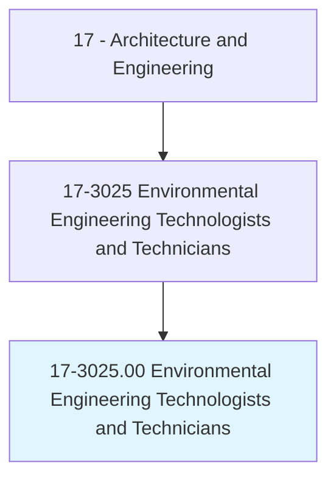
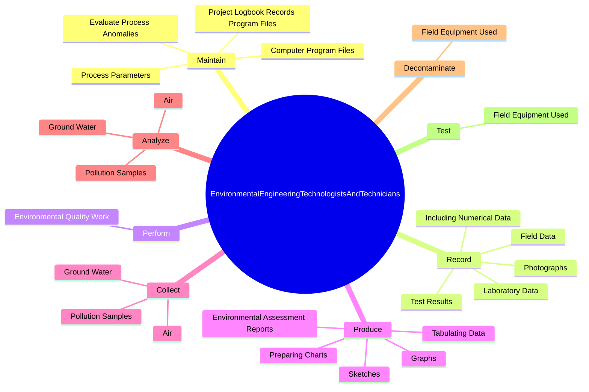
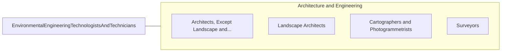

# Environmental Engineering Technologists and Technicians

> Apply theory and principles of environmental engineering to modify, test, and operate equipment and devices used in the prevention, control, and remediation of environmental problems, including waste treatment and site remediation, under the direction of engineering staff or scientists. May assist in the development of environmental remediation devices.

## Overview

Environmental Engineering Technologists and Technicians is an occupation within the Architecture and Engineering category. Apply theory and principles of environmental engineering to modify, test, and operate equipment and devices used in the prevention, control, and remediation of environmental problems, including waste treatment and site remediation, under the direction of engineering staff or scientists. 

## Classification Hierarchy

## Key Statistics

| Metric | Value |
|--------|-------|
| SOC Code | 17-3025.00 |
| Category | [Architecture and Engineering](/occupations/Architecture) |
| Task Count | 90 |
| Source | O*NET |

## Core Tasks

### maintain.ProjectLogbookRecordsProgramFiles

Environmental Engineering Technologists and Technicians maintain project logbook records program files as part of their core responsibilities.

**Actions:**
- `maintain.ProjectLogbookRecordsProgramFiles`
- `maintain.ComputerProgramFiles`
- `maintain.ProcessParameters`
- `maintain.EvaluateProcessAnomalies`

### record.LaboratoryData

Environmental Engineering Technologists and Technicians record laboratory data as part of their core responsibilities.

**Actions:**
- `record.LaboratoryData.of.VisualObservations`
- `record.FieldData.of.VisualObservations`
- `record.IncludingNumericalData.of.VisualObservations`
- `record.TestResults.of.VisualObservations`

### perform.EnvironmentalQualityWork

Environmental Engineering Technologists and Technicians perform environmental quality work as part of their core responsibilities.

**Actions:**
- `perform.EnvironmentalQualityWork.in.FieldSettings`
- `perform.EnvironmentalQualityWork.in.OfficeSettings`

## Skills & Competencies

### Technical Skills
- **Engineering Design** - Advanced
- **CAD/CAM** - Advanced
- **Technical Analysis** - Advanced

### Soft Skills
- **Communication** - Essential
- **Problem Solving** - Essential
- **Critical Thinking** - Important
- **Teamwork** - Important
- **Adaptability** - Important

## Related Occupations

## Industries

This occupation is found across multiple industries. See [Industries](/industries) for sector-specific employment data.

## Career Progression

---

*Source: O*NET 17-3025.00 - ONETOccupation*
