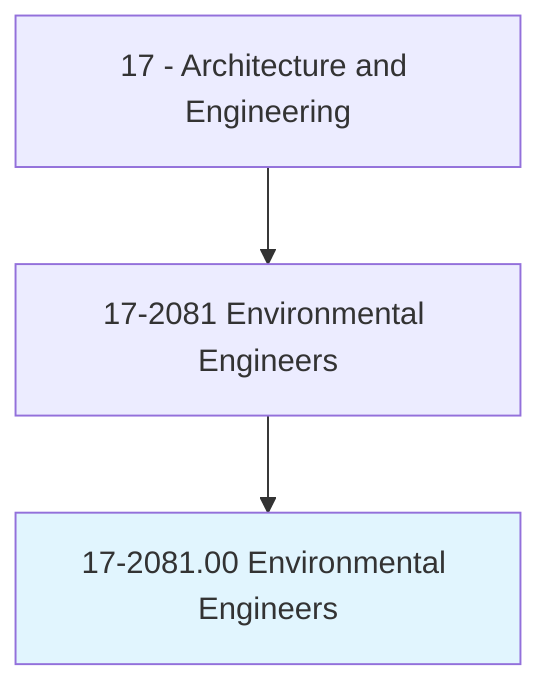
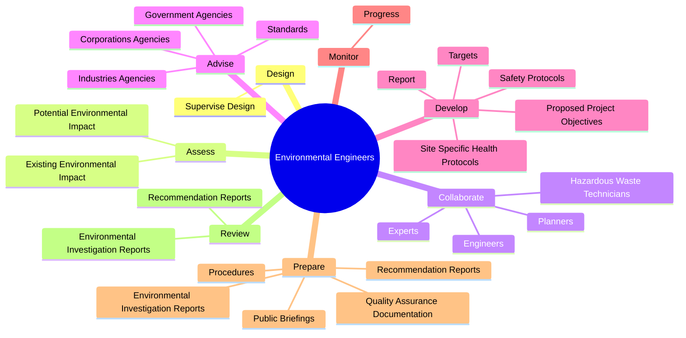
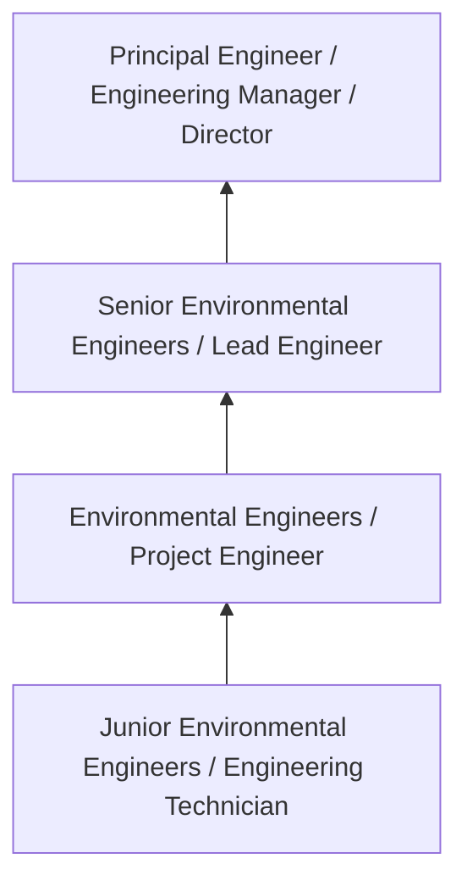
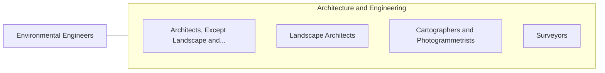

# Environmental Engineers

> Research, design, plan, or perform engineering duties in the prevention, control, and remediation of environmental hazards using various engineering disciplines. Work may include waste treatment, site remediation, or pollution control technology.

## Overview

Environmental Engineers professionals research, design, plan, or perform engineering duties in the prevention, control, and remediation of environmental hazards using various engineering disciplines. This occupation falls within the Architecture and Engineering category and requires a combination of specialized knowledge, technical skills, and practical experience.

These professionals work across diverse settings and organizational contexts, applying their expertise to meet the demands of their field. They must stay current with industry standards, emerging practices, and regulatory requirements that affect their work. The role demands both independent judgment and collaborative skills, as practitioners regularly interact with colleagues, stakeholders, and the public.

As the field continues to evolve, Environmental Engineers professionals increasingly leverage technology and data-driven approaches to enhance their effectiveness. Career opportunities span the public and private sectors, with demand influenced by economic conditions, demographic shifts, and technological advancement.

## Classification Hierarchy



## Key Statistics

| Metric | Value |
|--------|-------|
| SOC Code | 17-2081.00 |
| Job Zone | N/A |
| Category | [Architecture and Engineering](/occupations/Architecture/index) |
| Core Tasks | 122+ |
| Salary Range | $55,000 - $140,000 |
| Median Salary | $85,000 |
| Growth Outlook | 4% (As fast as average) |
| Source | O*NET |

## Core Tasks



### provide.TechnicalSupport

Environmental Engineers provide technical support as part of their core responsibilities.

**Actions:**
- `provide.TechnicalSupport.for.EnvironmentalRemediationProjects` - Provide technical support for environmental remediation or litigation project...
- `provide.TechnicalSupport.for.LitigationProjects` - Provide technical support for environmental remediation or litigation project...
- `provide.TechnicalSupport.for.IncludingRemediationSystemDesign` - Provide technical support for environmental remediation or litigation project...
- `provide.TechnicalSupport.for.Determination.of.RegulatoryApplicability` - Provide technical support for environmental remediation or litigation project...
- `provide.AdministrativeSupport.for.Projects.by.CollectingData` - Provide administrative support for projects by collecting data, providing pro...

### develop.ProposedProjectObjectives

Environmental Engineers develop proposed project objectives as part of their core responsibilities.

**Actions:**
- `develop.ProposedProjectObjectives.to.ManagementOnProgressInAttainingThem` - Develop proposed project objectives and targets and report to management on p...
- `develop.Targets.to.ManagementOnProgressInAttainingThem` - Develop proposed project objectives and targets and report to management on p...
- `develop.Report.to.ManagementOnProgressInAttainingThem` - Develop proposed project objectives and targets and report to management on p...
- `develop.SiteSpecificHealthProtocols.for.LoadingWaste` - Develop site-specific health and safety protocols, such as spill contingency ...
- `develop.SiteSpecificHealthProtocols.for.TransportingWaste` - Develop site-specific health and safety protocols, such as spill contingency ...

### collaborate.Planners

Environmental Engineers collaborate planners as part of their core responsibilities.

**Actions:**
- `collaborate.Planners.in.Law` - Collaborate with environmental scientists, planners, hazardous waste technici...
- `collaborate.Planners.in.Business` - Collaborate with environmental scientists, planners, hazardous waste technici...
- `collaborate.Planners.in.OtherSpecialists.to.address.EnvironmentalProblems` - Collaborate with environmental scientists, planners, hazardous waste technici...
- `collaborate.HazardousWasteTechnicians.in.Law` - Collaborate with environmental scientists, planners, hazardous waste technici...
- `collaborate.HazardousWasteTechnicians.in.Business` - Collaborate with environmental scientists, planners, hazardous waste technici...

### assess.ExistingEnvironmentalImpact

Environmental Engineers assess existing environmental impact as part of their core responsibilities.

**Actions:**
- `assess.ExistingEnvironmentalImpact.of.LandUseProjects.on.Air` - Assess the existing or potential environmental impact of land use projects on...
- `assess.ExistingEnvironmentalImpact.of.Water` - Assess the existing or potential environmental impact of land use projects on...
- `assess.ExistingEnvironmentalImpact.of.Land` - Assess the existing or potential environmental impact of land use projects on...
- `assess.PotentialEnvironmentalImpact.of.LandUseProjects.on.Air` - Assess the existing or potential environmental impact of land use projects on...
- `assess.PotentialEnvironmentalImpact.of.Water` - Assess the existing or potential environmental impact of land use projects on...


## Skills & Competencies

### Technical Skills
- **Technical Design** - Expert
- **Engineering Analysis** - Advanced
- **CAD/BIM Software** - Advanced
- **Project Management** - Advanced
- **Code Compliance** - Advanced
- **Quality Assurance** - Proficient

### Soft Skills
- **Analytical Thinking** - Critical
- **Problem Solving** - Critical
- **Attention to Detail** - Essential
- **Teamwork** - Essential
- **Communication** - Essential

## Education & Certifications

| Requirement | Details |
|-------------|---------|
| Typical Education | Bachelor's degree in engineering, architecture, or related field |
| Work Experience | 2-4 years professional experience |
| On-the-Job Training | Moderate - technical specialization required |
| Certifications | Professional Engineer (PE), Architect License, or field-specific certifications |

## Career Progression



## Industry Variations

### Private Sector Engineering
Design and development work for commercial clients. Environmental Engineers professionals focus on product development, system design, and project delivery.

### Government and Infrastructure
Public works and infrastructure projects with emphasis on regulatory compliance and long-term sustainability.

### Construction and Field Engineering
On-site implementation and oversight of engineering designs. Strong focus on quality control and safety compliance.

### Consulting
Advisory services for diverse clients. Requires strong project management skills and ability to work across multiple simultaneous projects.

## Technology & Tools

- **Computer-Aided Design (CAD) software**
- **Building Information Modeling (BIM)**
- **Geographic Information Systems (GIS)**
- **Structural analysis software**
- **Project management tools**

## Related Occupations



## Industries

- [Engineering Services](/industries/Engineering) - High Employment
- [Construction](/industries/Construction) - High Employment
- [Manufacturing](/industries/Manufacturing) - Moderate Employment
- [Government](/industries/Government) - Moderate Employment

## Departments

This occupation typically works in:
- [Engineering](/departments/Engineering/index)
- [Design](/departments/Design)
- [Project Management](/departments/ProjectManagement)

## GraphDL Semantic Structure

```
Environmental Engineers perform:
- design.SuperviseDesign.of.SystemsProcessesEquipment.for.ControlManagementRemediationOfWaterAirSoilQuality
- assess.ExistingEnvironmentalImpact.of.LandUseProjects.on.Air
- assess.ExistingEnvironmentalImpact.of.Water
- assess.ExistingEnvironmentalImpact.of.Land
- assess.PotentialEnvironmentalImpact.of.LandUseProjects.on.Air
- assess.PotentialEnvironmentalImpact.of.Water
```

---

*Source: O*NET 17-2081.00 - ONETOccupation*
