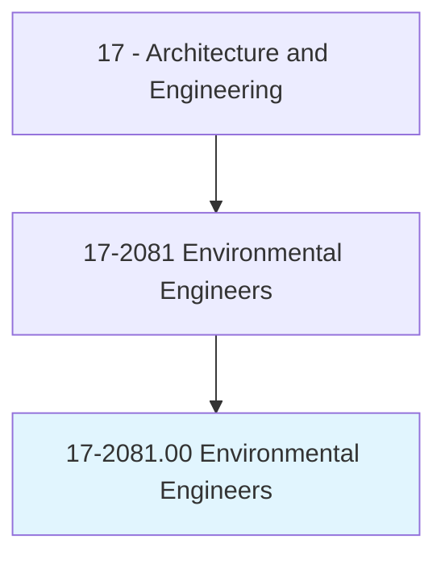
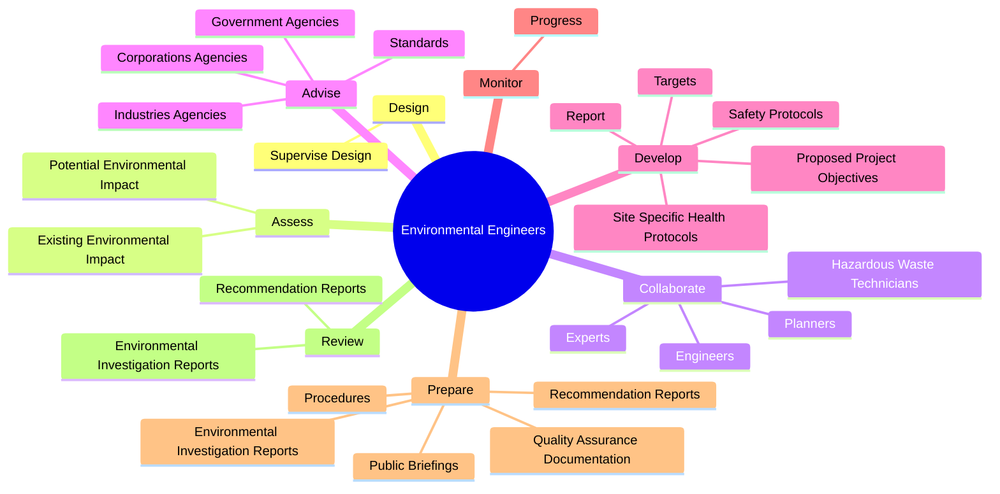
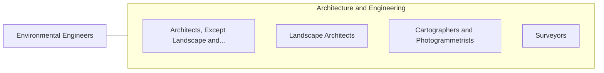

# Environmental Engineers

> Research, design, plan, or perform engineering duties in the prevention, control, and remediation of environmental hazards using various engineering disciplines. Work may include waste treatment, site remediation, or pollution control technology.

## Overview

Environmental Engineers is an occupation within the Architecture and Engineering category. Research, design, plan, or perform engineering duties in the prevention, control, and remediation of environmental hazards using various engineering disciplines. 

## Classification Hierarchy

## Key Statistics

| Metric | Value |
|--------|-------|
| SOC Code | 17-2081.00 |
| Category | [Architecture and Engineering](/occupations/Architecture) |
| Task Count | 122 |
| Source | O*NET |

## Core Tasks

### design.SuperviseDesign

Environmental Engineers design supervise design as part of their core responsibilities.

**Actions:**
- `design.SuperviseDesign.of.SystemsProcessesEquipment.for.ControlManagementRemediationOfWaterAirSoilQuality`

### assess.ExistingEnvironmentalImpact

Environmental Engineers assess existing environmental impact as part of their core responsibilities.

**Actions:**
- `assess.ExistingEnvironmentalImpact.of.LandUseProjects.on.Air`
- `assess.ExistingEnvironmentalImpact.of.Water`
- `assess.ExistingEnvironmentalImpact.of.Land`
- `assess.PotentialEnvironmentalImpact.of.LandUseProjects.on.Air`

### collaborate.Planners

Environmental Engineers collaborate planners as part of their core responsibilities.

**Actions:**
- `collaborate.Planners.in.Law`
- `collaborate.Planners.in.Business`
- `collaborate.Planners.in.OtherSpecialists.to.address.EnvironmentalProblems`
- `collaborate.HazardousWasteTechnicians.in.Law`

## Skills & Competencies

### Technical Skills
- **Engineering Design** - Advanced
- **CAD/CAM** - Advanced
- **Technical Analysis** - Advanced

### Soft Skills
- **Communication** - Essential
- **Problem Solving** - Essential
- **Critical Thinking** - Important
- **Teamwork** - Important
- **Adaptability** - Important

## Related Occupations

## Industries

This occupation is found across multiple industries. See [Industries](/industries) for sector-specific employment data.

## Career Progression

---

*Source: O*NET 17-2081.00 - ONETOccupation*
