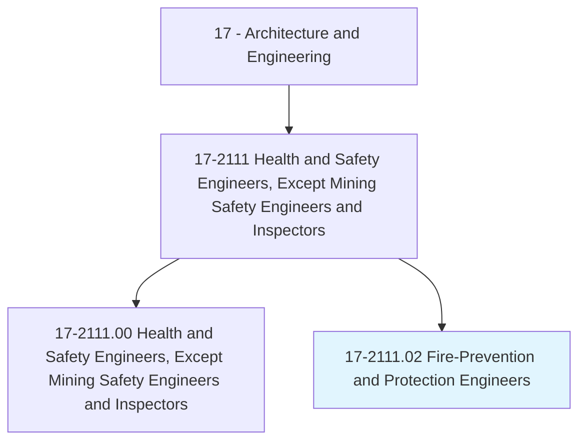
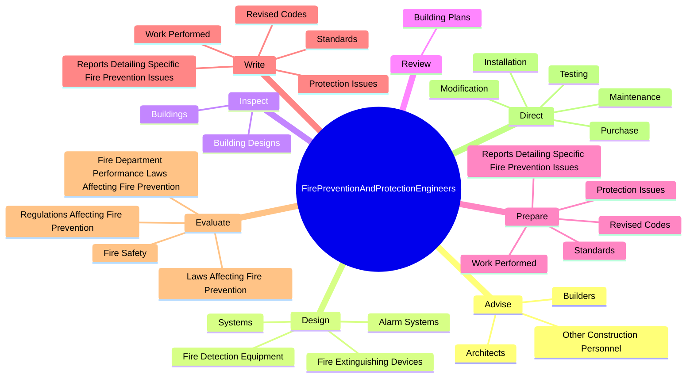
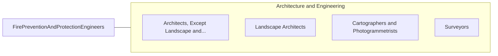

# Fire-Prevention and Protection Engineers

> Research causes of fires, determine fire protection methods, and design or recommend materials or equipment such as structural components or fire-detection equipment to assist organizations in safeguarding life and property against fire, explosion, and related hazards.

## Overview

Fire-Prevention and Protection Engineers is classified under Architecture and Engineering (SOC 17). Research causes of fires, determine fire protection methods, and design or recommend materials or equipment such as structural components or fire-detection equipment to assist organizations in safeguarding life and property against fire, explosion, and related hazards.

## Classification Hierarchy

## Key Statistics

| Metric | Value |
|--------|-------|
| SOC Code | 17-2111.02 |
| Category | [Architecture and Engineering](/occupations/Architecture) |
| Task Count | 73 |
| Source | O*NET |

## Core Tasks

### advise.Architects

Fire-Prevention and Protection Engineers advise architects as part of their core responsibilities.

**Actions:**
- `advise.Architects.on.FirePreventionEquipment.on.FireCodeStandardInterpretationCompliance`
- `advise.Architects.on.Techniques.on.FireCodeStandardInterpretationCompliance`
- `advise.Builders.on.FirePreventionEquipment.on.FireCodeStandardInterpretationCompliance`
- `advise.Builders.on.Techniques.on.FireCodeStandardInterpretationCompliance`

### design.FireDetectionEquipment

Fire-Prevention and Protection Engineers design fire detection equipment as part of their core responsibilities.

**Actions:**
- `design.FireDetectionEquipment`
- `design.AlarmSystems`
- `design.FireExtinguishingDevices`
- `design.Systems`

### inspect.Buildings

Fire-Prevention and Protection Engineers inspect buildings as part of their core responsibilities.

**Actions:**
- `inspect.Buildings.to.determine.FireProtectionSystemRequirementsProblemsInAreas`
- `inspect.Buildings.to.PotentialProblemsInAreas`
- `inspect.Buildings.to.water.Supplies`
- `inspect.Buildings.to.exit.Locations`

## Skills & Competencies

### Technical Skills
- **Engineering Design** - Advanced
- **CAD/CAM** - Advanced
- **Technical Analysis** - Advanced

### Soft Skills
- **Communication** - Essential
- **Problem Solving** - Essential
- **Critical Thinking** - Important
- **Teamwork** - Important
- **Adaptability** - Important

## Related Occupations

## Industries

This occupation is found across multiple industries. See [Industries](/industries) for sector-specific employment data.

## Career Progression

---

*Source: O*NET 17-2111.02 - ONETOccupation*
