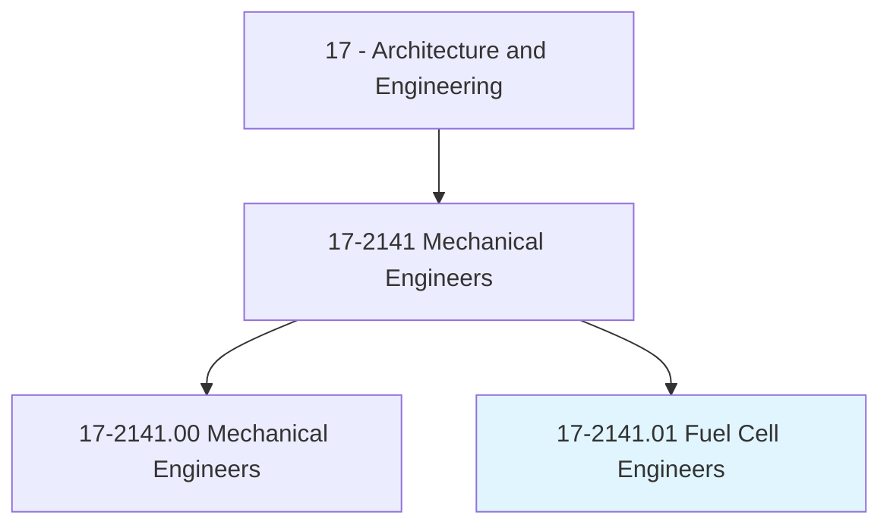
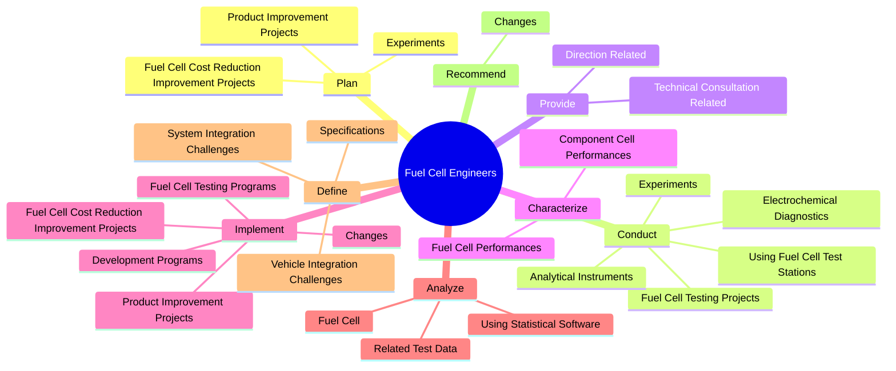

# Fuel Cell Engineers

> Design, evaluate, modify, or construct fuel cell components or systems for transportation, stationary, or portable applications.

## Overview

Fuel Cell Engineers is classified under Architecture and Engineering (SOC 17). Design, evaluate, modify, or construct fuel cell components or systems for transportation, stationary, or portable applications.

## Classification Hierarchy

## Key Statistics

| Metric | Value |
|--------|-------|
| SOC Code | 17-2141.01 |
| Category | [Architecture and Engineering](/occupations/Architecture) |
| Task Count | 131 |
| Source | O*NET |

## Core Tasks

### plan.Experiments

Fuel Cell Engineers plan experiments as part of their core responsibilities.

**Actions:**
- `plan.Experiments.to.validate.NewMaterials`
- `plan.Experiments.to.optimize.StartupProtocols`
- `plan.Experiments.to.reduce.ConditioningTime`
- `plan.Experiments.to.examine.ContaminantTolerance`

### conduct.Experiments

Fuel Cell Engineers conduct experiments as part of their core responsibilities.

**Actions:**
- `conduct.Experiments.to.validate.NewMaterials`
- `conduct.Experiments.to.optimize.StartupProtocols`
- `conduct.Experiments.to.reduce.ConditioningTime`
- `conduct.Experiments.to.examine.ContaminantTolerance`

### provide.TechnicalConsultationRelated

Fuel Cell Engineers provide technical consultation related as part of their core responsibilities.

**Actions:**
- `provide.TechnicalConsultationRelated.to.Development`
- `provide.TechnicalConsultationRelated.to.production.OfFuelCellSystems`
- `provide.DirectionRelated.to.Development`
- `provide.DirectionRelated.to.production.OfFuelCellSystems`

## Skills & Competencies

### Technical Skills
- **Engineering Design** - Advanced
- **CAD/CAM** - Advanced
- **Technical Analysis** - Advanced

### Soft Skills
- **Communication** - Essential
- **Problem Solving** - Essential
- **Critical Thinking** - Important
- **Teamwork** - Important
- **Adaptability** - Important

## Related Occupations

## Industries

This occupation is found across multiple industries. See [Industries](/industries) for sector-specific employment data.

## Career Progression

---

*Source: O*NET 17-2141.01 - ONETOccupation*
