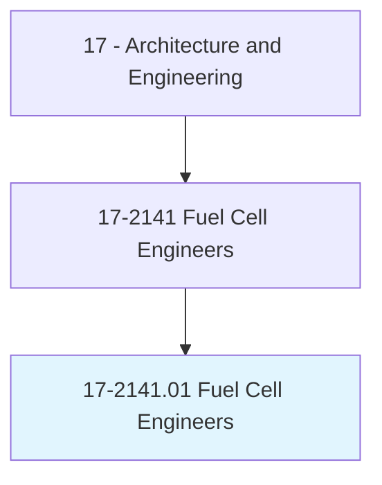
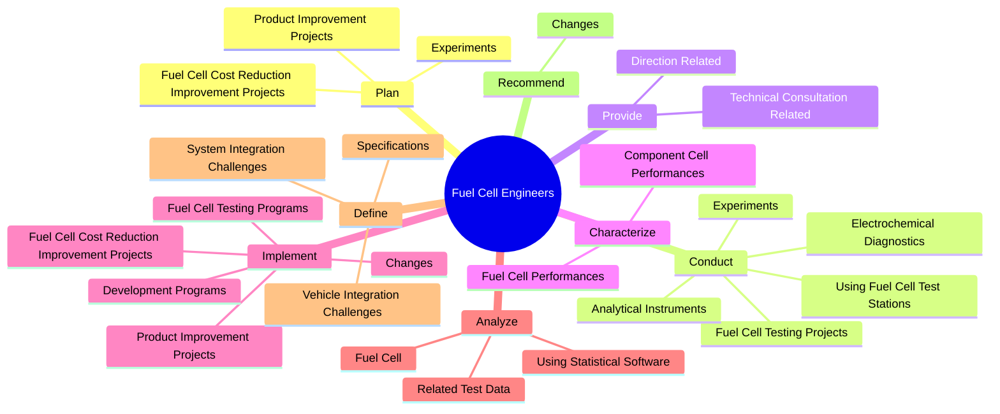
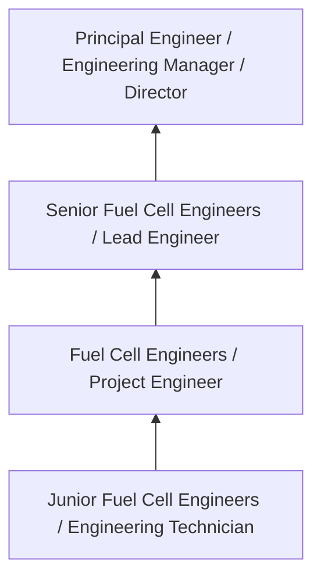

# Fuel Cell Engineers

> Design, evaluate, modify, or construct fuel cell components or systems for transportation, stationary, or portable applications.

## Overview

Fuel Cell Engineers professionals design, evaluate, modify, or construct fuel cell components or systems for transportation, stationary, or portable applications.. This occupation falls within the Architecture and Engineering category and requires a combination of specialized knowledge, technical skills, and practical experience.

These professionals work across diverse settings and organizational contexts, applying their expertise to meet the demands of their field. They must stay current with industry standards, emerging practices, and regulatory requirements that affect their work. The role demands both independent judgment and collaborative skills, as practitioners regularly interact with colleagues, stakeholders, and the public.

As the field continues to evolve, Fuel Cell Engineers professionals increasingly leverage technology and data-driven approaches to enhance their effectiveness. Career opportunities span the public and private sectors, with demand influenced by economic conditions, demographic shifts, and technological advancement.

## Classification Hierarchy



## Key Statistics

| Metric | Value |
|--------|-------|
| SOC Code | 17-2141.01 |
| Job Zone | N/A |
| Category | [Architecture and Engineering](/occupations/Architecture/index) |
| Core Tasks | 131+ |
| Salary Range | $55,000 - $140,000 |
| Median Salary | $85,000 |
| Growth Outlook | 4% (As fast as average) |
| Source | O*NET |

## Core Tasks



### conduct.Experiments

Fuel Cell Engineers conduct experiments as part of their core responsibilities.

**Actions:**
- `conduct.Experiments.to.validate.NewMaterials` - Plan or conduct experiments to validate new materials, optimize startup proto...
- `conduct.Experiments.to.optimize.StartupProtocols` - Plan or conduct experiments to validate new materials, optimize startup proto...
- `conduct.Experiments.to.reduce.ConditioningTime` - Plan or conduct experiments to validate new materials, optimize startup proto...
- `conduct.Experiments.to.examine.ContaminantTolerance` - Plan or conduct experiments to validate new materials, optimize startup proto...
- `conduct.FuelCellTestingProjects` - Conduct fuel cell testing projects, using fuel cell test stations, analytical...

### plan.Experiments

Fuel Cell Engineers plan experiments as part of their core responsibilities.

**Actions:**
- `plan.Experiments.to.validate.NewMaterials` - Plan or conduct experiments to validate new materials, optimize startup proto...
- `plan.Experiments.to.optimize.StartupProtocols` - Plan or conduct experiments to validate new materials, optimize startup proto...
- `plan.Experiments.to.reduce.ConditioningTime` - Plan or conduct experiments to validate new materials, optimize startup proto...
- `plan.Experiments.to.examine.ContaminantTolerance` - Plan or conduct experiments to validate new materials, optimize startup proto...
- `plan.FuelCellCostReductionImprovementProjects.in.Collaboration.with.OtherEngineers` - Plan or implement fuel cell cost reduction or product improvement projects in...

### implement.FuelCellCostReductionImprovementProjects

Fuel Cell Engineers implement fuel cell cost reduction improvement projects as part of their core responsibilities.

**Actions:**
- `implement.FuelCellCostReductionImprovementProjects.in.Collaboration.with.OtherEngineers` - Plan or implement fuel cell cost reduction or product improvement projects in...
- `implement.FuelCellCostReductionImprovementProjects.in.Suppliers` - Plan or implement fuel cell cost reduction or product improvement projects in...
- `implement.FuelCellCostReductionImprovementProjects.in.SupportPersonnel` - Plan or implement fuel cell cost reduction or product improvement projects in...
- `implement.FuelCellCostReductionImprovementProjects.in.Customers` - Plan or implement fuel cell cost reduction or product improvement projects in...
- `implement.ProductImprovementProjects.in.Collaboration.with.OtherEngineers` - Plan or implement fuel cell cost reduction or product improvement projects in...

### design.FuelCellTestingPrograms

Fuel Cell Engineers design fuel cell testing programs as part of their core responsibilities.

**Actions:**
- `design.FuelCellTestingPrograms` - Design or implement fuel cell testing or development programs.
- `design.DevelopmentPrograms` - Design or implement fuel cell testing or development programs.
- `design.FuelCellSystems` - Design fuel cell systems, subsystems, stacks, assemblies, or components, such...
- `design.Subsystems` - Design fuel cell systems, subsystems, stacks, assemblies, or components, such...
- `design.Stacks` - Design fuel cell systems, subsystems, stacks, assemblies, or components, such...


## Skills & Competencies

### Technical Skills
- **Technical Design** - Expert
- **Engineering Analysis** - Advanced
- **CAD/BIM Software** - Advanced
- **Project Management** - Advanced
- **Code Compliance** - Advanced
- **Quality Assurance** - Proficient

### Soft Skills
- **Analytical Thinking** - Critical
- **Problem Solving** - Critical
- **Attention to Detail** - Essential
- **Teamwork** - Essential
- **Communication** - Essential

## Education & Certifications

| Requirement | Details |
|-------------|---------|
| Typical Education | Bachelor's degree in engineering, architecture, or related field |
| Work Experience | 2-4 years professional experience |
| On-the-Job Training | Moderate - technical specialization required |
| Certifications | Professional Engineer (PE), Architect License, or field-specific certifications |

## Career Progression



## Industry Variations

### Private Sector Engineering
Design and development work for commercial clients. Fuel Cell Engineers professionals focus on product development, system design, and project delivery.

### Government and Infrastructure
Public works and infrastructure projects with emphasis on regulatory compliance and long-term sustainability.

### Construction and Field Engineering
On-site implementation and oversight of engineering designs. Strong focus on quality control and safety compliance.

### Consulting
Advisory services for diverse clients. Requires strong project management skills and ability to work across multiple simultaneous projects.

## Technology & Tools

- **Computer-Aided Design (CAD) software**
- **Building Information Modeling (BIM)**
- **Geographic Information Systems (GIS)**
- **Structural analysis software**
- **Project management tools**

## Related Occupations


## Industries

- [Engineering Services](/industries/Engineering) - High Employment
- [Construction](/industries/Construction) - High Employment
- [Manufacturing](/industries/Manufacturing) - Moderate Employment
- [Government](/industries/Government) - Moderate Employment

## Departments

This occupation typically works in:
- [Engineering](/departments/Engineering/index)
- [Design](/departments/Design)
- [Project Management](/departments/ProjectManagement)

## GraphDL Semantic Structure

```
Fuel Cell Engineers perform:
- plan.Experiments.to.validate.NewMaterials
- plan.Experiments.to.optimize.StartupProtocols
- plan.Experiments.to.reduce.ConditioningTime
- plan.Experiments.to.examine.ContaminantTolerance
- conduct.Experiments.to.validate.NewMaterials
- conduct.Experiments.to.optimize.StartupProtocols
```

---

*Source: O*NET 17-2141.01 - ONETOccupation*
