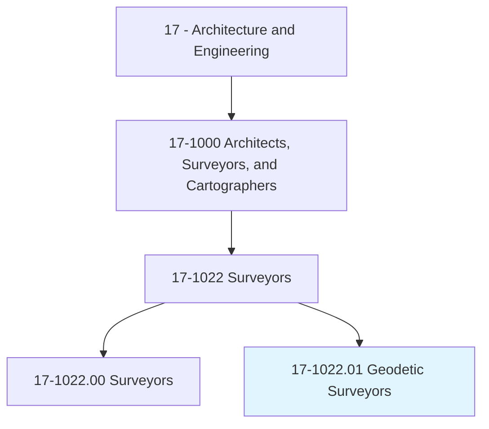
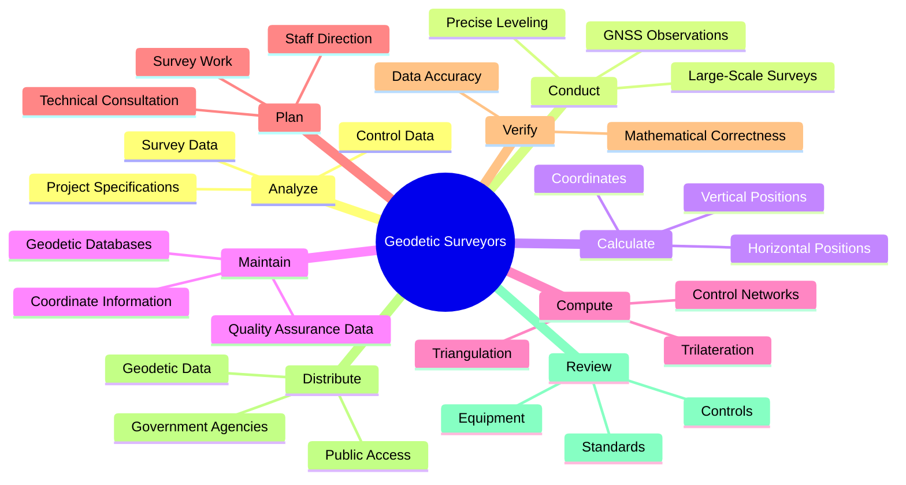
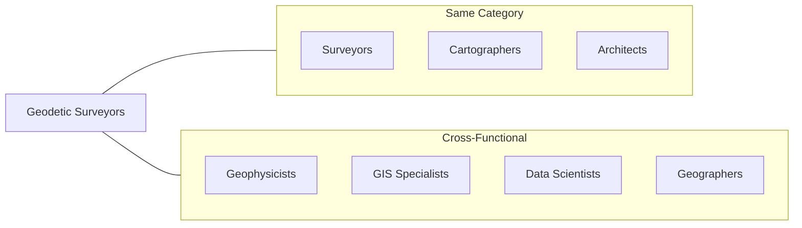
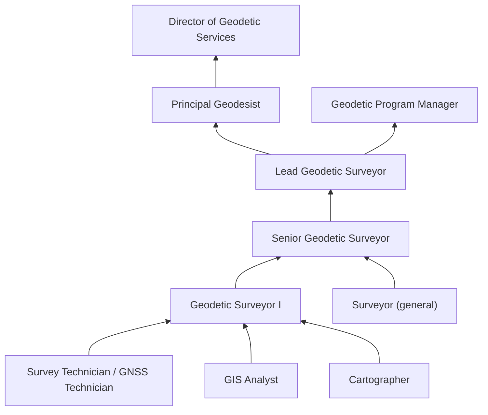

# Geodetic Surveyors

> Measure large areas of the Earth's surface using satellite observations, global navigation satellite systems (GNSS), light detection and ranging (LIDAR), or related sources.

## Overview

Geodetic Surveyors are specialized professionals who measure and map large areas of the Earth's surface with extremely high precision. Unlike traditional surveyors who work on individual property boundaries, geodetic surveyors establish the fundamental reference framework that underpins all other surveying and mapping activities. They use advanced technologies including satellite-based positioning systems (GPS/GNSS), precise leveling instruments, and sophisticated mathematical models to account for the Earth's shape, rotation, and gravitational variations. Their work supports national mapping programs, infrastructure projects, scientific research, and the maintenance of coordinate systems that enable everything from GPS navigation to land registration systems.

## Classification Hierarchy

## Key Statistics

| Metric | Value |
|--------|-------|
| SOC Code | 17-1022.01 |
| Job Zone | 4 (Considerable Preparation) |
| Category | [Architecture and Engineering](/occupations/Architecture/index) |
| Core Tasks | 15+ |
| Base Occupation | [Surveyors](./Surveyors.mdx) |
| Source | O*NET |

## Core Tasks

### analyze.ControlData

Geodetic Surveyors analyze survey control data to ensure accuracy and adherence to specifications.

**Actions:**
- `analyze.ControlData.to.ensure.AdherenceToProjectSpecificationsSurveyStandards` - Verify compliance with project specifications
- `analyze.ControlData.to.LandSurveyStandards` - Ensure conformance to national standards
- `analyze.SurveyData.to.ensure.AdherenceToProjectSpecificationsSurveyStandards` - Review collected survey data

### conduct.Surveys

Geodetic Surveyors perform precise surveys to determine positions, elevations, and other features over large areas.

**Actions:**
- `conduct.Surveys.to.determine.ExactPositions` - Establish precise coordinate locations
- `conduct.Surveys.to.MeasurementOfPoints` - Collect high-accuracy point measurements
- `conduct.Surveys.to.Elevations` - Determine precise elevations
- `conduct.Surveys.to.lines` - Survey linear features
- `conduct.Surveys.to.Areas` - Calculate area measurements
- `conduct.Surveys.to.Volumes` - Compute volume determinations
- `conduct.Surveys.to.Contours` - Map terrain contour lines
- `conduct.Surveys.to.OtherFeaturesOfLandSurfaces` - Document land surface characteristics

### calculate.Positions

Geodetic Surveyors calculate precise horizontal and vertical positions on the Earth's surface.

**Actions:**
- `calculate.ExactHorizontalPosition.of.Points.on.EarthsSurface` - Determine horizontal coordinates
- `calculate.VerticalPosition.of.Points.on.EarthsSurface` - Establish elevation values

### maintain.Databases

Geodetic Surveyors manage databases of geodetic information for use by other professionals and the public.

**Actions:**
- `maintain.Databases.of.Geodetic` - Maintain geodetic data repositories
- `maintain.Databases.of.RelatedInformation` - Manage supporting information
- `maintain.Databases.of.IncludingCoordinate` - Store coordinate data
- `maintain.Databases.of.Descriptive` - Maintain descriptive metadata
- `maintain.Databases.of.QualityAssuranceData` - Track data quality metrics

### compute.Coordinates

Geodetic Surveyors compute coordinates using various geodetic techniques.

**Actions:**
- `compute.HorizontalCoordinates.of.ControlNetworks` - Calculate horizontal control network coordinates
- `compute.HorizontalCoordinates.of.UsingDirectLeveling` - Apply direct leveling methods
- `compute.HorizontalCoordinates.of.OtherGeodeticSurveyTechniques` - Use various geodetic techniques
- `compute.HorizontalCoordinates.of.Triangulation` - Apply triangulation methods
- `compute.HorizontalCoordinates.of.Trilateration` - Use trilateration calculations
- `compute.HorizontalCoordinates.of.Traversing` - Perform traverse computations
- `compute.VerticalCoordinates.of.ControlNetworks` - Establish vertical control

### plan.Work

Geodetic Surveyors plan and direct survey work, providing technical consultation.

**Actions:**
- `plan.Work.of.GeodeticSurveyingStaff` - Organize staff assignments and workload
- `plan.Work.of.ProvidingTechnicalConsultationAsNeeded` - Offer expert technical guidance
- `direct.Work.of.GeodeticSurveyingStaff` - Lead survey teams

### verify.Correctness

Geodetic Surveyors verify the mathematical correctness and accuracy of survey data.

**Actions:**
- `verify.MathematicalCorrectness.of.NewlyCollectedSurveyData` - Validate computational accuracy

### assess.Quality

Geodetic Surveyors evaluate control data quality to determine needs for additional surveys.

**Actions:**
- `assess.Quality.of.ControlData.to.determine.NeedForAdditionalSurveyDataForEngineering` - Evaluate data adequacy for engineering projects
- `assess.Quality.of.Construction` - Review data for construction applications
- `assess.Quality.of.OtherProjects` - Assess fitness for various project types

### distribute.Data

Geodetic Surveyors share compiled geodetic data with government agencies and the public.

**Actions:**
- `distribute.CompiledGeodeticData.to.GovernmentAgencies` - Provide data to government partners
- `distribute.CompiledGeodeticData.to.GeneralPublic` - Make data publicly accessible

### provide.Training

Geodetic Surveyors train others in geodetic methods and procedures.

**Actions:**
- `provide.Training.in.Use.of.MethodsForObservingCheckingControlsForGeodeticPlaneCoordinates` - Train on observation methods
- `provide.Training.in.Procedures.for.ObservingCheckingControlsForGeodeticPlaneCoordinates` - Teach standard procedures
- `provide.Interpretation.in.Use.of.MethodsForObservingCheckingControlsForGeodeticPlaneCoordinates` - Interpret technical guidelines

### review.Standards

Geodetic Surveyors review and recommend updates to standards, controls, and equipment.

**Actions:**
- `review.ExistingStandards` - Evaluate current standards
- `review.Controls` - Assess control networks
- `review.EquipmentUsed` - Evaluate surveying equipment
- `review.RecommendingChanges` - Propose improvements
- `review.UpgradesAsNeeded` - Recommend technology updates

## Skills & Competencies

### Technical Skills
- **Geodesy** - Expert
- **GNSS/GPS Technology** - Expert
- **Precise Leveling** - Expert
- **Mathematical Modeling** - Expert
- **Coordinate Systems** - Expert
- **Data Adjustment** - Expert
- **Remote Sensing** - Advanced
- **GIS Applications** - Advanced
- **Programming** - Advanced

### Soft Skills
- **Analytical Thinking** - Critical
- **Attention to Detail** - Critical
- **Mathematical Reasoning** - Critical
- **Problem Solving** - Essential
- **Communication** - Essential
- **Leadership** - Essential
- **Continuous Learning** - Essential

## Related Occupations

## Industries

- [Government](/industries/Government) - High Employment (NOAA, USGS, NGS, state agencies)
- [Professional, Scientific, and Technical Services](/industries/ProfessionalServices) - High Employment
- [Mining, Quarrying, and Oil and Gas Extraction](/industries/Mining/index) - Moderate Employment
- [Utilities](/industries/Utilities/index) - Moderate Employment
- [Scientific Research](/industries/Research) - Moderate Employment

## Industry Variations

### Federal Government (National Geodetic Survey)
Works on the National Spatial Reference System (NSRS), maintaining the geodetic framework that supports all U.S. positioning and navigation activities.

### State and Regional Government
Maintains state plane coordinate systems and high-accuracy reference networks for local surveying and mapping activities.

### Infrastructure and Utilities
Supports large-scale infrastructure projects requiring precise positioning, including pipelines, transmission lines, and transportation corridors.

### Offshore and Marine
Provides positioning services for offshore oil and gas exploration, marine construction, and hydrographic surveying.

### Research and Academia
Conducts research in geodesy, geophysics, and Earth science, often studying crustal movement, sea level change, and tectonic activity.

### Defense and Intelligence
Supports military mapping, navigation, and targeting systems requiring extremely high-precision positioning data.

## Career Progression

## Education & Training

| Requirement | Details |
|-------------|---------|
| Typical Education | Bachelor's or Master's degree in Geodesy, Geomatics, Surveying Engineering, or related field |
| Work Experience | 2-5 years in surveying with geodetic specialization |
| On-the-Job Training | Extensive training in specialized equipment and geodetic theory |
| Licensure | Required in all states - PS license with geodetic experience |
| Common Certifications | CFedS (Certified Federal Surveyor), NSPS certifications |

## Departments

This occupation typically works in:
- [Geodetic Services](/departments/Geodetics)
- [Surveying](/departments/Surveying)
- [Geospatial Services](/departments/Geospatial)
- [Research and Development](/departments/RandD)

## Tools & Technologies

### Positioning Systems
- High-precision GNSS receivers
- Real-time kinematic (RTK) systems
- Continuously Operating Reference Stations (CORS)
- Network RTK services

### Precise Leveling
- Digital levels
- Invar rods
- Automatic levels
- Laser levels

### Software
- Geodetic adjustment software (OPUS, GIPSY)
- Coordinate transformation tools
- Network adjustment programs
- Statistical analysis packages

### Data Systems
- Geodetic database management systems
- Quality assurance tools
- Data distribution platforms
- Metadata management systems

### Reference Systems
- ITRF (International Terrestrial Reference Frame)
- NAD 83 / NAVD 88
- State Plane Coordinate Systems
- UTM coordinates

---

*Source: O*NET 17-1022.01 - ONETOccupation*
