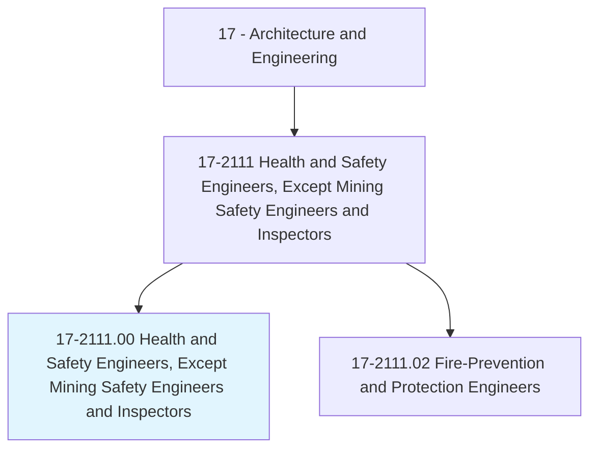
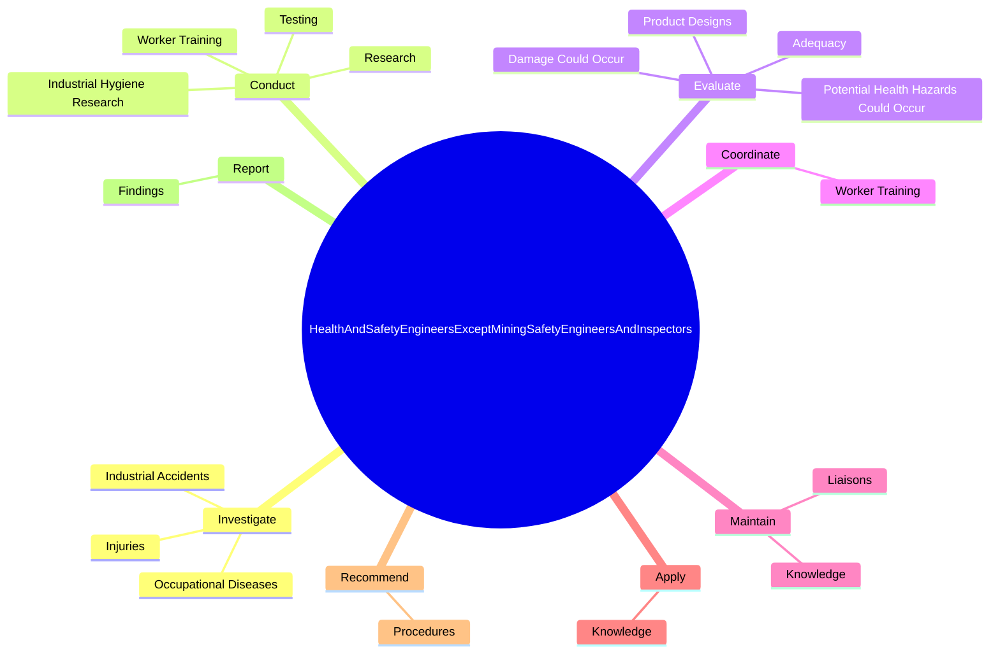
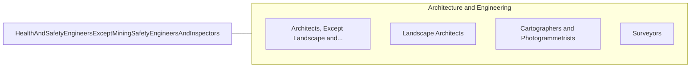

# Health and Safety Engineers, Except Mining Safety Engineers and Inspectors

> Promote worksite or product safety by applying knowledge of industrial processes, mechanics, chemistry, psychology, and industrial health and safety laws. Includes industrial product safety engineers.

## Overview

Health and Safety Engineers, Except Mining Safety Engineers and Inspectors is an occupation within the Architecture and Engineering category. Promote worksite or product safety by applying knowledge of industrial processes, mechanics, chemistry, psychology, and industrial health and safety laws. 

## Classification Hierarchy

## Key Statistics

| Metric | Value |
|--------|-------|
| SOC Code | 17-2111.00 |
| Category | [Architecture and Engineering](/occupations/Architecture/index) |
| Task Count | 97 |
| Source | O*NET |

## Core Tasks

### investigate.IndustrialAccidents

Health and Safety Engineers, Except Mining Safety Engineers and Inspectors investigate industrial accidents as part of their core responsibilities.

**Actions:**
- `investigate.IndustrialAccidents.to.determine.CausesMeasures`
- `investigate.IndustrialAccidents.to.PreventiveMeasures`
- `investigate.Injuries.to.determine.CausesMeasures`
- `investigate.Injuries.to.PreventiveMeasures`

### conduct.Research

Health and Safety Engineers, Except Mining Safety Engineers and Inspectors conduct research as part of their core responsibilities.

**Actions:**
- `conduct.Research.to.evaluate.SafetyLevelsForProducts`
- `conduct.WorkerTraining.in.Areas`
- `conduct.WorkerTraining.in.SafetyLaws`
- `conduct.WorkerTraining.in.Regulations`

### evaluate.ProductDesigns

Health and Safety Engineers, Except Mining Safety Engineers and Inspectors evaluate product designs as part of their core responsibilities.

**Actions:**
- `evaluate.ProductDesigns.for.Safety`
- `evaluate.PotentialHealthHazardsCouldOccur.from.ProductMisuse`
- `evaluate.DamageCouldOccur.from.ProductMisuse`
- `evaluate.Adequacy.of.ActionsTaken.to.correct.HealthInspectionViolations`

## Skills & Competencies

### Technical Skills
- **Engineering Design** - Advanced
- **CAD/CAM** - Advanced
- **Technical Analysis** - Advanced

### Soft Skills
- **Communication** - Essential
- **Problem Solving** - Essential
- **Critical Thinking** - Important
- **Teamwork** - Important
- **Adaptability** - Important

## Related Occupations

## Industries

This occupation is found across multiple industries. See [Industries](/industries) for sector-specific employment data.

## Career Progression

---

*Source: O*NET 17-2111.00 - ONETOccupation*
