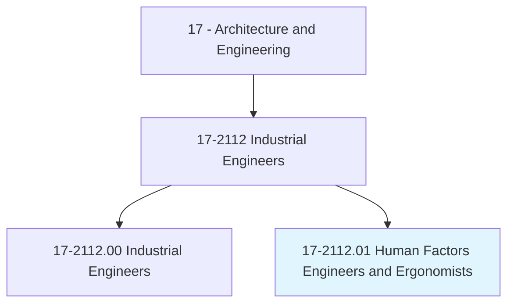
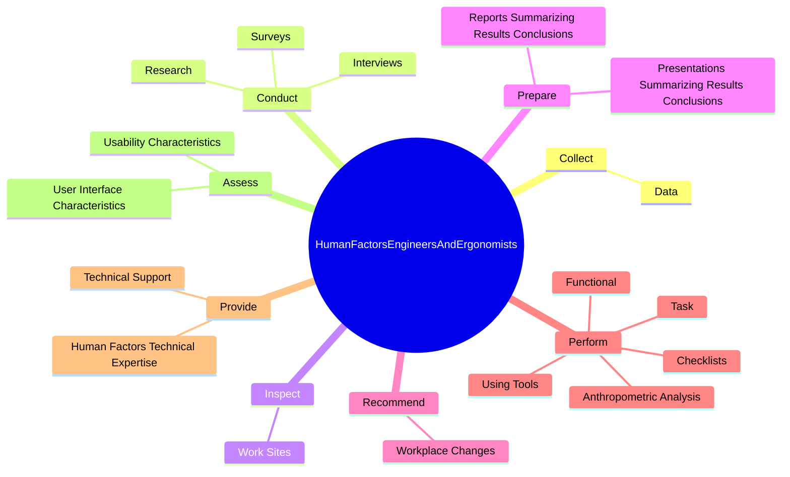
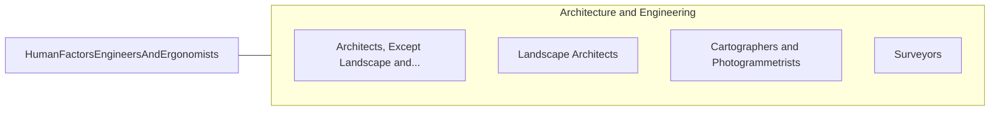

# Human Factors Engineers and Ergonomists

> Design objects, facilities, and environments to optimize human well-being and overall system performance, applying theory, principles, and data regarding the relationship between humans and respective technology. Investigate and analyze characteristics of human behavior and performance as it relates to the use of technology.

## Overview

Human Factors Engineers and Ergonomists is a specialized variant within the Architecture and Engineering category. Design objects, facilities, and environments to optimize human well-being and overall system performance, applying theory, principles, and data regarding the relationship between humans and respective technology. 

## Classification Hierarchy

## Key Statistics

| Metric | Value |
|--------|-------|
| SOC Code | 17-2112.01 |
| Category | [Architecture and Engineering](/occupations/Architecture/index) |
| Task Count | 181 |
| Source | O*NET |

## Core Tasks

### collect.Data

Human Factors Engineers and Ergonomists collect data as part of their core responsibilities.

**Actions:**
- `collect.Data.through.DirectObservation.of.WorkActivities`
- `collect.Data.through.DirectObservation.of.WitnessingConductOfTests`

### conduct.Interviews

Human Factors Engineers and Ergonomists conduct interviews as part of their core responsibilities.

**Actions:**
- `conduct.Interviews.of.Users.to.collect.InformationOnTopics`
- `conduct.Interviews.of.Customers.to.collect.InformationOnTopics`
- `conduct.Interviews.of.Requirements`
- `conduct.Interviews.of.Needs`

### inspect.WorkSites

Human Factors Engineers and Ergonomists inspect work sites as part of their core responsibilities.

**Actions:**
- `inspect.WorkSites.to.identify.PhysicalHazards`

## Skills & Competencies

### Technical Skills
- **Engineering Design** - Advanced
- **CAD/CAM** - Advanced
- **Technical Analysis** - Advanced

### Soft Skills
- **Communication** - Essential
- **Problem Solving** - Essential
- **Critical Thinking** - Important
- **Teamwork** - Important
- **Adaptability** - Important

## Related Occupations

## Industries

This occupation is found across multiple industries. See [Industries](/industries) for sector-specific employment data.

## Career Progression

---

*Source: O*NET 17-2112.01 - ONETOccupation*
